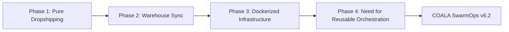
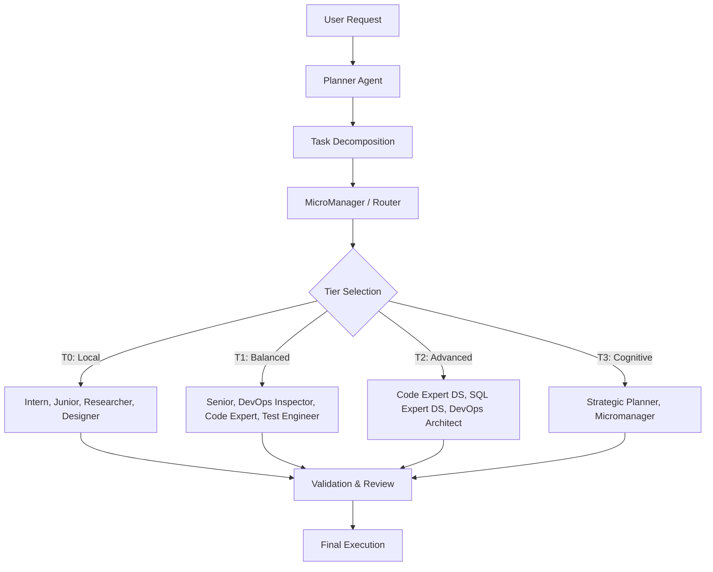
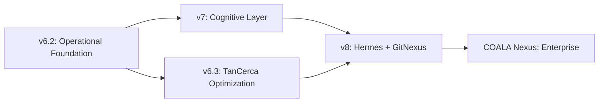

# COALA SwarmOps — Foundation Document

> **The v6.2 Covenant: Why This Version Matters and Will Never Be Rewritten**

---

## 1. The Foundation Pledge

COALA SwarmOps v6.2 is not a prototype. It is not an experiment. It is the operational foundation upon which every future version of this ecosystem will be built.

**This document exists to protect that foundation.**

It ensures that:
- The history of how this platform evolved is never lost
- The technical decisions of v6.2 are preserved and understood
- Future contributors and agents do not accidentally rewrite what already works
- The evolution from v6.2 → v7 → Hermes → GitNexus follows continuity, not disruption

> **Rule #0 of COALA SwarmOps:** v6.2 is evolved, never rewritten.

---

## 2. Origin Story: From Operational Necessity

### 2.1 The Real Beginning

COALA SwarmOps was not born in a research lab or as an AI experiment.

It evolved organically from the operational chaos of maintaining real-world systems:

| System | What It Was | The Problem It Created |
|--------|-------------|------------------------|
| **TanCerca.cl** | E-commerce dropshipping platform | Inventory sync, Docker orchestration, multi-service coordination |
| **img.bodegamk.cl** | Dockerized image/infrastructure service | Container management, deployment pipelines |
| **Windows automation environments** | Enterprise Windows 10 workstations | No native AI tooling, WSL dependency issues, Git Bash fragmentation |
| **Multi-project DevOps workflows** | Scattered repositories and pipelines | No unified orchestration, repeated manual steps |

### 2.2 The Creator's Profile

Cristian Tapia combined:
- Retail and commercial operations experience
- Systems analysis background
- DevOps engineering practice
- Cloud architecture knowledge
- Infrastructure automation skills

This hybrid profile created a unique perspective: **AI orchestration should serve operations, not replace human judgment.**

### 2.3 Phase Evolution of TanCerca.cl



Each phase increased operational complexity until manual management became unsustainable. The need for orchestration became inevitable.

---

## 3. What v6.2 Solved

### 3.1 Core Problems Addressed

| Problem | Before v6.2 | After v6.2 |
|---------|-------------|------------|
| **Windows AI integration** | No native AI CLI for Windows. WSL or Linux VMs required. | Native Windows support via mhito/ai port. Git Bash compatible. |
| **Operational orchestration** | Manual execution of repetitive DevOps tasks. | Multi-agent swarm with automated task distribution. |
| **AI CLI integration** | No unified interface for local + cloud models. | `ai` and `aic` commands integrated with Ollama, Groq, DeepSeek. |
| **DevOps execution** | Scripts scattered across projects. | Specification-driven development workflows. |
| **Multi-project coordination** | Context switching between repositories. | Unified swarm context and cross-project orchestration. |
| **Cost control** | Every task sent to expensive cloud models. | Tiered execution: local models first, escalate only when needed. |

### 3.2 The Windows Differentiator

Most AI orchestration platforms assume Linux/macOS. COALA SwarmOps v6.2 specifically addressed Windows enterprise environments:

**Technical achievements:**
- Port of mhito/ai to native Windows 10
- Git Bash compatibility layer
- Operational wrappers for Windows-native execution
- CI/CD integration via GitHub Actions
- Ollama local model integration
- Groq cloud fallback support
- DeepSeek reasoning support

**Operational results:**
- **87/96 tests passing** on Windows
- Functional execution in enterprise Windows environments
- No WSL dependency for core workflows
- Native terminal integration

This is a genuine competitive advantage. Enterprise Windows environments represent a massive underserved market in AI orchestration.

---

## 4. v6.2 Architecture Snapshot

### 4.1 The Swarm Model (18 Agents, 4 Tiers)



### 4.2 Tier Definitions

| Tier | Cost | Models | Use Case |
|------|------|--------|----------|
| **T0** | $0 | Local: Qwen 3.5 9B, DeepSeek, Llama | Fast execution, simple tasks, high volume |
| **T1** | ~$0.14 | Cloud: Gemini 2.5 Pro (free tier) | Moderate reasoning, code generation |
| **T2** | ~$0.44-$3.00 | Cloud: DeepSeek Pro, Kimi K2.6 | Complex reasoning, architecture design |
| **T3** | ~$0.74-$3.49 | Cloud: Claude, GPT-class | Critical validation, strategic decisions |

### 4.3 Key Architectural Patterns

**Circuit Breaker Pattern**
- If T0 fails on a task type repeatedly, the system learns and automatically escalates future similar tasks to T1
- Prevents wasting local compute on problems that consistently need more reasoning power

**Error Learning**
- Errors are categorized and stored in `docs/errors/`
- The swarm learns from failure patterns
- Self-healing playbook applies known fixes automatically

**1-Fail Escalation**
- If T0 fails once, the task immediately escalates to T1
- No retry loops that waste time and tokens
- Fast failure is preferred to slow retry

**Specification-Driven Development**
- Every feature starts with a specification document
- SDD reduces hallucinations by constraining context
- Token usage is optimized through structured input

---

## 5. Evolution Path: v6.2 and Beyond

### 5.1 Historical Versions

| Version | Period | Character | Status |
|---------|--------|-----------|--------|
| **v1-v5** | 2024-2025 | Experimental operational workflows, manual orchestration, fragmented agents | Archived |
| **v6.2** | 2025-2026 | **Operational Stable Swarm** — functional workflows, Windows-native, multi-agent, cost-aware | **Current Foundation** |
| **v6.3** | 2026 | TanCerca optimization — Medusa.js improvements, storefront architecture | Active branch |
| **v7** | Planned | Cognitive Layer — semantic routing, adaptive memory, advanced planning | Roadmap |
| **v8** | Planned | Hermes + GitNexus — repository intelligence, swarm cognition | Roadmap |

### 5.2 The Evolution Map



### 5.3 What Each Version Adds

**v6.2 → v7: The Cognitive Leap**
- Semantic task routing (understanding what a task needs before assigning a tier)
- Adaptive memory that compresses and prioritizes context
- Smart Router agent (T0.5) for automatic tier classification
- Cost Guardian for budget control per feature

**v7 → v8: Repository Intelligence**
- Hermes cognitive layer for contextual planning
- GitNexus for repository inspection and architecture analysis
- Code understanding at the semantic level
- Swarm-assisted code reviews

**v8 → COALA Nexus: Enterprise**
- Multi-node distributed orchestration
- Advanced observability and monitoring
- Enterprise memory systems
- Premium routing algorithms

---

## 6. Current Score Card Baseline

Based on the SWARM v6.5 Score Card evaluation (78/100):

| Dimension | Score | Status |
|-----------|-------|--------|
| Architecture Híbrida T0-T3 | 12/15 | Solid foundation, needs smarter auto-routing |
| Manejo de Errores & Fallback | 11/15 | Circuit breaker implemented, needs retry policy refinement |
| Cobertura de Roles | 12/15 | 18 agents defined, missing cost optimization agent |
| Agnostic Intelligence CLI | 8/10 | Integrated, needs auto-install verification |
| COALA + 4 Capas de Memoria | 9/10 | WM, EM, SM, PM implemented |
| Gates & Validación | 8/10 | 5 gates + 8 validators operational |
| Seguridad | 8/10 | OWASP + PCI-DSS baseline |
| Escalabilidad de Costos | 6/10 | Biggest gap — needs budget alerts and downgrading |
| Output Contracts | 4/5 | Each agent generates output, needs JSON Schema validation |
| TDD & Calidad | 4/5 | Red-green-refactor mandatory, needs mutation testing |

**Target for v7.0: 100/100**

The path to 100 requires 12 strategic improvements documented in the score card, with top priorities:
1. Smart Router (auto tier classification)
2. Cost Guardian (budget control)
3. Auto-Installer T0 (bootstrap for Windows)
4. Retry Policy Inteligente (context-aware retries)

---

## 7. From Experiment to Ecosystem

### 7.1 The Transition

COALA SwarmOps is transitioning from:

```
Operational Experimentation
        ↓
Structured Open-Source Orchestration Platform
```

This transition requires:
- **Stable terminology** — consistent naming across all documentation
- **Documented architecture** — decisions recorded and justified
- **Version continuity** — no breaking rewrites, only additive evolution
- **Modular structure** — each component can evolve independently
- **Contributor onboarding** — clear paths for external contributors
- **Roadmap discipline** — features prioritized by operational value

### 7.2 Repository Structure Direction

```
COALA-SwarmOps/
│
├── docs/                    # Documentation ecosystem
│   ├── foundation/          # Core identity documents
│   ├── architecture/        # Technical architecture
│   ├── strategy/            # Business and growth strategy
│   ├── errors/              # Error taxonomy and playbooks
│   └── specs/               # Feature specifications
│
├── core/                    # COALA Core orchestration engine
├── agents/                  # Agent definitions and configurations
├── hermes/                  # Cognitive layer (planned)
├── gitnexus/                # Repository intelligence (planned)
├── providers/               # AI provider integrations
├── models/                  # Model configurations and Modelfiles
├── examples/                # Example workflows and demos
├── scripts/                 # Installation and utility scripts
├── tests/                   # Test suites
├── ui/                      # User interface (future)
└── infrastructure/          # Docker, CI/CD, deployment configs
```

### 7.3 What v6.2 Leaves as Legacy

Every future version of COALA SwarmOps inherits from v6.2:

- **The tier system** — T0-T3 escalation model
- **The circuit breaker** — error learning pattern
- **The SDD workflow** — specification-first development
- **Windows-native support** — enterprise Windows compatibility
- **Cost-awareness** — minimize tokens, maximize local execution
- **The swarm structure** — planner → router → worker → validation

These are not implementation details. They are architectural DNA.

---

## 8. Development Rules Inherited from v6.2

### 8.1 What We Avoid

| Anti-Pattern | Why |
|--------------|-----|
| Unnecessary rewrites | v6.2 works. Evolve it, don't replace it. |
| Overengineering | Solve real operational problems, not theoretical ones. |
| Uncontrolled agent proliferation | 18 agents is enough. Add only with justification. |
| Infinite architecture redesign | The architecture serves the workflow, not the other way around. |
| Premature Kubernetes complexity | Docker first. Scale when operational demand requires it. |
| Excessive abstraction | Code should be readable by the humans who maintain it. |
| Hype-driven AI decisions | We use AI that works, not AI that is trending. |

### 8.2 What We Prioritize

| Priority | Principle |
|----------|-----------|
| Operational stability | If it breaks operations, it doesn't ship. |
| Demonstrable workflows | Every feature must be demonstrable end-to-end. |
| Modular architecture | Components can be replaced without rewriting the system. |
| Practical execution | Theory is welcome, but execution is mandatory. |
| Contributor clarity | Documentation must be understandable by new contributors. |
| Documentation quality | Undocumented code is technical debt. |
| Cost efficiency | Every token saved is a competitive advantage. |
| Real infrastructure support | If it doesn't work on Windows and Linux, it doesn't count. |

---

## 9. The Foundation Covenant

This document is a contract between the present and the future of COALA SwarmOps.

**We, the maintainers and contributors of COALA SwarmOps, commit to:**

1. **Preserve v6.2's operational wisdom** — The patterns that make the swarm work are documented here and must be understood before modification.

2. **Evolve, never rewrite** — v6.2 is the trunk of the tree. New versions are branches, not new trees.

3. **Honor the operational origin** — Every feature must justify itself with a real operational need, not theoretical appeal.

4. **Protect cost-awareness** — The tier system and local-first approach are non-negotiable. Cloud is fallback, not foundation.

5. **Maintain Windows compatibility** — Enterprise Windows support is a core differentiator, not an afterthought.

6. **Document before coding** — The SDD philosophy is part of the foundation. Specifications first, implementation second.

7. **Measure before claiming** — The 78/100 score is our baseline. Every improvement must be measurable.

---

> *"v6.2 is not our past. It is our foundation. Build upon it, never beneath it."*
>
> *— COALA SwarmOps Foundation Document*

---

**Document Version:** 1.0  
**Based on:** COALA SwarmOps v6.2  
**Last Updated:** 2026-05-26  
**Next Review:** v7.0 milestone