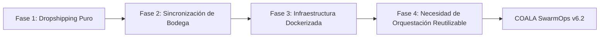
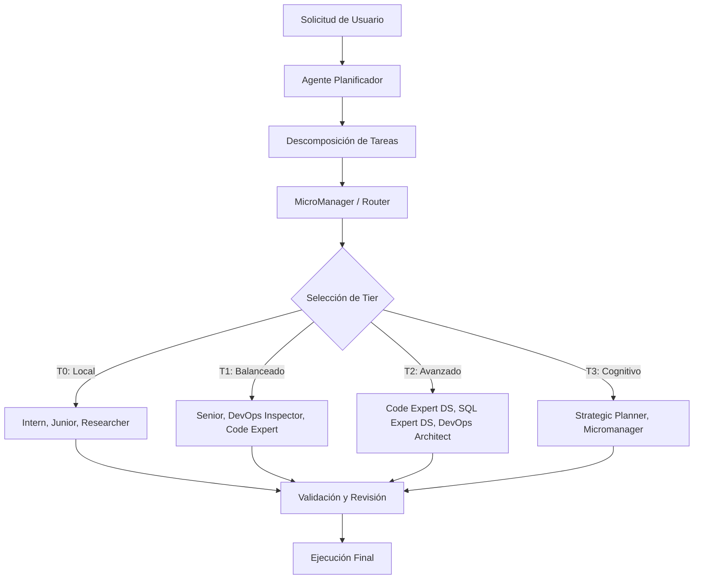
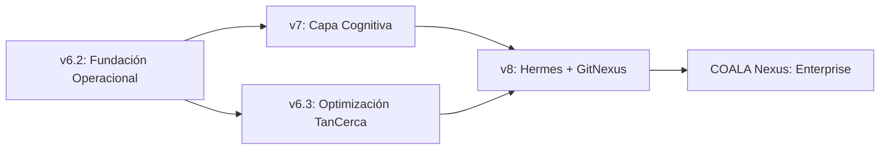

# COALA SwarmOps — Documento de Fundación

> **El Pacto v6.2: Por Qué Esta Versión Importa y Nunca Será Reescrita**

---

## 1. El Juramento de la Fundación

COALA SwarmOps v6.2 no es un prototipo. No es un experimento. Es la base operacional sobre la cual se construirá cada versión futura de este ecosistema.

**Este documento existe para proteger esa fundación.**

Garantiza que:
- La historia de cómo evolucionó esta plataforma nunca se pierda
- Las decisiones técnicas de v6.2 se preserven y entiendan
- Futuros contribuidores y agentes no reescriban accidentalmente lo que ya funciona
- La evolución de v6.2 → v7 → Hermes → GitNexus siga continuidad, no disrupción

> **Regla #0 de COALA SwarmOps:** v6.2 evoluciona, nunca se reescribe.

---

## 2. Historia de Origen: De la Necesidad Operacional

### 2.1 El Verdadero Comienzo

COALA SwarmOps no nació en un laboratorio de investigación ni como un experimento de IA.

Evolucionó orgánicamente desde el caos operacional de mantener sistemas del mundo real:

| Sistema | Qué Era | El Problema que Creó |
|---------|---------|----------------------|
| **TanCerca.cl** | Plataforma e-commerce dropshipping | Sincronización de inventario, orquestación Docker, coordinación multi-servicio |
| **img.bodegamk.cl** | Servicio Dockerizado de imágenes/infraestructura | Gestión de contenedores, pipelines de despliegue |
| **Entornos de automatización Windows** | Estaciones de trabajo Windows 10 empresariales | Sin herramientas IA nativas, problemas con WSL, fragmentación de Git Bash |
| **Flujos de trabajo DevOps multi-proyecto** | Repositorios y pipelines dispersos | Sin orquestación unificada, pasos manuales repetidos |

### 2.2 El Perfil del Creador

Cristian Tapia combinó:
- Experiencia en operaciones y comercio minorista
- Formación en análisis de sistemas
- Práctica en ingeniería DevOps
- Conocimiento en arquitectura cloud
- Habilidades en automatización de infraestructura

Este perfil híbrido creó una perspectiva única: **la orquestación de IA debe servir a las operaciones, no reemplazar el juicio humano.**

### 2.3 Evolución por Fases de TanCerca.cl



Cada fase aumentó la complejidad operacional hasta que la gestión manual se volvió insostenible. La necesidad de orquestación se hizo inevitable.

---

## 3. Qué Resolvió v6.2

### 3.1 Problemas Centrales Abordados

| Problema | Antes de v6.2 | Después de v6.2 |
|----------|---------------|-----------------|
| **Integración IA en Windows** | Sin CLI de IA nativo para Windows. Requería WSL o VMs Linux. | Soporte nativo Windows mediante port de mhito/ai. Compatible con Git Bash. |
| **Orquestación operacional** | Ejecución manual de tareas DevOps repetitivas. | Swarm multi-agente con distribución automatizada de tareas. |
| **Integración CLI de IA** | Sin interfaz unificada para modelos locales + cloud. | Comandos `ai` y `aic` integrados con Ollama, Groq, DeepSeek. |
| **Ejecución DevOps** | Scripts dispersos entre proyectos. | Flujos de trabajo de desarrollo dirigido por especificaciones. |
| **Coordinación multi-proyecto** | Cambio de contexto entre repositorios. | Contexto unificado de swarm y orquestación cross-proyecto. |
| **Control de costos** | Cada tarea enviada a modelos cloud caros. | Ejecución por niveles: modelos locales primero, escalar solo cuando se necesite. |

### 3.2 El Diferenciador Windows

La mayoría de plataformas de orquestación de IA asumen Linux/macOS. COALA SwarmOps v6.2 abordó específicamente entornos empresariales Windows:

**Logros técnicos:**
- Port de mhito/ai a Windows 10 nativo
- Capa de compatibilidad Git Bash
- Wrappers operacionales para ejecución nativa Windows
- Integración CI/CD mediante GitHub Actions
- Integración de modelos locales Ollama
- Soporte fallback cloud Groq
- Soporte de razonamiento DeepSeek

**Resultados operacionales:**
- **87/96 tests pasando** en Windows
- Ejecución funcional en entornos empresariales Windows
- Sin dependencia de WSL para flujos core
- Integración nativa de terminal

Esta es una ventaja competitiva genuina. Los entornos empresariales Windows representan un mercado masivo y poco atendido en orquestación de IA.

---

## 4. Snapshot Arquitectónico de v6.2

### 4.1 El Modelo de Swarm (18 Agentes, 4 Niveles/Tiers)



### 4.2 Definiciones de Tier

| Tier | Costo | Modelos | Caso de Uso |
|------|-------|---------|-------------|
| **T0** | $0 | Local: Qwen 3.5 9B, DeepSeek, Llama | Ejecución rápida, tareas simples, alto volumen |
| **T1** | ~$0.14 | Cloud: Gemini 2.5 Pro (free tier) | Razonamiento moderado, generación de código |
| **T2** | ~$0.44-$3.00 | Cloud: DeepSeek Pro, Kimi K2.6 | Razonamiento complejo, diseño de arquitectura |
| **T3** | ~$0.74-$3.49 | Cloud: Claude, GPT-class | Validación crítica, decisiones estratégicas |

### 4.3 Patrones Arquitectónicos Clave

**Patrón Circuit Breaker**
- Si T0 falla repetidamente en un tipo de tarea, el sistema aprende y escala automáticamente tareas similares futuras a T1
- Previene desperdiciar computación local en problemas que consistentemente necesitan más poder de razonamiento

**Aprendizaje por Error**
- Los errores se categorizan y almacenan en `docs/errors/`
- El swarm aprende de patrones de falla
- El playbook de auto-sanación aplica fixes conocidos automáticamente

**Escalación por 1 Fallo**
- Si T0 falla una vez, la tarea escala inmediatamente a T1
- Sin ciclos de reintento que desperdician tiempo y tokens
- El fallo rápido se prefiere al reintento lento

**Desarrollo Dirigido por Especificaciones (SDD)**
- Cada feature comienza con un documento de especificación
- SDD reduce alucinaciones al restringir el contexto
- El uso de tokens se optimiza mediante entrada estructurada

---

## 5. Ruta de Evolución: v6.2 y Más Allá

### 5.1 Versiones Históricas

| Versión | Período | Carácter | Estado |
|---------|---------|----------|--------|
| **v1-v5** | 2024-2025 | Flujos operacionales experimentales, orquestación manual, agentes fragmentados | Archivado |
| **v6.2** | 2025-2026 | **Swarm Operacional Estable** — flujos funcionales, Windows nativo, multi-agente, cost-aware | **Fundación Actual** |
| **v6.3** | 2026 | Optimización TanCerca — mejoras Medusa.js, arquitectura de storefront | Rama activa |
| **v7** | Planificado | Capa Cognitiva — routing semántico, memoria adaptativa, planificación avanzada | Roadmap |
| **v8** | Planificado | Hermes + GitNexus — inteligencia de repositorio, cognición de swarm | Roadmap |

### 5.2 El Mapa de Evolución



### 5.3 Qué Añade Cada Versión

**v6.2 → v7: El Salto Cognitivo**
- Routing semántico de tareas (entender qué necesita una tarea antes de asignar tier)
- Memoria adaptativa que comprime y prioriza contexto
- Agente Smart Router (T0.5) para clasificación automática de tier
- Cost Guardian para control de presupuesto por feature

**v7 → v8: Inteligencia de Repositorio**
- Capa cognitiva Hermes para planificación contextual
- GitNexus para inspección de repositorios y análisis de arquitectura
- Comprensión de código a nivel semántico
- Reviews de código asistidas por swarm

**v8 → COALA Nexus: Enterprise**
- Orquestación distribuida multi-nodo
- Observabilidad y monitoreo avanzados
- Sistemas de memoria enterprise
- Algoritmos de routing premium

---

## 6. Línea Base del Score Card Actual

Basado en la evaluación del SWARM v6.5 Score Card (78/100):

| Dimensión | Score | Estado |
|-----------|-------|--------|
| Arquitectura Híbrida T0-T3 | 12/15 | Base sólida, necesita auto-routing más inteligente |
| Manejo de Errores y Fallback | 11/15 | Circuit breaker implementado, necesita refinamiento de retry |
| Cobertura de Roles | 12/15 | 18 agentes definidos, falta agente de optimización de costos |
| Agnostic Intelligence CLI | 8/10 | Integrado, necesita verificación de auto-instalación |
| COALA + 4 Capas de Memoria | 9/10 | WM, EM, SM, PM implementadas |
| Gates y Validación | 8/10 | 5 gates + 8 validadores operacionales |
| Seguridad | 8/10 | Línea base OWASP + PCI-DSS |
| Escalabilidad de Costos | 6/10 | Mayor brecha — necesita alertas de presupuesto y downgrade |
| Contratos de Output | 4/5 | Cada agente genera output, necesita validación JSON Schema |
| TDD y Calidad | 4/5 | Red-green-refactor obligatorio, necesita mutation testing |

**Objetivo para v7.0: 100/100**

El camino a 100 requiere 12 mejoras estratégicas documentadas en el score card, con prioridades top:
1. Smart Router (clasificación automática de tier)
2. Cost Guardian (control de presupuesto)
3. Auto-Installer T0 (bootstrap para Windows)
4. Retry Policy Inteligente (reintentos context-aware)

---

## 7. De Experimento a Ecosistema

### 7.1 La Transición

COALA SwarmOps está transitando de:

```
Experimentación Operacional
        ↓
Desarrollo de Plataforma de Orquestación Open Source Estructurada
```

Esta transición requiere:
- **Terminología estable** — nomenclatura consistente en toda la documentación
- **Arquitectura documentada** — decisiones registradas y justificadas
- **Continuidad de versiones** — sin rewrites rompedores, solo evolución aditiva
- **Estructura modular** — cada componente puede evolucionar independientemente
- **Onboarding de contribuidores** — caminos claros para contribuidores externos
- **Disciplina de roadmap** — features priorizadas por valor operacional

### 7.2 Dirección de Estructura de Repositorio

```
COALA-SwarmOps/
│
├── docs/                    # Ecosistema de documentación
│   ├── foundation/          # Documentos de identidad core
│   ├── architecture/        # Arquitectura técnica
│   ├── strategy/            # Estrategia de negocio y crecimiento
│   ├── errors/              # Taxonomía de errores y playbooks
│   └── specs/               # Especificaciones de features
│
├── core/                    # Motor de orquestación COALA Core
├── agents/                  # Definiciones y configuraciones de agentes
├── hermes/                  # Capa cognitiva (planificado)
├── gitnexus/                # Inteligencia de repositorio (planificado)
├── providers/               # Integraciones de proveedores de IA
├── models/                  # Configuraciones de modelos y Modelfiles
├── examples/                # Ejemplos de flujos de trabajo y demos
├── scripts/                 # Scripts de instalación y utilidades
├── tests/                   # Suites de tests
├── ui/                      # Interfaz de usuario (futuro)
└── infrastructure/          # Docker, CI/CD, configs de despliegue
```

### 7.3 Legado que v6.2 Deja

Cada versión futura de COALA SwarmOps hereda de v6.2:

- **El sistema de tiers** — modelo de escalación T0-T3
- **El circuit breaker** — patrón de aprendizaje por error
- **El flujo de trabajo SDD** — desarrollo especificación-first
- **Soporte nativo Windows** — compatibilidad empresarial Windows
- **Conciencia de costos** — minimizar tokens, maximizar ejecución local
- **La estructura de swarm** — planificador → router → worker → validación

Estos no son detalles de implementación. Son ADN arquitectónico.

---

## 8. Reglas de Desarrollo Heredadas de v6.2

### 8.1 Qué Evitamos

| Anti-Patrón | Por Qué |
|-------------|---------|
| Reescrituras innecesarias | v6.2 funciona. Evoluciónalo, no lo reemplaces. |
| Sobre-ingeniería | Resuelve problemas operacionales reales, no teóricos. |
| Proliferación incontrolada de agentes | 18 agentes es suficiente. Añade solo con justificación. |
| Rediseño infinito de arquitectura | La arquitectura sirve al flujo de trabajo, no al revés. |
| Complejidad prematura de Kubernetes | Docker primero. Escala cuando la demanda operacional lo requiera. |
| Abstracción excesiva | El código debe ser legible por los humanos que lo mantienen. |
| Decisiones de IA hype-driven | Usamos IA que funciona, no IA que está de moda. |

### 8.2 Qué Priorizamos

| Prioridad | Principio |
|-----------|-----------|
| Estabilidad operacional | Si rompe operaciones, no se envía. |
| Flujos de trabajo demostrables | Cada feature debe ser demostrable end-to-end. |
| Arquitectura modular | Los componentes pueden reemplazarse sin reescribir el sistema. |
| Ejecución práctica | La teoría es bienvenida, pero la ejecución es obligatoria. |
| Claridad para contribuidores | La documentación debe ser entendible por nuevos contribuidores. |
| Calidad de documentación | Código no documentado es deuda técnica. |
| Eficiencia de costos | Cada token ahorrado es una ventaja competitiva. |
| Soporte de infraestructura real | Si no funciona en Windows y Linux, no cuenta. |

---

## 9. El Pacto de la Fundación

Este documento es un contrato entre el presente y el futuro de COALA SwarmOps.

**Nosotros, los mantenedores y contribuidores de COALA SwarmOps, nos comprometemos a:**

1. **Preservar la sabiduría operacional de v6.2** — Los patrones que hacen funcionar al swarm están documentados aquí y deben entenderse antes de modificarse.

2. **Evolucionar, nunca reescribir** — v6.2 es el tronco del árbol. Las nuevas versiones son ramas, no árboles nuevos.

3. **Honrar el origen operacional** — Cada feature debe justificarse con una necesidad operacional real, no un atractivo teórico.

4. **Proteger la conciencia de costos** — El sistema de tiers y el enfoque local-first son innegociables. Cloud es fallback, no fundación.

5. **Mantener la compatibilidad Windows** — El soporte empresarial Windows es un diferenciador core, no una ocurrencia tardía.

6. **Documentar antes de programar** — La filosofía SDD es parte de la fundación. Especificaciones primero, implementación segundo.

7. **Medir antes de reclamar** — El score 78/100 es nuestra línea base. Cada mejora debe ser mensurable.

---

> *"v6.2 no es nuestro pasado. Es nuestra fundación. Construye sobre ella, nunca debajo de ella."*
>
> *— Documento de Fundación COALA SwarmOps*

---

**Versión del Documento:** 1.0  
**Basado en:** COALA SwarmOps v6.2  
**Última Actualización:** 2026-05-26  
**Próxima Revisión:** hito v7.0