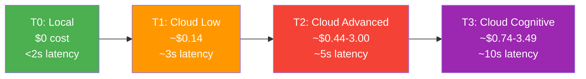
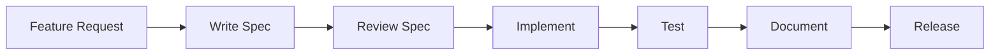
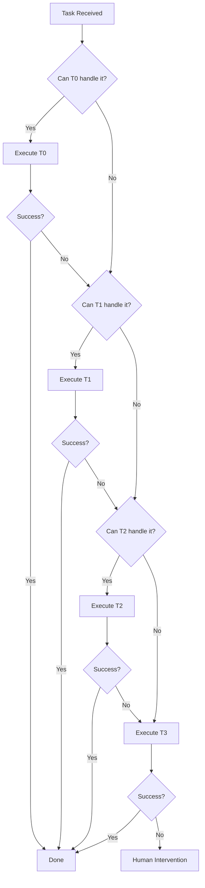
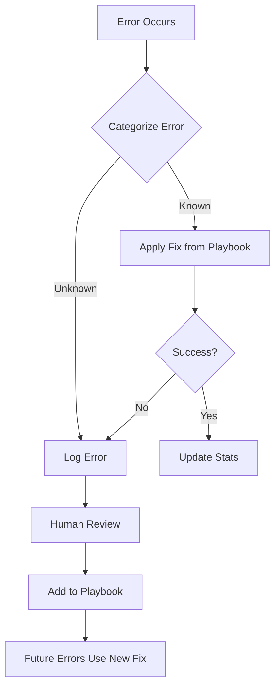

# COALA SwarmOps — Philosophy Document

> **How We Think: The Principles That Guide Every Technical Decision**

---

## 1. The Core Belief

COALA SwarmOps is built on a single conviction:

> **AI should serve operations, not consume them.**

Every agent, every tier, every routing decision exists to make engineering workflows cheaper, faster, and more reliable. Not to impress with technology. Not to chase AI hype. To solve real operational problems with controlled costs and measurable outcomes.

---

## 2. The Seven Principles

### 2.1 Self-Hosted First

**Statement:** The primary execution environment for COALA SwarmOps is local infrastructure. Cloud is a fallback layer, not a foundation.

**What this means:**
- Local models (Ollama, Qwen, DeepSeek) handle the majority of tasks
- Data does not leave the premises unless explicitly required
- Privacy is architectural, not an afterthought
- Infrastructure ownership is a feature, not a burden

**Why it matters:**
- **Cost:** Local execution is free. Cloud execution accumulates.
- **Privacy:** Sensitive code and infrastructure data stay local.
- **Control:** No vendor lock-in, no API deprecation surprises.
- **Latency:** Local models respond in milliseconds, not seconds.

**The tier system enforces this:**


**Exception handling:**
- If T0 fails, escalate to T1
- If T1 fails, escalate to T2
- T3 is reserved for tasks that genuinely require advanced reasoning
- The default is never cloud. The default is always local.

---

### 2.2 Cost-Aware AI

**Statement:** Every token consumed must be justified. Every routing decision considers cost. Waste is a bug.

**What this means:**
- Each task has an estimated cost before execution
- The swarm prefers the cheapest tier that can reliably complete the task
- Cost overruns trigger alerts and automatic downgrading suggestions
- Budgets are per-feature, not global

**Cost taxonomy:**

| Tier | Model | Cost per 1K tokens | Typical Task Cost |
|------|-------|-------------------|-------------------|
| T0 | Qwen 3.5 9B (local) | $0.00 | $0.00 |
| T1 | Gemini 2.5 Pro | ~$0.00 (free tier) | ~$0.00-0.14 |
| T2 | Kimi K2.6 / DeepSeek Pro | ~$0.44-1.50 | ~$0.50-3.00 |
| T3 | Claude / GPT-4 | ~$0.74-3.49 | ~$1.00-5.00 |

**Cost control mechanisms:**
- **Smart Router (v7.0):** Classifies tasks into tiers before execution
- **Cost Guardian:** Monitors accumulated cost per feature, alerts at 150%, blocks at 200%
- **Downgrade suggestions:** When T2 succeeds reliably on a task type, future similar tasks may be downgraded to T1
- **Error learning:** If T0 consistently fails on a pattern, the system learns to start at T1, avoiding wasted local compute

**The cost mindset:**
> "A task that costs $5 to complete is acceptable if it saves $50 of engineering time. A task that costs $5 to complete is unacceptable if a $0.14 alternative exists and would succeed."

---

### 2.3 Operational Before Hype

**Statement:** We solve operational problems with proven technology. We do not chase AI trends or implement features for their novelty.

**What this means:**
- Every feature must have a real operational use case
- Experimental AI models are evaluated before adoption
- The SDD workflow prevents speculative development
- "Cool" is not a justification. "Useful" is.

**The hype resistance checklist:**

Before adopting any new AI technology, the swarm must answer:

```
[ ] Does this solve a problem we currently have?
[ ] Is it better than our current solution, not just different?
[ ] Can we measure the improvement?
[ ] Does it work on Windows and Linux?
[ ] Can it run self-hosted?
[ ] Is the cost justified by the value?
[ ] Will it still be relevant in 12 months?
```

If any answer is "no" or "unclear," adoption is postponed.

**Historical examples of hype resistance:**
- No blockchain integration (no operational need)
- No NFT features (irrelevant to DevOps)
- No "autonomous agent" hype (controlled escalation is preferred)
- No premature Kubernetes adoption (Docker solves current needs)

---

### 2.4 Structured Execution

**Statement:** Chaotic prompting leads to chaotic results. Structured context leads to structured outcomes.

**What this means:**
- Every feature begins with a specification document
- Every agent has a defined role, input schema, and output contract
- Context is controlled and optimized, not maximized
- Workflows are deterministic where possible, probabilistic only where necessary

**Specification-Driven Development (SDD):**



**Why SDD reduces hallucinations:**
- Agents work within defined boundaries
- Context is pre-filtered to relevant information
- Output expectations are explicit
- Token usage is optimized by removing noise

**The structured context rules:**
1. **Relevance filter:** Only include files and information directly related to the task
2. **Length limits:** Compress files >200 lines before inclusion
3. **Schema enforcement:** Outputs must match expected formats
4. **Validation gate:** Every output is checked before acceptance

---

### 2.5 Swarm Specialization

**Statement:** Generalist agents are inefficient. Specialist agents collaborating through orchestration are powerful.

**What this means:**
- Each agent has one primary responsibility
- Agents do not overlap in function
- Collaboration is orchestrated, not emergent
- The MicroManager coordinates, agents execute

**The 18-agent structure:**

| Role | Tier | Specialty | When Used |
|------|------|-----------|-----------|
| **Intern** | T0 | Copy/paste, formatting, trivial tasks | 100% deterministic tasks |
| **Junior** | T0 | Simple bugs, 1-2 line fixes | Low complexity code changes |
| **Researcher** | T0 | Local documentation search | Information retrieval |
| **Designer** | T1 | CSS/Tailwind/UI changes | Visual modifications |
| **Senior** | T1 | Git commands, architecture | DevOps and structural tasks |
| **DevOps Inspector** | T1 | Docker, containers, infrastructure | Infrastructure inspection |
| **Code Expert** | T1 | General development | Standard code implementation |
| **Test Engineer** | T1 | Test writing and execution | TDD workflows |
| **SQL Expert** | T1 | Database queries | SQL tasks |
| **Strategic Planner** | T3 | Execution plans, architecture | Complex planning |
| **Micromanager** | T3 | Pipeline coordination | Feature orchestration |
| **Evidence Checker** | T1 | Technical verification | Pre-PR validation |
| **Context Guardian** | T0 | Context persistence | Session continuity |
| **Integration Tester** | T1 | E2E validation | Post-implementation testing |
| **Docs Writer** | T0 | Documentation | README, CHANGELOG updates |

**Why specialization matters:**
- **Efficiency:** The right model for the right task
- **Quality:** Experts outperform generalists on their domain
- **Cost:** T0 specialists are free for trivial tasks
- **Reliability:** Defined responsibilities prevent blame diffusion

---

### 2.6 Controlled Escalation

**Statement:** Escalation to higher tiers is a deliberate decision, not a default behavior.

**What this means:**
- Tasks start at the lowest viable tier
- Escalation requires justification
- Repeated escalations trigger pattern analysis
- Downgrading is as important as escalating

**The escalation decision tree:**



**Escalation rules:**
1. **1-fail rule:** If T0 fails once, escalate to T1 (no retry loops)
2. **Error classification:** OOM errors retry with reduced context; syntax errors escalate immediately
3. **Confidence threshold:** If Smart Router confidence < 0.8, escalate directly
4. **Budget check:** If feature cost > 150% estimate, require approval
5. **Pattern learning:** If a task type consistently escalates, start at higher tier

**Downgrade rules:**
1. If T2 succeeds on a task type 5+ times, attempt T1 next time
2. If T1 succeeds on a task type 10+ times, attempt T0 next time
3. Downgrade failures automatically re-escalate

---

### 2.7 Real Infrastructure Support

**Statement:** AI orchestration that doesn't work in real environments is theoretical. We support real infrastructure.

**What this means:**
- Windows 10 is a first-class platform, not an afterthought
- Git Bash compatibility is required, not optional
- Docker is the container standard, but no K8s requirement
- Enterprise constraints (proxies, firewalls, air-gapped networks) are considered

**The Windows commitment:**

| Capability | Status |
|-----------|--------|
| Native Windows 10 execution | ✅ |
| Git Bash compatibility | ✅ |
| No WSL dependency | ✅ |
| PowerShell script support | ✅ |
| CMD batch support | ✅ |
| CI/CD via GitHub Actions | ✅ |
| Ollama Windows integration | ✅ |

**The infrastructure reality checklist:**

```
[ ] Works without internet (local models)
[ ] Works behind corporate proxy
[ ] Works on Windows domain-joined machines
[ ] Works with standard Git installation
[ ] Works with Docker Desktop for Windows
[ ] Does not require admin privileges for basic operations
[ ] Handles paths with spaces correctly
[ ] Handles Windows vs Linux line endings
```

---

## 3. Error as Learning

### 3.1 The Error Philosophy

In COALA SwarmOps, errors are not failures. They are data.

**Principles:**
- Every error is categorized and stored
- Error patterns trigger automatic fixes
- The swarm learns from its own mistakes
- Humans review error trends, not individual errors

### 3.2 Error Taxonomy

| Error Type | Example | Handling |
|-----------|---------|----------|
| **OOM (Out of Memory)** | Context too large for T0 | Retry with reduced context (8K → 4K) |
| **Timeout** | Model took too long to respond | Retry once after 10 seconds |
| **Syntax** | Generated invalid code | No retry, escalate immediately |
| **Logic** | Code runs but produces wrong result | Log for pattern analysis, human review |
| **Permission** | Agent lacks access | Report to human, do not escalate |
| **Dependency** | Missing library or tool | Suggest installation, log for playbook |

### 3.3 The Self-Healing Playbook



**Example playbook entries:**

| Symptom | Cause | Fix | Applied By |
|---------|-------|-----|------------|
| ENOENT src/utils/helpers.ts | Missing file | Create stub file | Senior agent |
| Module not found: lodash | Missing dependency | Run `npm install` | DevOps Inspector |
| Docker daemon not running | Docker Desktop off | Alert user, suggest start | DevOps Inspector |
| Git push rejected | Non-fast-forward | Suggest `git pull` first | Senior agent |

---

## 4. The 78→100 Mindset

### 4.1 Measurement Over Opinion

COALA SwarmOps does not improve based on gut feeling. It improves based on metrics.

**Current baseline (v6.5): 78/100**

| Dimension | Score | Target | v7.0 Plan |
|-----------|-------|--------|-----------|
| Architecture | 12/15 | 15/15 | Smart Router |
| Error Handling | 11/15 | 15/15 | Retry Policy + Self-Healing |
| Role Coverage | 12/15 | 15/15 | Cost Guardian + Performance Monitor |
| AI CLI | 8/10 | 10/10 | Auto-Installer |
| Memory | 9/10 | 10/10 | Memory Compression |
| Gates | 8/10 | 10/10 | Cost Approval Gate |
| Security | 8/10 | 10/10 | SAST + Dependency Scanning |
| Cost Scaling | 6/10 | 10/10 | Budget Alerts + Downgrading |
| Output Contracts | 4/5 | 5/5 | JSON Schema Validation |
| TDD Quality | 4/5 | 5/5 | Mutation Testing |

### 4.2 Continuous Improvement Rules

1. **Score every release:** Each version must have a measurable score
2. **Track error rates:** Weekly review of docs/errors/tier0-*.md
3. **Monitor costs:** Per-feature cost reports are mandatory
4. **Measure latency:** Task completion time by tier
5. **Survey contributors:** Quarterly contributor experience review

### 4.3 The Honest Metric

> **"If we can't measure it, we don't claim it."**

- We claim 87/96 tests passing because we counted.
- We claim 40-60% cost reduction because we calculated it.
- We claim Windows support because we tested it.
- We do not claim features that are planned but not implemented.

---

## 5. Legal and Copyright Awareness

### 5.1 The Honesty Imperative

COALA SwarmOps is committed to honest, lawful operation:

- **Copyright compliance:** Generated code respects licenses of referenced projects
- **MIT foundation:** Core is open source, contributions are properly licensed
- **Attribution:** Third-party tools and inspirations are credited
- **No plagiarism:** Agent outputs are original or properly attributed
- **Regulatory awareness:** PCI-DSS baseline for payment-adjacent operations

### 5.2 Selling What We Know

> **"We monetize expertise, not deception."**

- Services are sold based on demonstrated capability
- Documentation is public and verifiable
- Limitations are disclosed upfront
- Pricing is transparent and justified

---

## 6. The Philosophy in Practice

### 6.1 Daily Decision Examples

| Scenario | Without Philosophy | With Philosophy |
|----------|-------------------|-----------------|
| New AI model released | Adopt immediately | Evaluate against checklist, test in isolation |
| Task fails on T0 | Retry 3 times | Escalate immediately, log error |
| Feature request arrives | Start coding | Write spec first, estimate cost |
| Windows test breaks | "Works on my machine" | Fix before merge, update CI |
| Cost overruns | Ignore until bill arrives | Alert at 150%, block at 200% |
| Documentation outdated | "Someone will fix it" | Update as part of every PR |

### 6.2 The Agent's Oath

Every agent in the COALA SwarmOps ecosystem operates under these principles:

1. **I will prefer local execution** when it can reliably complete the task
2. **I will justify every token** consumed in my execution
3. **I will solve operational problems**, not chase technological novelty
4. **I will work within specifications**, not invent requirements
5. **I will specialize in my domain**, not pretend to be generalist
6. **I will escalate with purpose**, not by default
7. **I will respect real infrastructure constraints**, including Windows
8. **I will learn from errors**, not ignore them
9. **I will measure my output**, not assume its quality
10. **I will act with honesty**, disclosing limitations and attributing sources

---

## 7. Conclusion

The philosophy of COALA SwarmOps is not abstract. It is operational.

Every principle exists to answer a real question:
- **Self-hosted first?** "How do we keep costs near zero?"
- **Cost-aware?** "How do we avoid token waste?"
- **Operational before hype?** "How do we avoid building useless features?"
- **Structured execution?** "How do we reduce hallucinations?"
- **Swarm specialization?** "How do we assign the right tool to the right task?"
- **Controlled escalation?** "How do we balance cost and quality?"
- **Real infrastructure?** "How do we work where engineers actually work?"

These principles are not suggestions. They are constraints that keep the project focused, honest, and useful.

> *"Philosophy is not what we say. It is what we do when no one is watching the code."*
>
> *— COALA SwarmOps Philosophy Document*

---

**Document Version:** 1.0  
**Based on:** COALA SwarmOps v6.2  
**Last Updated:** 2026-05-26  
**Next Review:** v7.0 milestone