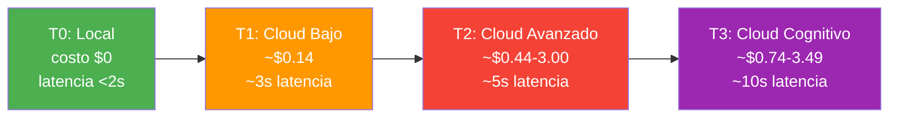
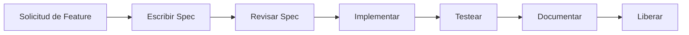
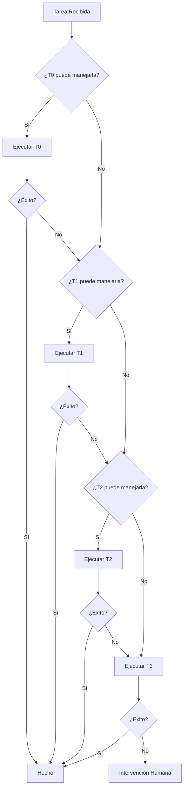
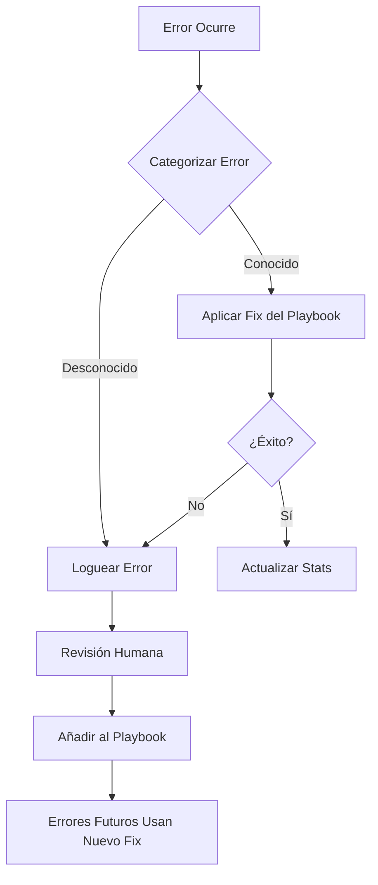

# COALA SwarmOps — Documento de Filosofía

> **Cómo Pensamos: Los Principios que Guían Cada Decisión Técnica**

---

## 1. La Creencia Central

COALA SwarmOps se construye sobre una sola convicción:

> **La IA debe servir a las operaciones, no consumirlas.**

Cada agente, cada tier, cada decisión de routing existe para hacer los flujos de trabajo de ingeniería más baratos, más rápidos y más confiables. No para impresionar con tecnología. No para perseguir el hype de IA. Para resolver problemas operacionales reales con costos controlados y resultados medibles.

---

## 2. Los Siete Principios

### 2.1 Self-Hosted First (Primero lo Autoalojado)

**Declaración:** El entorno de ejecución primario de COALA SwarmOps es infraestructura local. Cloud es una capa de fallback, no una fundación.

**Qué significa esto:**
- Los modelos locales (Ollama, Qwen, DeepSeek) manejan la mayoría de las tareas
- Los datos no salen de las instalaciones a menos que se requiera explícitamente
- La privacidad es arquitectónica, no una ocurrencia tardía
- La propiedad de infraestructura es una feature, no una carga

**Por qué importa:**
- **Costo:** La ejecución local es gratis. La ejecución cloud se acumula.
- **Privacidad:** Código sensible y datos de infraestructura permanecen locales.
- **Control:** Sin vendor lock-in, sin sorpresas de deprecación de APIs.
- **Latencia:** Los modelos locales responden en milisegundos, no segundos.

**El sistema de tiers refuerza esto:**


**Manejo de excepciones:**
- Si T0 falla, escalar a T1
- Si T1 falla, escalar a T2
- T3 está reservado para tareas que genuinamente requieren razonamiento avanzado
- El default nunca es cloud. El default siempre es local.

---

### 2.2 Cost-Aware AI (IA Consciente de Costos)

**Declaración:** Cada token consumido debe ser justificado. Cada decisión de routing considera el costo. El desperdicio es un bug.

**Qué significa esto:**
- Cada tarea tiene un costo estimado antes de la ejecución
- El swarm prefiere el tier más barato que pueda completar la tarea confiablemente
- Los sobrecostos disparan alertas y sugerencias automáticas de downgrade
- Los presupuestos son por-feature, no globales

**Taxonomía de costos:**

| Tier | Modelo | Costo por 1K tokens | Costo Típico de Tarea |
|------|--------|---------------------|-----------------------|
| T0 | Qwen 3.5 9B (local) | $0.00 | $0.00 |
| T1 | Gemini 2.5 Pro | ~$0.00 (free tier) | ~$0.00-0.14 |
| T2 | Kimi K2.6 / DeepSeek Pro | ~$0.44-1.50 | ~$0.50-3.00 |
| T3 | Claude / GPT-4 | ~$0.74-3.49 | ~$1.00-5.00 |

**Mecanismos de control de costos:**
- **Smart Router (v7.0):** Clasifica tareas en tiers antes de ejecución
- **Cost Guardian:** Monitorea costo acumulado por feature, alerta al 150%, bloquea al 200%
- **Sugerencias de downgrade:** Cuando T2 tiene éxito confiable en un tipo de tarea, futuras tareas similares pueden bajar a T1
- **Aprendizaje por error:** Si T0 falla consistentemente en un patrón, el sistema aprende a empezar en T1, evitando computación local desperdiciada

**La mentalidad de costos:**
> "Una tarea que cuesta $5 completarse es aceptable si ahorra $50 de tiempo de ingeniería. Una tarea que cuesta $5 completarse es inaceptable si existe una alternativa de $0.14 que tendría éxito."

---

### 2.3 Operational Before Hype (Operacional Antes que Hype)

**Declaración:** Resolvemos problemas operacionales con tecnología probada. No perseguimos tendencias de IA ni implementamos features por su novedad.

**Qué significa esto:**
- Cada feature debe tener un caso de uso operacional real
- Los modelos de IA experimentales se evalúan antes de adopción
- El flujo de trabajo SDD previene desarrollo especulativo
- "Cool" no es una justificación. "Útil" sí lo es.

**El checklist de resistencia al hype:**

Antes de adoptar cualquier nueva tecnología de IA, el swarm debe responder:

```
[ ] ¿Esto resuelve un problema que actualmente tenemos?
[ ] ¿Es mejor que nuestra solución actual, no solo diferente?
[ ] ¿Podemos medir la mejora?
[ ] ¿Funciona en Windows y Linux?
[ ] ¿Puede ejecutarse self-hosted?
[ ] ¿El costo está justificado por el valor?
[ ] ¿Seguirá siendo relevante en 12 meses?
```

Si alguna respuesta es "no" o "no está claro", la adopción se pospone.

**Ejemplos históricos de resistencia al hype:**
- Sin integración blockchain (sin necesidad operacional)
- Sin features NFT (irrelevante para DevOps)
- Sin hype de "agente autónomo" (la escalación controlada se prefiere)
- Sin adopción prematura de Kubernetes (Docker resuelve necesidades actuales)

---

### 2.4 Structured Execution (Ejecución Estructurada)

**Declaración:** El prompting caótico lleva a resultados caóticos. El contexto estructurado lleva a resultados estructurados.

**Qué significa esto:**
- Cada feature comienza con un documento de especificación
- Cada agente tiene un rol definido, esquema de entrada y contrato de salida
- El contexto se controla y optimiza, no se maximiza
- Los flujos de trabajo son deterministas donde sea posible, probabilísticos solo donde sea necesario

**Desarrollo Dirigido por Especificaciones (SDD):**



**Por qué SDD reduce alucinaciones:**
- Los agentes trabajan dentro de límites definidos
- El contexto se pre-filtra a información relevante
- Las expectativas de output son explícitas
- El uso de tokens se optimiza eliminando ruido

**Las reglas de contexto estructurado:**
1. **Filtro de relevancia:** Solo incluir archivos e información directamente relacionada con la tarea
2. **Límites de longitud:** Comprimir archivos >200 líneas antes de inclusión
3. **Enforcement de esquema:** Los outputs deben coincidir con formatos esperados
4. **Gate de validación:** Cada output se verifica antes de aceptación

---

### 2.5 Swarm Specialization (Especialización del Swarm)

**Declaración:** Los agentes generalistas son ineficientes. Los agentes especialistas colaborando mediante orquestación son poderosos.

**Qué significa esto:**
- Cada agente tiene una responsabilidad primaria
- Los agentes no se solapan en función
- La colaboración es orquestada, no emergente
- El MicroManager coordina, los agentes ejecutan

**La estructura de 18 agentes:**

| Rol | Tier | Especialidad | Cuándo se Usa |
|-----|------|--------------|---------------|
| **Intern** | T0 | Copy/paste, formateo, tareas triviales | Tareas 100% determinísticas |
| **Junior** | T0 | Bugs simples, fixes de 1-2 líneas | Cambios de código de baja complejidad |
| **Researcher** | T0 | Búsqueda local de documentación | Recuperación de información |
| **Designer** | T1 | CSS/Tailwind/UI | Modificaciones visuales |
| **Senior** | T1 | Comandos git, arquitectura | Tareas DevOps y estructurales |
| **DevOps Inspector** | T1 | Docker, contenedores, infraestructura | Inspección de infraestructura |
| **Code Expert** | T1 | Desarrollo general | Implementación de código estándar |
| **Test Engineer** | T1 | Escritura y ejecución de tests | Flujos de trabajo TDD |
| **SQL Expert** | T1 | Queries de base de datos | Tareas SQL |
| **Strategic Planner** | T3 | Planes de ejecución, arquitectura | Planificación compleja |
| **Micromanager** | T3 | Coordinación de pipeline | Orquestación de features |
| **Evidence Checker** | T1 | Verificación técnica | Validación pre-PR |
| **Context Guardian** | T0 | Persistencia de contexto | Continuidad de sesión |
| **Integration Tester** | T1 | Validación E2E | Testing post-implementación |
| **Docs Writer** | T0 | Documentación | Actualizaciones de README, CHANGELOG |

**Por qué importa la especialización:**
- **Eficiencia:** El modelo correcto para la tarea correcta
- **Calidad:** Los especialistas superan a los generalistas en su dominio
- **Costo:** Especialistas T0 son gratis para tareas triviales
- **Confiabilidad:** Responsabilidades definidas previenen difusión de culpa

---

### 2.6 Controlled Escalation (Escalación Controlada)

**Declaración:** La escalación a tiers superiores es una decisión deliberada, no un comportamiento por defecto.

**Qué significa esto:**
- Las tareas comienzan en el tier más bajo viable
- La escalación requiere justificación
- Las escalaciones repetidas disparan análisis de patrones
- El downgrade es tan importante como el escalamiento

**El árbol de decisión de escalación:**



**Reglas de escalación:**
1. **Regla de 1 fallo:** Si T0 falla una vez, escalar a T1 (sin ciclos de reintento)
2. **Clasificación de errores:** Errores OOM reintentan con contexto reducido; errores de sintaxis escalan inmediatamente
3. **Umbral de confianza:** Si Smart Router confianza < 0.8, escalar directamente
4. **Chequeo de presupuesto:** Si costo de feature > 150% estimado, requerir aprobación
5. **Aprendizaje de patrones:** Si un tipo de tarea escala consistentemente, empezar en tier superior

**Reglas de downgrade:**
1. Si T2 tiene éxito en un tipo de tarea 5+ veces, intentar T1 la próxima vez
2. Si T1 tiene éxito en un tipo de tarea 10+ veces, intentar T0 la próxima vez
3. Los fallos de downgrade escalan automáticamente de vuelta

---

### 2.7 Real Infrastructure Support (Soporte de Infraestructura Real)

**Declaración:** La orquestación de IA que no funciona en entornos reales es teórica. Soportamos infraestructura real.

**Qué significa esto:**
- Windows 10 es una plataforma de primera clase, no una ocurrencia tardía
- La compatibilidad con Git Bash es requerida, no opcional
- Docker es el estándar de contenedores, pero sin requerimiento de K8s
- Las restricciones empresariales (proxies, firewalls, redes air-gapped) se consideran

**El compromiso Windows:**

| Capacidad | Estado |
|-----------|--------|
| Ejecución nativa Windows 10 | ✅ |
| Compatibilidad Git Bash | ✅ |
| Sin dependencia WSL | ✅ |
| Soporte scripts PowerShell | ✅ |
| Soporte batch CMD | ✅ |
| CI/CD vía GitHub Actions | ✅ |
| Integración Ollama Windows | ✅ |

**El checklist de realidad de infraestructura:**

```
[ ] Funciona sin internet (modelos locales)
[ ] Funciona detrás de proxy corporativo
[ ] Funciona en máquinas Windows unidas a dominio
[ ] Funciona con instalación estándar de Git
[ ] Funciona con Docker Desktop para Windows
[ ] No requiere privilegios de admin para operaciones básicas
[ ] Maneja paths con espacios correctamente
[ ] Maneja finales de línea Windows vs Linux
```

---

## 3. Error como Aprendizaje

### 3.1 La Filosofía del Error

En COALA SwarmOps, los errores no son fallas. Son datos.

**Principios:**
- Cada error se categoriza y almacena
- Los patrones de error disparan fixes automáticos
- El swarm aprende de sus propios errores
- Los humanos revisan tendencias de error, no errores individuales

### 3.2 Taxonomía de Errores

| Tipo de Error | Ejemplo | Manejo |
|--------------|---------|--------|
| **OOM (Out of Memory)** | Contexto demasiado grande para T0 | Reintentar con contexto reducido (8K → 4K) |
| **Timeout** | Modelo tardó demasiado en responder | Reintentar una vez tras 10 segundos |
| **Sintaxis** | Código generado inválido | Sin reintento, escalar inmediatamente |
| **Lógica** | Código corre pero produce resultado incorrecto | Log para análisis de patrones, revisión humana |
| **Permiso** | Agente carece de acceso | Reportar a humano, no escalar |
| **Dependencia** | Librería o herramienta faltante | Sugerir instalación, log para playbook |

### 3.3 El Playbook de Auto-Sanación



**Ejemplos de entradas del playbook:**

| Síntoma | Causa | Fix | Aplicado Por |
|---------|-------|-----|--------------|
| ENOENT src/utils/helpers.ts | Archivo faltante | Crear archivo stub | Agente Senior |
| Module not found: lodash | Dependencia faltante | Ejecutar `npm install` | DevOps Inspector |
| Docker daemon not running | Docker Desktop apagado | Alertar usuario, sugerir iniciar | DevOps Inspector |
| Git push rejected | Non-fast-forward | Sugerir `git pull` primero | Agente Senior |

---

## 4. La Mentalidad 78→100

### 4.1 Medición Sobre Opinión

COALA SwarmOps no mejora basado en corazonadas. Mejora basado en métricas.

**Línea base actual (v6.5): 78/100**

| Dimensión | Score | Target | Plan v7.0 |
|-----------|-------|--------|-----------|
| Arquitectura | 12/15 | 15/15 | Smart Router |
| Manejo de Errores | 11/15 | 15/15 | Retry Policy + Self-Healing |
| Cobertura de Roles | 12/15 | 15/15 | Cost Guardian + Performance Monitor |
| AI CLI | 8/10 | 10/10 | Auto-Installer |
| Memoria | 9/10 | 10/10 | Compresión de Memoria |
| Gates | 8/10 | 10/10 | Gate de Aprobación de Costo |
| Seguridad | 8/10 | 10/10 | SAST + Dependency Scanning |
| Escalabilidad de Costos | 6/10 | 10/10 | Alertas de Presupuesto + Downgrade |
| Contratos de Output | 4/5 | 5/5 | Validación JSON Schema |
| Calidad TDD | 4/5 | 5/5 | Mutation Testing |

### 4.2 Reglas de Mejora Continua

1. **Scorear cada release:** Cada versión debe tener un score mensurable
2. **Trackear tasas de error:** Revisión semanal de docs/errors/tier0-*.md
3. **Monitorear costos:** Reportes de costo por feature son obligatorios
4. **Medir latencia:** Tiempo de completitud de tarea por tier
5. **Encuestar contribuidores:** Revisión trimestral de experiencia de contribuidores

### 4.3 La Métrica Honesta

> **"Si no podemos medirlo, no lo reclamamos."**

- Reclamamos 87/96 tests pasando porque los contamos.
- Reclamamos reducción de costos 40-60% porque lo calculamos.
- Reclamamos soporte Windows porque lo testeamos.
- No reclamamos features que están planificados pero no implementados.

---

## 5. Conciencia Legal y de Copyright

### 5.1 El Imperativo de Honestidad

COALA SwarmOps se compromete con operación honesta y lícita:

- **Cumplimiento de copyright:** Código generado respeta licencias de proyectos referenciados
- **Fundación MIT:** El core es open source, las contribuciones tienen licencia apropiada
- **Atribución:** Herramientas de terceros e inspiraciones son acreditadas
- **Sin plagio:** Los outputs de agentes son originales o apropiadamente atribuidos
- **Conciencia regulatoria:** Línea base PCI-DSS para operaciones adyacentes a pagos

### 5.2 Vendiendo Lo Que Sabemos

> **"Monetizamos expertise, no engaño."**

- Los servicios se venden basados en capacidad demostrada
- La documentación es pública y verificable
- Las limitaciones se divulgan upfront
- El pricing es transparente y justificado

---

## 6. La Filosofía en la Práctica

### 6.1 Ejemplos de Decisiones Diarias

| Escenario | Sin Filosofía | Con Filosofía |
|-----------|---------------|---------------|
| Nuevo modelo de IA liberado | Adoptar inmediatamente | Evaluar contra checklist, testear en aislamiento |
| Tarea falla en T0 | Reintentar 3 veces | Escalar inmediatamente, loguear error |
| Solicitud de feature llega | Empezar a programar | Escribir spec primero, estimar costo |
| Test de Windows se rompe | "Funciona en mi máquina" | Fix antes del merge, actualizar CI |
| Sobrecostos | Ignorar hasta que llega la factura | Alertar al 150%, bloquear al 200% |
| Documentación desactualizada | "Alguien lo arreglará" | Actualizar como parte de cada PR |

### 6.2 El Juramento del Agente

Cada agente en el ecosistema COALA SwarmOps opera bajo estos principios:

1. **Preferiré ejecución local** cuando pueda completar la tarea confiablemente
2. **Justificaré cada token** consumido en mi ejecución
3. **Resolveré problemas operacionales**, no perseguiré novedad tecnológica
4. **Trabajaré dentro de especificaciones**, no inventaré requerimientos
5. **Me especializaré en mi dominio**, no pretenderé ser generalista
6. **Escalaré con propósito**, no por defecto
7. **Respetaré restricciones de infraestructura real**, incluyendo Windows
8. **Aprenderé de errores**, no los ignoraré
9. **Mediré mi output**, no asumiré su calidad
10. **Actuaré con honestidad**, divulgando limitaciones y atribuyendo fuentes

---

## 7. Conclusión

La filosofía de COALA SwarmOps no es abstracta. Es operacional.

Cada principio existe para responder una pregunta real:
- **¿Self-hosted first?** "¿Cómo mantenemos costos cerca de cero?"
- **¿Cost-aware?** "¿Cómo evitamos desperdicio de tokens?"
- **¿Operational before hype?** "¿Cómo evitamos construir features inútiles?"
- **¿Structured execution?** "¿Cómo reducimos alucinaciones?"
- **¿Swarm specialization?** "¿Cómo asignamos la herramienta correcta a la tarea correcta?"
- **¿Controlled escalation?** "¿Cómo balanceamos costo y calidad?"
- **¿Real infrastructure?** "¿Cómo trabajamos donde los ingenieros realmente trabajan?"

Estos principios no son sugerencias. Son restricciones que mantienen el proyecto enfocado, honesto y útil.

> *"La filosofía no es lo que decimos. Es lo que hacemos cuando nadie está mirando el código."*
>
> *— Documento de Filosofía COALA SwarmOps*

---

**Versión del Documento:** 1.0  
**Basado en:** COALA SwarmOps v6.2  
**Última Actualización:** 2026-05-26  
**Próxima Revisión:** hito v7.0