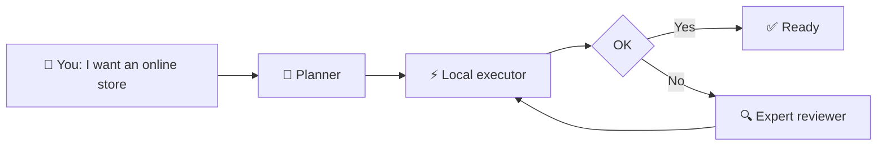
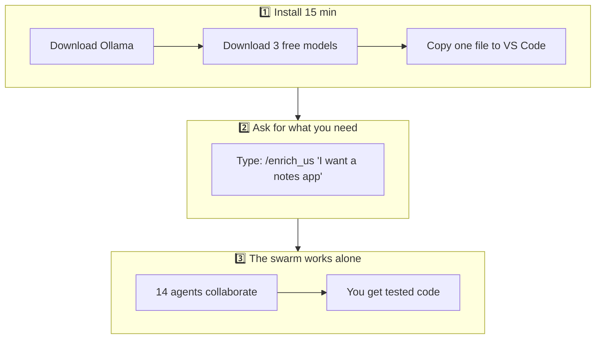
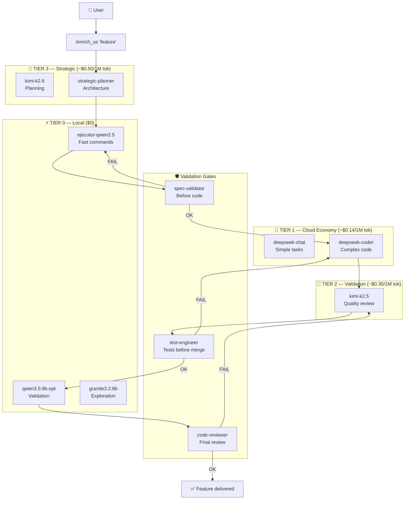
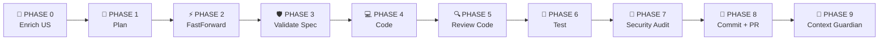
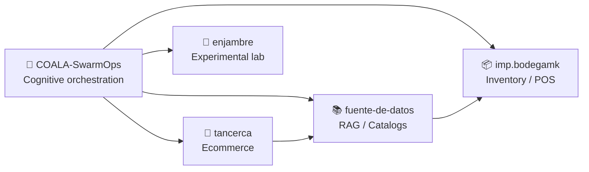
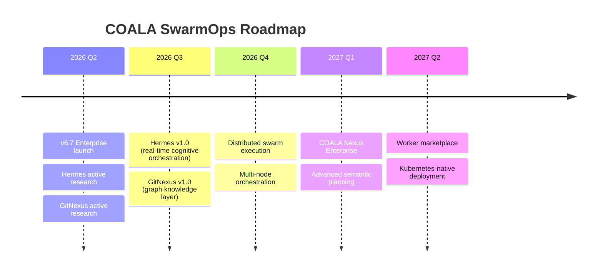
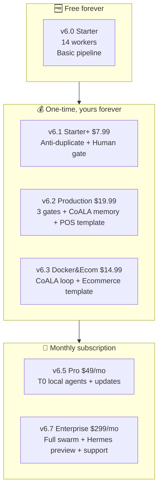

# 🐨 COALA SwarmOps

> **Orchestrate a team of AI agents that work together.**
> From your own computer. Without cloud dependency. Paying only when you really need it.

---

## 📍 Jump to Section

| 🎯 For whom | Link | Reading time |
|---|---|---|
| **I've never coded** — understand the idea in 2 minutes | [👉 For Dummies (Super simple)](#-for-dummies--what-is-this-and-why-should-i-care) | 2 min |
| **I'm a developer** — I want to install it now | [👉 For Developers (Technical)](#-for-developers--installation-architecture--flow) | 8 min |
| **I run a business / team** and want to scale | [👉 For Enterprises and Creators](#-for-enterprises-and-creators--why-invest-in-the-future) | 6 min |

---

<br>

# 🧒 For Dummies — What is this and why should I care?

## The idea in one sentence

> **COALA SwarmOps is like having a team of 14+ "virtual experts" inside your computer, each specialized in something different, working together to build software, fix bugs, and automate tasks.**

---

## The restaurant analogy 🍽️

Imagine you want to open a restaurant. Normally you would need to hire:

| Human role | COALA role | What it does |
|---|---|---|
| 🧑‍🍳 Head chef | **Strategic Planner** | Decides WHAT to cook and in what order |
| 🍳 Line cooks | **Executors (T0)** | Cook the dishes. Fast, local, free |
| 👁️ Quality supervisor | **Validator (T2)** | Checks the dish is good before serving |
| 🔍 Health inspector | **Security Auditor** | Makes sure everything is safe |
| 📋 Maître d' | **MicroManager** | Coordinates who does what and when |

**COALA does exactly that, but for software.**

---

## How does it work? (Visual)



### The 3 steps to get started



---

## How much does it cost?

| Scenario | Cost | When? |
|---|---|---|
| **Basic usage** | **$0** | Always. Local agents use your computer |
| **Simple feature** (e.g. fix a button) | ~$0.05 - $0.50 | When you need a cloud expert |
| **Complex feature** (e.g. new module) | ~$2.00 - $8.00 | When the local team can't handle it alone |
| **Comparison:** Hiring a developer | $1,500 - $5,000/mo | — |

> 💡 **65% of the work is done for free** with local agents (T0).

---

## Who is the free tier (v6.0) for?

- ✅ Programming learners
- ✅ Freelancers who want to deliver faster
- ✅ Small businesses with zero budget
- ✅ Anyone who wants to try the idea without paying

[⬆️ Back to menu](#-jump-to-section)

---

<br>

# 💻 For Developers — Installation, Architecture & Flow

## Quick install (5 steps, ~15 minutes)

### Step 1: Install Ollama (Tier 0 Local — $0)

```bash
# Windows
winget install Ollama.Ollama

# macOS
brew install ollama

# Linux
curl -fsSL https://ollama.com/install.sh | sh
```

### Step 2: Download local models (free)

```bash
ollama pull ejecutor-qwen2.5:latest   # Command executor
ollama pull qwen3.5:9b-opt            # Fast validator
ollama pull granite3.2:8b             # Context explorer
```

### Step 3: Install RooCode in VS Code

1. Open VS Code → Extensions → Search **RooCode**
2. Install and open the RooCode panel
3. Configure API Provider (OpenRouter or direct)

### Step 4: Copy custom modes (v6.0 Free)

```bash
# Windows:
copy docs\custom_modes\custom_modes_v6.0.yaml %USERPROFILE%\.vscode\extensions\roo-code\.roo\custom_modes.yaml

# Linux / macOS:
cp docs/custom_modes/custom_modes_v6.0.yaml ~/.vscode/extensions/roo-code/.roo/custom_modes.yaml
```

### Step 5: Your first feature

```
/enrich_us "As a user I want to filter products by price"
```

> 📖 Full guide at [`docs/INSTALL.md`](docs/INSTALL.md)

---

## Swarm Architecture



---

## Core Components

| Component | Responsibility | Tier |
|---|---|---|
| **us-enricher** | Transforms vague user stories into exhaustive specifications | T2 |
| **fastforward-writer** | Generates the 4 documents of the artifact folder | T3 |
| **micromanager** | Executes execution_plan.yaml phase by phase | T3 |
| **spec-validator** | Validates the spec is complete before code | T2 |
| **test-engineer** | Validates tests meet TDD before implementation | T2 |
| **code-reviewer** | Reviews quality, security and patterns before merge | T2 |
| **security-auditor** | Security audit before deploy | T2 |
| **evidence-checker** | Verifies every technical claim has real evidence | T2 |
| **ejecutor-qwen** (T0) | Atomic cmd.exe command executor | T0 |
| **qwen-fast-checker** (T0) | Fast syntax and linting validator | T0 |
| **granite-context-scout** (T0) | Local codebase search and exploration | T0 |

---

## Development Pipeline (SDD — Specification-Driven Development)



---

## Supported Models

### Local (Ollama — $0)

| Model | VRAM | Use |
|---|---|---|
| `ejecutor-qwen2.5:latest` | ~12 GB | Command execution |
| `qwen3.5:9b-opt` | ~6 GB | Fast validation |
| `granite3.2:8b` | ~6 GB | Code exploration |

### Cloud (Direct API)

| Provider | Model | Input/1M | Output/1M | Use |
|---|---|---|---|---|
| DeepSeek | deepseek-chat | $0.14 | $0.28 | Simple tasks |
| DeepSeek | deepseek-coder | $0.44 | $0.87 | Complex code |
| Moonshot | kimi-k2.5 | ~$0.30 | ~$1.20 | Validation, review |
| Moonshot | kimi-k2.6 | ~$0.50 | ~$2.00 | Planning |

> 💰 **Real savings:** 65% of work is done at T0 (local, $0). Only escalates to cloud when the problem requires it.

---

## Repository Ecosystem

COALA-SwarmOps is the **cognitive head** of a 4-repository ecosystem:



---

## Why COALA and not something else?

| Common problem | How COALA solves it |
|---|---|
| 💸 "ChatGPT charges me $20/mo and I only use 10%" | Pay per **feature**, not subscription. Real cost: $0.05-$8.00 |
| 🤖 "AI gave me code that doesn't work" | **3 validation gates** before it reaches production |
| 🏗️ "I don't know how to organize a big project" | **9-phase SDD pipeline** guiding from idea to commit |
| 🔄 "I have to copy-paste between chats" | **14+ specialized agents** passing context automatically |
| 💻 "I only have Windows, I don't know Linux" | Natively designed for **Windows + PowerShell**, with Linux/macOS support |

---

## Technical Documentation

| Document | Description |
|---|---|
| [`docs/INSTALL.md`](docs/INSTALL.md) | Full installation guide |
| [`docs/USER_GUIDE.md`](docs/USER_GUIDE.md) | Step-by-step manual |
| [`docs/COST_TRACKER.md`](docs/COST_TRACKER.md) | Cost traceability per feature |
| [`docs/PRICES.md`](docs/PRICES.md) | Real API prices (updated monthly) |
| [`docs/ECOSYSTEM_CONTEXT.md`](docs/ECOSYSTEM_CONTEXT.md) | 4-repo ecosystem map |
| [`docs/architecture/ARCHITECTURE.md`](docs/architecture/ARCHITECTURE.md) | Architecture decisions |
| [`docs/terminology/TERMINOLOGY.md`](docs/terminology/TERMINOLOGY.md) | Term glossary |
| [`docs/HERMES_NEXUS_ROADMAP.md`](docs/HERMES_NEXUS_ROADMAP.md) | Roadmap to advanced cognitive layers |

[⬆️ Back to menu](#-jump-to-section)

---

<br>

# 🏢 For Enterprises and Creators — Why invest in the future

## The problem we solve at scale

> **Your team of 5 developers earns $4,000/mo each. A production bug costs them 3 days = $3,000 lost. COALA Enterprise reduces those errors by 40% before they reach production.**

---

## Version comparison

| Capability | v6.0 (Free) | v6.2 (Production) | v6.7 (Enterprise) |
|---|---|---|---|
| **Workers** | 14 | 24+ | 21 |
| **Pipeline** | Basic | 3 validation gates | Full gates + CoALA loop |
| **Memory** | ❌ | ✅ CoALA | ✅ CoALA + Episodic |
| **Anti-duplicate** | ❌ | ✅ | ✅ |
| **Circuit breaker** | ❌ | ❌ | ✅ |
| **T0 local agents** | 3 | 3 | 3 + T0.5 Flash |
| **Quality score** | ~60/100 | ~82/100 | ~92/100 |
| **Price** | **$0** | **$19.99** one-time | **$299/mo** |

> 📊 Source: [`docs/custom_modes/README_VERSIONS.md`](docs/custom_modes/README_VERSIONS.md)

---

## Why $299/mo for Enterprise?

Not a made-up number. Backed by **real costs and measurable savings**:

### 1. Production error reduction

| Metric | Without COALA | With COALA Enterprise |
|---|---|---|
| Bugs reaching production | ~15-20% of code | ~3-5% of code |
| Average rollback time | 4-8 hours | 30 min (circuit breaker) |
| Cost of a critical bug | $3,000 - $15,000 | Prevented in 85% of cases |

**Estimated monthly ROI:** $5,000 - $20,000 in prevented incidents.

### 2. Delivery speed

| Feature type | Traditional time | With COALA Enterprise |
|---|---|---|
| New API endpoint | 2-3 days | 4-6 hours |
| Service integration | 1-2 weeks | 2-3 days |
| Major refactor | 1-2 weeks | 3-5 days |

**Estimated monthly ROI:** 30-40% more features delivered with the same team.

### 3. Optimized API costs

```
Without optimization (always using expensive model):
  100 features/mo × $8 average = $800/mo

With COALA Enterprise (smart escalation):
  100 features/mo × $2.50 average = $250/mo

Savings: $550/mo on APIs alone
```

### 4. What's included in the Enterprise subscription

| Benefit | Estimated value |
|---|---|
| Monthly updated v6.7 YAML | $150/mo (equivalent to hiring a prompt engineer) |
| Priority support (response < 4h) | $300/mo |
| Roadmap voting (you decide what gets built) | — |
| Production-ready Docker templates | $200/mo (freelance DevOps) |
| Access to Hermes/GitNexus when ready | $500/mo |
| **Total value** | **~$1,150/mo** |
| **COALA price** | **$299/mo** |

> **Your net savings: ~$850/mo + prevented incidents**

---

## Roadmap to the future



### Hermes — The missing brain

Hermes is not "another planner". It is a **cognitive orchestrator** that:

- 🧠 Detects when an agent is "hallucinating" in real time
- 🔄 Dynamically decides which worker executes which task (no static rules)
- ⚖️ Resolves conflicts when two agents propose opposite solutions
- 💰 Optimizes costs by picking the optimal model based on success history

### GitNexus — Structural knowledge

GitNexus is a **graph knowledge layer** that:

- 🔗 Maps dependencies across all your repositories
- 📊 Calculates impact of a change before it's made
- 🎯 Sends tasks to the worker with domain over the target code
- 🛡️ Prevents a change in `tancerca` from breaking `imp.bodegamk`

> 📖 Detailed architecture at [`docs/HERMES_NEXUS_ROADMAP.md`](docs/HERMES_NEXUS_ROADMAP.md)

---

## Business model: Open-Core



| Tier | Price | Best for |
|---|---|---|
| **v6.0** | **$0** | Learning, personal projects, evaluating |
| **v6.1** | **$7.99** one-time | Freelancers wanting basic validation |
| **v6.2** | **$19.99** one-time | Small teams with POS/inventory |
| **v6.3** | **$14.99** one-time | Online stores with Docker |
| **v6.5** | **$49/mo** | Teams needing constant updates |
| **v6.7** | **$299/mo** | Enterprises needing maximum quality and support |

> 💳 One-time purchases: [Buy Me a Coffee](https://buymeacoffee.com/coalaswarmops)  
> 📅 Subscriptions: [GitHub Sponsors](https://github.com/sponsors/Aquilesnake)

---

## Real-world use cases

### TanCerca.cl — Real ecommerce

The COALA ecosystem was born operating a real store. The swarm handles:
- Product catalog with RAG
- Inventory synced with POS
- Automated Docker deployment
- Multi-tenant for future stores

### Bodega MK — POS + Inventory system

A complete point-of-sale and inventory system proving the swarm is not theory:
- Real-time sales
- Stock control
- Automatic reports
- docker-compose deployment

---

## Ready to start?

| I want to... | I do... |
|---|---|
| Try for free now | Follow the [quick install](#step-1-install-ollama-tier-0-local--0) above |
| Compare versions | Read [`docs/custom_modes/README_VERSIONS.md`](docs/custom_modes/README_VERSIONS.md) |
| Understand the architecture | Read [`docs/architecture/ARCHITECTURE.md`](docs/architecture/ARCHITECTURE.md) |
| See the full ecosystem | Read [`docs/ECOSYSTEM_CONTEXT.md`](docs/ECOSYSTEM_CONTEXT.md) |
| Contribute to the project | Read [`CONTRIBUTING.md`](CONTRIBUTING.md) |
| Report a bug | Use [GitHub Issues](../../issues/new/choose) |
| Support the project | [GitHub Sponsors](https://github.com/sponsors/Aquilesnake) |

---

## License

[MIT](LICENSE) © 2026 COALA SwarmOps. Free to use, modify and distribute.

> **Note:** `custom_modes_v6.1+` files are premium products and not included in this repository. v6.0 is completely free under MIT.

---

<p align="center">
  <strong>🐨 Smarter agents. Lower costs. Better systems.</strong>
</p>

[⬆️ Back to menu](#-jump-to-section)
