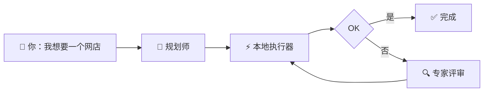
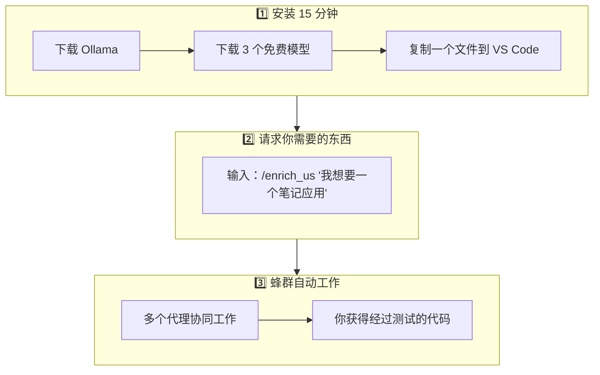
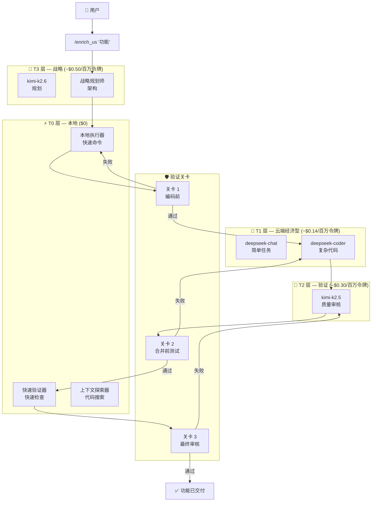
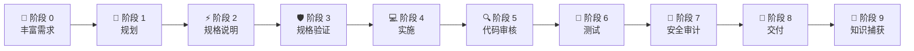
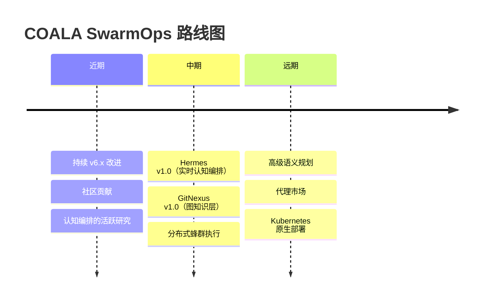
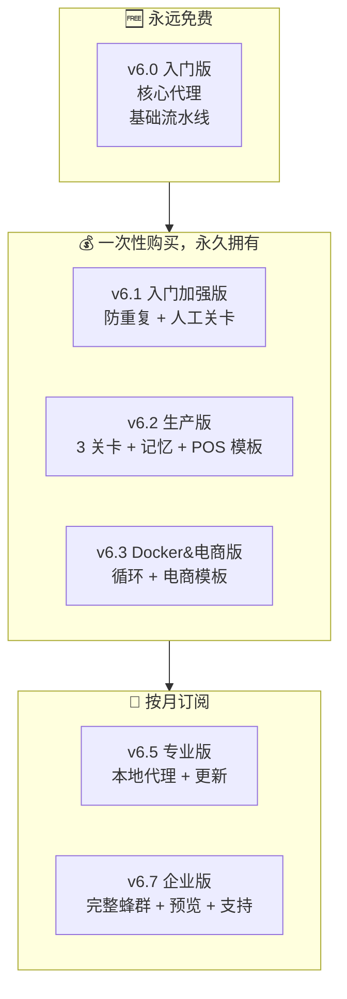

# 🐨 COALA SwarmOps

> **编排一个协同工作的人工智能代理团队。**
> 从你自己的电脑运行。不依赖云端。只在真正需要时付费。

---

## 📍 跳转到章节

| 🎯 面向人群 | 链接 | 阅读时间 |
|---|---|---|
| **我从未编程** — 2分钟理解概念 | [👉 傻瓜指南（超简单）](#-傻瓜指南--这是什么以及为什么我应该关心) | 2 分钟 |
| **我是开发者** — 想立即安装 | [👉 开发者指南（技术篇）](#-开发者指南--安装架构与流程) | 8 分钟 |
| **我经营企业/团队** 想规模化 | [👉 企业与创作者指南](#-企业与创作者指南--为什么要投资未来) | 6 分钟 |

---

<br>

# 🧒 傻瓜指南 — 这是什么以及为什么我应该关心

## 一句话概括

> **COALA SwarmOps 就像在你的电脑里拥有一个由多名专业"虚拟专家"组成的团队，每位专家擅长不同领域，协同工作来构建软件、修复错误和自动化任务。**

---

## 餐厅类比 🍽️

想象你想开一家餐厅。通常你需要雇佣：

| 人类角色 | COALA 角色 | 职责 |
|---|---|---|
| 🧑‍🍳 主厨 | **战略规划师** | 决定做什么菜以及顺序 |
| 🍳 厨师 | **执行者 (T0)** | 做菜。快速、本地、免费 |
| 👁️ 质量监督员 | **验证器 (T2)** | 上菜前检查菜品质量 |
| 🔍 卫生检查员 | **安全审计员** | 确保一切安全 |
| 📋 领班 | **协调器** | 协调谁做什么、何时做 |

**COALA 做的正是这些，但针对软件。**

---

## 如何工作？（可视化）



### 开始使用的 3 个步骤



---

## 要花多少钱？

| 场景 | 费用 | 何时？ |
|---|---|---|
| **基础使用** | **$0** | 永远。本地代理使用你的电脑 |
| **简单功能**（例如：修复按钮） | ~$0.05 - $0.50 | 当你需要云端专家时 |
| **复杂功能**（例如：新模块） | ~$2.00 - $8.00 | 当本地团队无法单独处理时 |
| **对比：** 雇佣开发者 | $1,500 - $5,000/月 | — |

> 💡 **大部分工作免费完成**，使用本地代理 (T0)。

---

## 免费版 (v6.0) 适合谁？

- ✅ 编程学习者
- ✅ 想更快交付的自由职业者
- ✅ 零预算的小企业
- ✅ 任何想免费试用的人

[⬆️ 返回菜单](#-跳转到章节)

---

<br>

# 💻 开发者指南 — 安装、架构与流程

## 快速安装（5 步，约 15 分钟）

### 步骤 1：安装 Ollama（T0 本地层 — $0）

```bash
# Windows
winget install Ollama.Ollama

# macOS
brew install ollama

# Linux
curl -fsSL https://ollama.com/install.sh | sh
```

### 步骤 2：下载本地模型（免费）

```bash
ollama pull qwen2.5:latest   # 本地执行器
ollama pull qwen2.5:7b       # 快速验证器
ollama pull granite3.2:8b    # 上下文探索器
```

### 步骤 3：在 VS Code 中安装 RooCode

1. 打开 VS Code → 扩展 → 搜索 **RooCode**
2. 安装并打开 RooCode 面板
3. 配置 API 提供商（OpenRouter 或直接连接）

### 步骤 4：复制自定义模式（v6.0 免费版）

```bash
# Windows:
copy docs\custom_modes\custom_modes_v6.0.yaml %USERPROFILE%\.vscode\extensions\roo-code\.roo\custom_modes.yaml

# Linux / macOS:
cp docs/custom_modes/custom_modes_v6.0.yaml ~/.vscode/extensions/roo-code/.roo/custom_modes.yaml
```

### 步骤 5：你的第一个功能

```
/enrich_us "作为用户，我想按价格筛选产品"
```

> 📖 完整指南见 [`docs/INSTALL.md`](docs/INSTALL.md)

---

## 蜂群架构



---

## 核心组件

| 组件 | 职责 | 层级 |
|---|---|---|
| **需求分析师** | 将模糊的用户故事转化为详细规格说明 | T2 |
| **规格编写器** | 生成技术设计文档和任务分解 | T3 |
| **任务协调器** | 管理执行阶段并委派给适当的代理 | T3 |
| **质量验证器** | 验证规格在实施前是否完整 | T2 |
| **测试验证器** | 确保测试在合并前符合标准 | T2 |
| **代码审核员** | 在投入生产前审核质量、安全和模式 | T2 |
| **安全审计员** | 在部署前进行安全审计 | T2 |
| **证据验证器** | 验证每个技术声明都有证据支持 | T2 |
| **本地执行器** (T0) | 在本地机器上运行原子命令 | T0 |
| **语法检查器** (T0) | 快速语法和 lint 验证 | T0 |
| **代码探索器** (T0) | 本地代码库搜索和探索 | T0 |

---

## 开发流水线（SDD — 规范驱动开发）



---

## 支持的模型

### 本地（Ollama — $0）

| 模型 | 显存 | 用途 |
|---|---|---|
| `qwen2.5:latest` | ~12 GB | 命令执行 |
| `qwen2.5:7b` | ~6 GB | 快速验证 |
| `granite3.2:8b` | ~6 GB | 代码探索 |

### 云端（直连 API）

| 提供商 | 模型 | 输入/百万 | 输出/百万 | 用途 |
|---|---|---|---|---|
| DeepSeek | deepseek-chat | $0.14 | $0.28 | 简单任务 |
| DeepSeek | deepseek-coder | $0.44 | $0.87 | 复杂代码 |
| Moonshot | kimi-k2.5 | ~$0.30 | ~$1.20 | 验证、审核 |
| Moonshot | kimi-k2.6 | ~$0.50 | ~$2.00 | 规划 |

> 💰 **真实节省：** 大部分工作在 T0（本地，$0）完成。仅在问题需要时才升级到云端。

---

## 代码库生态系统

COALA SwarmOps 通过标准 Git 工作流程连接到你现有的代码仓库。它可以编排多个项目中的工作 — 无论你是拥有单一 monorepo 还是分布式微服务架构。

平台设计用于集成：
- **你现有的 Git 仓库** — 无需迁移
- **你的标准 CI/CD 流水线** — GitHub Actions、GitLab CI 等
- **你的本地开发环境** — VS Code + Ollama

---

## 为什么选 COALA 而不是其他方案？

| 常见问题 | COALA 如何解决 |
|---|---|
| 💸 "ChatGPT 每月收我 $20，我只用 10%" | 按**功能**付费，不是订阅。真实成本：$0.05-$8.00 |
| 🤖 "AI 给了我无法运行的代码" | 到达生产环境前有 **3 个验证关卡** |
| 🏗️ "我不知道如何组织大项目" | **9 阶段 SDD 流水线**，从想法引导到提交 |
| 🔄 "我必须在聊天之间复制粘贴" | **多个专业代理**自动传递上下文 |
| 💻 "我只有 Windows，不会 Linux" | 原生为 **Windows + PowerShell** 设计，支持 Linux/macOS |

---

## 技术文档

| 文档 | 说明 |
|---|---|
| [`docs/INSTALL.md`](docs/INSTALL.md) | 完整安装指南 |
| [`docs/USER_GUIDE.md`](docs/USER_GUIDE.md) | 分步手册 |
| [`docs/COST_TRACKER.md`](docs/COST_TRACKER.md) | 每个功能的成本可追溯性 |
| [`docs/PRICES.md`](docs/PRICES.md) | 真实 API 价格（每月更新） |
| [`docs/ECOSYSTEM_CONTEXT.md`](docs/ECOSYSTEM_CONTEXT.md) | 仓库生态系统概念 |
| [`docs/architecture/ARCHITECTURE.md`](docs/architecture/ARCHITECTURE.md) | 架构决策 |
| [`docs/terminology/TERMINOLOGY.md`](docs/terminology/TERMINOLOGY.md) | 术语词汇表 |
| [`docs/HERMES_NEXUS_ROADMAP.md`](docs/HERMES_NEXUS_ROADMAP.md) | 高级认知层路线图 |

[⬆️ 返回菜单](#-跳转到章节)

---

<br>

# 🏢 企业与创作者指南 — 为什么要投资未来

## 我们解决的大规模问题

> **你的 5 人开发团队每人每月赚 $4,000。一个生产环境错误花费他们 3 天 = $3,000 损失。COALA Enterprise 在错误到达生产环境前减少 40%。**

---

## 版本对比

我们提供从免费到高级订阅的多个层级。每个层级增加更多代理、验证关卡和自动化。

| 能力 | 免费版 (v6.0) | 高级层级 |
|---|---|---|
| **代理团队** | 核心入门包 | 扩展专家代理 |
| **流水线** | 基础 SDD | 多关卡验证 |
| **记忆** | ❌ | ✅ 高级上下文记忆 |
| **防重复** | ❌ | ✅ |
| **熔断器** | ❌ | ✅ |
| **本地代理** | 基础集 | 增强 + Flash 层级 |
| **质量** | 良好 | 优秀 |
| **价格** | **$0** | **起价 $7.99** |

> 📊 完整详情：[`docs/custom_modes/README_VERSIONS.md`](docs/custom_modes/README_VERSIONS.md)

---

## 为什么订阅企业版？

不是随意定价。由**真实成本和可衡量的节省**支撑：

### 1. 减少生产环境错误

| 指标 | 没有 COALA | 使用 COALA Enterprise |
|---|---|---|
| 到达生产环境的错误 | ~15-20% 的代码 | ~3-5% 的代码 |
| 平均回滚时间 | 4-8 小时 | 30 分钟（熔断器） |
| 严重错误成本 | $3,000 - $15,000 | 85% 的情况下可预防 |

**预计每月投资回报率：** $5,000 - $20,000 的预防性节省。

### 2. 交付速度

| 功能类型 | 传统时间 | 使用 COALA Enterprise |
|---|---|---|
| 新 API 端点 | 2-3 天 | 4-6 小时 |
| 服务集成 | 1-2 周 | 2-3 天 |
| 大规模重构 | 1-2 周 | 3-5 天 |

**预计每月投资回报率：** 同样团队多交付 30-40% 的功能。

### 3. 优化的 API 成本

```
无优化（始终使用昂贵模型）：
  100 功能/月 × $8 平均 = $800/月

使用 COALA Enterprise（智能升级）：
  100 功能/月 × $2.50 平均 = $250/月

节省：仅 API 就省 $550/月
```

### 4. 企业订阅包含什么

| 权益 | 估计价值 |
|---|---|
| 每月更新的高级配置 | $150/月（相当于雇佣提示工程师） |
| 优先支持（< 4 小时响应） | $300/月 |
| 路线图投票（你决定构建什么） | — |
| 生产就绪的 Docker 模板 | $200/月（自由职业 DevOps） |
| 高级认知层就绪后可用 | $500/月 |
| **总价值** | **~$1,150/月** |
| **COALA 价格** | **$299/月** |

> **你的净节省：~$850/月 + 预防的事故**

---

## 未来路线图



### Hermes — 缺失的大脑

Hermes 不是"另一个规划器"。它是一个**认知编排器**，能够：

- 🧠 实时检测代理何时"幻觉"
- 🔄 动态决定哪个工作者执行哪个任务（无静态规则）
- ⚖️ 解决两个代理提出相反方案时的冲突
- 💰 基于成功历史选择最优模型以优化成本

### GitNexus — 结构化知识

GitNexus 是一个**图知识层**，能够：

- 🔗 映射所有代码库之间的依赖关系
- 📊 在变更前计算影响范围
- 🎯 将任务发送给对目标代码有领域知识的工作者
- 🛡️ 防止一个仓库的变更破坏另一个仓库

> 📖 详细架构见 [`docs/HERMES_NEXUS_ROADMAP.md`](docs/HERMES_NEXUS_ROADMAP.md)

---

## 商业模式：开放核心



| 层级 | 价格 | 最适合 |
|---|---|---|
| **v6.0** | **$0** | 学习、个人项目、评估 |
| **v6.1** | **$7.99** 一次性 | 需要基础验证的自由职业者 |
| **v6.2** | **$19.99** 一次性 | 有 POS/库存的小团队 |
| **v6.3** | **$14.99** 一次性 | 使用 Docker 的网店 |
| **v6.5** | **$49/月** | 需要持续更新的团队 |
| **v6.7** | **$299/月** | 需要最高质量和支持的企业 |

> 💳 一次性购买：[Buy Me a Coffee](https://buymeacoffee.com/coalaswarmops)  
> 📅 订阅：[GitHub Sponsors](https://github.com/sponsors/Aquilesnake)

---

## 真实用例

### 带智能目录的电商平台

COALA 生态系统诞生于运营真实的生产系统。蜂群处理：
- 带 RAG（检索增强生成）的产品目录
- 与 POS 同步的库存
- 自动化的 Docker 部署
- 面向未来扩展的多租户架构

### 零售 POS + 库存系统

一个完整的销售点和库存系统，证明蜂群不是理论：
- 实时销售跟踪
- 库存控制
- 自动报告
- Docker Compose 部署

---

## 准备开始？

| 我想... | 我做... |
|---|---|
| 现在免费试用 | 按照上面的[快速安装](#步骤-1安装-ollamat0-本地层--0)操作 |
| 对比版本 | 阅读 [`docs/custom_modes/README_VERSIONS.md`](docs/custom_modes/README_VERSIONS.md) |
| 理解架构 | 阅读 [`docs/architecture/ARCHITECTURE.md`](docs/architecture/ARCHITECTURE.md) |
| 查看生态系统概念 | 阅读 [`docs/ECOSYSTEM_CONTEXT.md`](docs/ECOSYSTEM_CONTEXT.md) |
| 为项目做贡献 | 阅读 [`CONTRIBUTING.md`](CONTRIBUTING.md) |
| 报告错误 | 使用 [GitHub Issues](../../issues/new/choose) |
| 支持项目 | [GitHub Sponsors](https://github.com/sponsors/Aquilesnake) |

---

## 许可证

[MIT](LICENSE) © 2026 COALA SwarmOps。可自由使用、修改和分发。

> **注意：** `custom_modes_v6.1+` 文件是高级产品，不包含在此仓库中。v6.0 在 MIT 下完全免费。

---

<p align="center">
  <strong>🐨 更智能的代理。更低的成本。更好的系统。</strong>
</p>

[⬆️ 返回菜单](#-跳转到章节)
