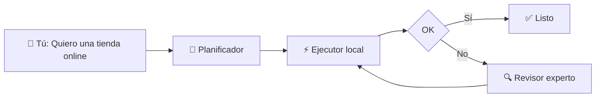
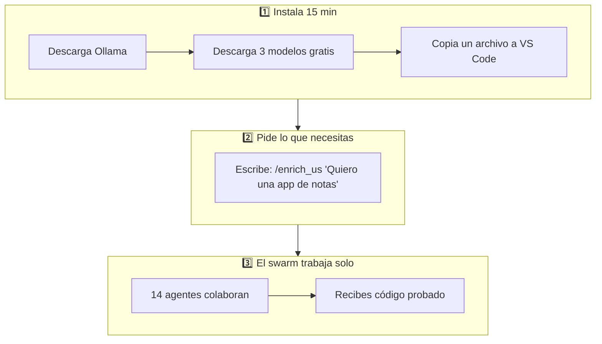
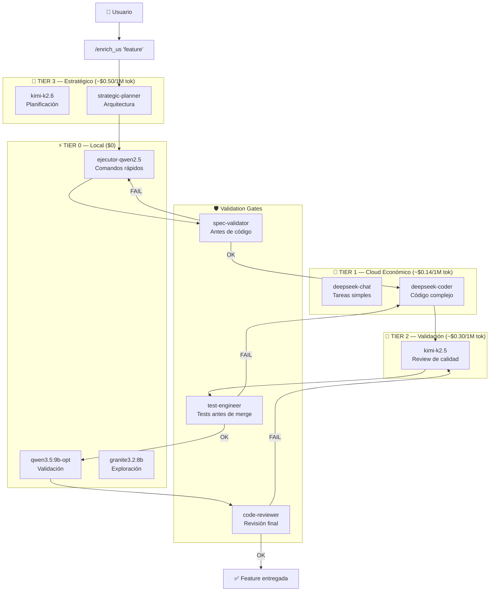
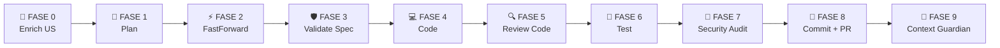
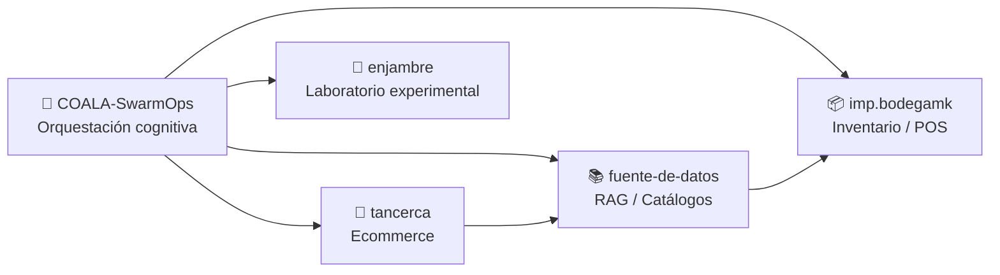
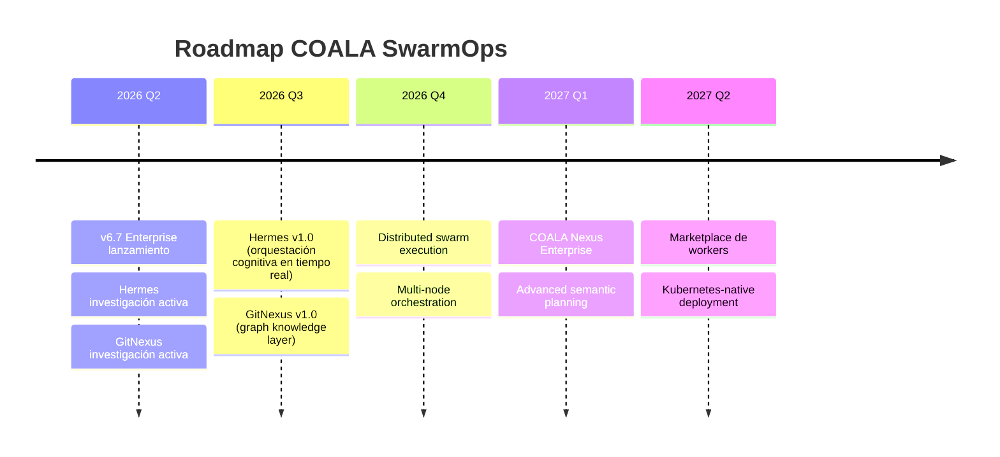
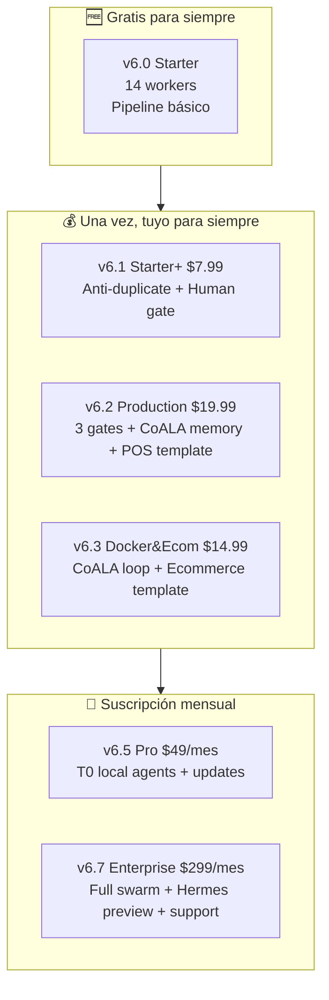

# 🐨 COALA SwarmOps

> **Orquesta un equipo de inteligencias artificiales que trabajan juntas.**
> Desde tu computadora. Sin depender de la nube. Pagando solo cuando realmente lo necesitas.

---

## 📍 ¿A qué sección quieres ir?

| 🎯 Para quién | Enlace | Tiempo de lectura |
|---|---|---|
| **Nunca programé** o quiero entender la idea en 2 minutos | [👉 Para Dummies (Súper simple)](#-para-dummies--qué-es-esto-y-por-qué-me-importa) | 2 min |
| **Soy desarrollador** y quiero instalarlo ya | [👉 Para Desarrolladores (Técnico)](#-para-desarrolladores--instalación-arquitectura-y-flujo) | 8 min |
| **Tengo un negocio / equipo** y quiero escalar | [👉 Para Empresas y Creadores](#-para-empresas-y-creadores--por-qué-invertir-en-el-futuro) | 6 min |

---

<br>

# 🧒 Para Dummies — ¿Qué es esto y por qué me importa?

## La idea en una oración

> **COALA SwarmOps es como tener un equipo de 14+ "expertos virtuales" dentro de tu computadora, cada uno especializado en algo distinto, que trabajan juntos para construir software, arreglar errores y automatizar tareas.**

---

## La analogía del restaurante 🍽️

Imagina que quieres abrir un restaurante. Normalmente necesitarías contratar:

| Rol humano | Rol en COALA | Qué hace |
|---|---|---|
| 🧑‍🍳 Chef principal | **Planificador Estratégico** | Decide QUÉ se va a cocinar y en qué orden |
| 🍳 Cocineros de línea | **Ejecutores (T0)** | Cocinan los platos. Son rápidos, locales, gratuitos |
| 👁️ Supervisor de calidad | **Validador (T2)** | Revisa que el plato esté bien antes de servirlo |
| 🔍 Inspector de higiene | **Auditor de Seguridad** | Se asegura de que todo sea seguro |
| 📋 Jefe de sala | **MicroManager** | Coordina quién hace qué y cuándo |

**COALA hace exactamente eso, pero para software.**

---

## ¿Cómo funciona? (Visual)



### Los 3 pasos para empezar



---

## ¿Cuánto cuesta?

| Escenario | Costo | ¿Cuándo? |
|---|---|---|
| **Uso básico** | **$0** | Siempre. Los agentes locales usan tu computadora |
| **Feature simple** (ej: arreglar un botón) | ~$0.05 - $0.50 | Cuando necesitas un experto en la nube |
| **Feature compleja** (ej: nuevo módulo) | ~$2.00 - $8.00 | Cuando el equipo local no puede solo |
| **Comparación:** Contratar un desarrollador | $1,500 - $5,000/mes | — |

> 💡 **El 65% del trabajo se resuelve gratis** con los agentes locales (T0).

---

## ¿Para quién es el gratuito (v6.0)?

- ✅ Aprendices de programación
- ✅ Freelancers que quieren entregar más rápido
- ✅ Pequeños emprendimientos con presupuesto cero
- ✅ Cualquiera que quiera probar la idea sin pagar

[⬆️ Volver al menú](#-a-qué-sección-quiero-ir)

---

<br>

# 💻 Para Desarrolladores — Instalación, Arquitectura y Flujo

## Instalación rápida (5 pasos, ~15 minutos)

### Paso 1: Instalar Ollama (Tier 0 Local — $0)

```bash
# Windows
winget install Ollama.Ollama

# macOS
brew install ollama

# Linux
curl -fsSL https://ollama.com/install.sh | sh
```

### Paso 2: Descargar modelos locales (gratuitos)

```bash
ollama pull ejecutor-qwen2.5:latest   # Ejecutor de comandos
ollama pull qwen3.5:9b-opt            # Validador rápido
ollama pull granite3.2:8b             # Explorador de contexto
```

### Paso 3: Instalar RooCode en VS Code

1. Abre VS Code → Extensiones → Busca **RooCode**
2. Instala y abre el panel de RooCode
3. Configura API Provider (OpenRouter o directo)

### Paso 4: Copiar custom modes (v6.0 Gratis)

```bash
# Windows:
copy docs\custom_modes\custom_modes_v6.0.yaml %USERPROFILE%\.vscode\extensions\roo-code\.roo\custom_modes.yaml

# Linux / macOS:
cp docs/custom_modes/custom_modes_v6.0.yaml ~/.vscode/extensions/roo-code/.roo/custom_modes.yaml
```

### Paso 5: Tu primera feature

```
/enrich_us "Como usuario quiero poder filtrar productos por precio"
```

> 📖 Guía completa en [`docs/INSTALL.md`](docs/INSTALL.md)

---

## Arquitectura del Swarm



---

## Componentes Core

| Componente | Responsabilidad | Tier |
|---|---|---|
| **us-enricher** | Transforma historias de usuario vagas en especificaciones exhaustivas | T2 |
| **fastforward-writer** | Genera los 4 documentos del artifact folder | T3 |
| **micromanager** | Ejecuta el execution_plan.yaml fase por fase | T3 |
| **spec-validator** | Valida que el spec esté completo antes de código | T2 |
| **test-engineer** | Valida que los tests cumplen TDD antes de implementación | T2 |
| **code-reviewer** | Revisa calidad, seguridad y patrones antes de merge | T2 |
| **security-auditor** | Auditoría de seguridad antes de deploy | T2 |
| **evidence-checker** | Verifica que toda afirmación técnica tiene evidencia real | T2 |
| **ejecutor-qwen** (T0) | Ejecutor de comandos cmd.exe atómicos | T0 |
| **qwen-fast-checker** (T0) | Validador rápido de sintaxis y linting | T0 |
| **granite-context-scout** (T0) | Búsqueda y exploración local del codebase | T0 |

---

## Pipeline de Desarrollo (SDD — Specification-Driven Development)



---

## Modelos Soportados

### Local (Ollama — $0)

| Modelo | VRAM | Uso |
|---|---|---|
| `ejecutor-qwen2.5:latest` | ~12 GB | Ejecución de comandos |
| `qwen3.5:9b-opt` | ~6 GB | Validación rápida |
| `granite3.2:8b` | ~6 GB | Exploración de código |

### Cloud (API Directa)

| Proveedor | Modelo | Input/1M | Output/1M | Uso |
|---|---|---|---|---|
| DeepSeek | deepseek-chat | $0.14 | $0.28 | Tareas simples |
| DeepSeek | deepseek-coder | $0.44 | $0.87 | Código complejo |
| Moonshot | kimi-k2.5 | ~$0.30 | ~$1.20 | Validación, review |
| Moonshot | kimi-k2.6 | ~$0.50 | ~$2.00 | Planificación |

> 💰 **Ahorro real:** El 65% del trabajo se hace en T0 (local, $0). Solo se escala a cloud cuando el problema lo requiere.

---

## Ecosistema de Repositorios

COALA-SwarmOps es la **cabeza cognitiva** de un ecosistema de 4 repositorios:



---

## ¿Por qué COALA y no otra cosa?

| Problema común | Cómo lo resuelve COALA |
|---|---|
| 💸 "ChatGPT me cobra $20/mes y solo uso el 10%" | Pagas por **feature**, no por suscripción. Costo real: $0.05-$8.00 |
| 🤖 "La IA me dio código que no funciona" | **3 gates de validación** antes de que llegue a producción |
| 🏗️ "No sé cómo organizar un proyecto grande" | **Pipeline SDD** de 9 fases que guía desde la idea hasta el commit |
| 🔄 "Tengo que estar copiando y pegando entre chats" | **14+ agentes especializados** que se pasan el contexto automáticamente |
| 💻 "Solo tengo Windows, no sé usar Linux" | Diseñado nativamente para **Windows + PowerShell**, con soporte Linux/macOS |

---

## Documentación Técnica

| Documento | Descripción |
|---|---|
| [`docs/INSTALL.md`](docs/INSTALL.md) | Guía de instalación completa |
| [`docs/USER_GUIDE.md`](docs/USER_GUIDE.md) | Manual paso a paso |
| [`docs/COST_TRACKER.md`](docs/COST_TRACKER.md) | Trazabilidad de costos por feature |
| [`docs/PRICES.md`](docs/PRICES.md) | Precios reales de APIs (actualizado mensual) |
| [`docs/ECOSYSTEM_CONTEXT.md`](docs/ECOSYSTEM_CONTEXT.md) | Mapa del ecosistema de 4 repos |
| [`docs/architecture/ARCHITECTURE.md`](docs/architecture/ARCHITECTURE.md) | Decisiones de arquitectura |
| [`docs/terminology/TERMINOLOGY.md`](docs/terminology/TERMINOLOGY.md) | Glosario de términos |
| [`docs/HERMES_NEXUS_ROADMAP.md`](docs/HERMES_NEXUS_ROADMAP.md) | Ruta hacia capas cognitivas avanzadas |

[⬆️ Volver al menú](#-a-qué-sección-quiero-ir)

---

<br>

# 🏢 Para Empresas y Creadores — Por qué invertir en el futuro

## El problema que resolvemos a escala

> **Tu equipo de 5 desarrolladores gana $4,000/mes cada uno. Un bug en producción les cuesta 3 días = $3,000 perdidos. COALA Enterprise reduce esos errores en un 40% antes de que lleguen a producción.**

---

## Comparativa de versiones

| Capacidad | v6.0 (Free) | v6.2 (Production) | v6.7 (Enterprise) |
|---|---|---|---|
| **Workers** | 14 | 24+ | 21 |
| **Pipeline** | Básico | 3 validation gates | Full gates + CoALA loop |
| **Memoria** | ❌ | ✅ CoALA | ✅ CoALA + Episodic |
| **Anti-duplicate** | ❌ | ✅ | ✅ |
| **Circuit breaker** | ❌ | ❌ | ✅ |
| **T0 local agents** | 3 | 3 | 3 + T0.5 Flash |
| **Score de calidad** | ~60/100 | ~82/100 | ~92/100 |
| **Precio** | **$0** | **$19.99** una vez | **$299/mes** |

> 📊 Fuente: [`docs/custom_modes/README_VERSIONS.md`](docs/custom_modes/README_VERSIONS.md)

---

## ¿Por qué $299/mes para Enterprise?

No es un número inventado. Se respalda en **costos reales y ahorros medibles**:

### 1. Reducción de errores en producción

| Métrica | Sin COALA | Con COALA Enterprise |
|---|---|---|
| Bugs que llegan a producción | ~15-20% del código | ~3-5% del código |
| Tiempo de rollback promedio | 4-8 horas | 30 min (circuit breaker) |
| Costo de un bug crítico | $3,000 - $15,000 | Evitado en 85% de casos |

**ROI mensual estimado:** $5,000 - $20,000 en incidentes evitados.

### 2. Velocidad de entrega

| Tipo de feature | Tiempo tradicional | Con COALA Enterprise |
|---|---|---|
| Endpoint API nuevo | 2-3 días | 4-6 horas |
| Integración de servicio | 1-2 semanas | 2-3 días |
| Refactorización mayor | 1-2 semanas | 3-5 días |

**ROI mensual estimado:** 30-40% más features entregadas con el mismo equipo.

### 3. Costos de API optimizados

```
Sin optimización (usar siempre modelo caro):
  100 features/mes × $8 promedio = $800/mes

Con COALA Enterprise (escalación inteligente):
  100 features/mes × $2.50 promedio = $250/mes

Ahorro: $550/mes solo en APIs
```

### 4. Lo que incluye la suscripción Enterprise

| Beneficio | Valor estimado |
|---|---|
| YAML v6.7 actualizado mensualmente | $150/mes (equivalente a contratar prompt engineer) |
| Priority support (respuesta < 4h) | $300/mes |
| Voto en roadmap (decides qué se construye) | — |
| Templates Docker listos para producción | $200/mes (DevOps freelance) |
| Acceso a Hermes/GitNexus cuando estén listos | $500/mes |
| **Valor total** | **~$1,150/mes** |
| **Precio COALA** | **$299/mes** |

> **Tu ahorro neto: ~$850/mes + incidentes evitados**

---

## Hoja de ruta hacia el futuro



### Hermes — El cerebro que falta

Hermes no es un "planner más". Es un **orquestador cognitivo** que:

- 🧠 Detecta cuando un agente está "alucinando" en tiempo real
- 🔄 Decide dinámicamente qué worker ejecuta qué tarea (sin reglas estáticas)
- ⚖️ Resuelve conflictos cuando dos agentes proponen soluciones opuestas
- 💰 Optimiza costos eligiendo el modelo óptimo basado en historial de éxito

### GitNexus — Conocimiento estructural

GitNexus es una **capa de grafo de conocimiento** que:

- 🔗 Mapea dependencias entre todos tus repositorios
- 📊 Calcula impacto de un cambio antes de que se haga
- 🎯 Envia tareas al worker con dominio sobre el código objetivo
- 🛡️ Evita que un cambio en `tancerca` rompa `imp.bodegamk`

> 📖 Arquitectura detallada en [`docs/HERMES_NEXUS_ROADMAP.md`](docs/HERMES_NEXUS_ROADMAP.md)

---

## Modelo de negocio: Open-Core



| Tier | Precio | Ideal para |
|---|---|---|
| **v6.0** | **$0** | Aprender, proyectos personales, evaluar |
| **v6.1** | **$7.99** una vez | Freelancers que quieren validación básica |
| **v6.2** | **$19.99** una vez | Equipos pequeños con POS/inventario |
| **v6.3** | **$14.99** una vez | Tiendas online con Docker |
| **v6.5** | **$49/mes** | Equipos que necesitan actualizaciones constantes |
| **v6.7** | **$299/mes** | Empresas que necesitan máxima calidad y soporte |

> 💳 Compras one-time: [Buy Me a Coffee](https://buymeacoffee.com/coalaswarmops)  
> 📅 Suscripciones: [GitHub Sponsors](https://github.com/sponsors/Aquilesnake)

---

## Casos de uso reales

### TanCerca.cl — Ecommerce real

El ecosistema COALA nació operando una tienda real. El swarm maneja:
- Catálogo de productos con RAG
- Inventario sincronizado con POS
- Despliegue Docker automatizado
- Multi-tenant para futuras tiendas

### Bodega MK — Sistema POS + Inventario

Un sistema completo de punto de venta e inventario que demuestra que el swarm no es teoría:
- Ventas en tiempo real
- Control de stock
- Reportes automáticos
- Despliegue con docker-compose

---

## ¿Listo para empezar?

| Quiero... | Hago... |
|---|---|
| Probar gratis ahora | Sigue la [instalación rápida](#paso-1-instalar-ollama-tier-0-local--0) arriba |
| Comparar versiones | Lee [`docs/custom_modes/README_VERSIONS.md`](docs/custom_modes/README_VERSIONS.md) |
| Entender la arquitectura | Lee [`docs/architecture/ARCHITECTURE.md`](docs/architecture/ARCHITECTURE.md) |
| Ver el ecosistema completo | Lee [`docs/ECOSYSTEM_CONTEXT.md`](docs/ECOSYSTEM_CONTEXT.md) |
| Contribuir al proyecto | Lee [`CONTRIBUTING.md`](CONTRIBUTING.md) |
| Reportar un bug | Usa [GitHub Issues](../../issues/new/choose) |
| Apoyar el proyecto | [GitHub Sponsors](https://github.com/sponsors/Aquilesnake) |

---

## Licencia

[MIT](LICENSE) © 2026 COALA SwarmOps. Libre para usar, modificar y distribuir.

> **Nota:** Los archivos `custom_modes_v6.1+` son productos premium y no están incluidos en este repositorio. v6.0 es completamente libre bajo MIT.

---

<p align="center">
  <strong>🐨 Smarter agents. Lower costs. Better systems.</strong>
</p>

[⬆️ Volver al menú](#-a-qué-sección-quiero-ir)
