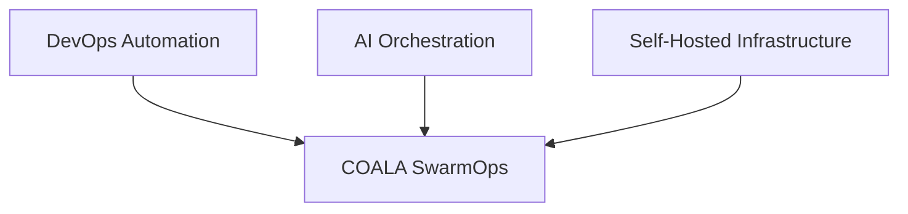
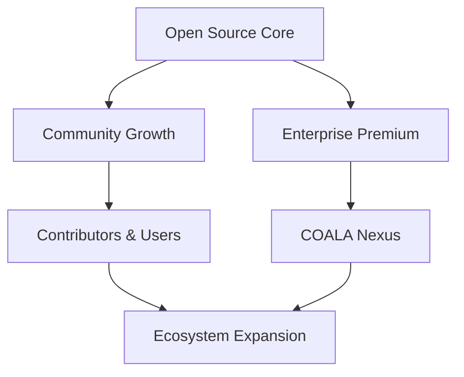
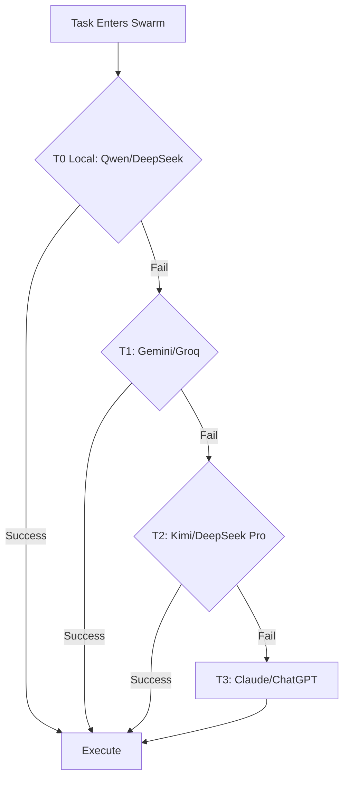

# COALA SwarmOps — Strategy Document

> **Direction, Growth, and Positioning: How COALA SwarmOps Competes and Wins**

---

## 1. Market Vision

### 1.1 Where We Compete

COALA SwarmOps operates at the intersection of three growing markets:



| Market | Size | Our Niche |
|--------|------|-----------|
| **DevOps Automation** | $20B+ by 2028 | Operational orchestration with AI agents, not just scripts |
| **AI Orchestration** | $15B+ by 2028 | Cost-aware, tiered execution with self-hosted first |
| **Self-Hosted AI** | $5B+ by 2028 | Windows-native, enterprise-ready, local model support |

### 1.2 The Real Niche

> **DevOps + Operational Orchestration with Cost-Aware AI**

We don't compete with:
- Generic chatbot frameworks (LangChain Agents, AutoGPT)
- IDE AI assistants (GitHub Copilot, Cursor)
- Cloud-only orchestration platforms (AWS Step Functions, Azure Logic Apps)
- AGI research projects (OpenAI, Anthropic direct products)

We compete by solving a problem they ignore:
**How to orchestrate real engineering workflows with AI while controlling costs and maintaining operational control.**

---

## 2. What COALA SwarmOps Is NOT

This section is critical. It defines boundaries that prevent feature creep, hype-driven development, and identity loss.

### 2.1 Explicit Non-Goals

| What We Are NOT | Why |
|-----------------|-----|
| **An AGI project** | We orchestrate existing AI, we don't create it. |
| **A generic chatbot framework** | We don't build conversational AI. We build operational AI. |
| **An IDE replacement** | We work alongside IDEs, not instead of them. |
| **Hype-driven automation** | We solve real problems, not chase AI trends. |
| **A cloud-only platform** | Self-hosted first. Cloud is fallback, not primary. |
| **A no-code tool** | Our users are engineers. They write code, we orchestrate execution. |
| **An AI research lab** | We apply proven AI, we don't research new models. |

### 2.2 The Boundary Test

Before adding any feature, ask:

```
Does this serve operational engineering workflows?
Does it reduce costs or improve execution quality?
Does it work on both Windows and Linux?
Can it run self-hosted?
```

If any answer is "no," the feature is rejected.

---

## 3. Competitive Differentiators

### 3.1 Against Existing Solutions

| Competitor | Their Strength | Our Advantage |
|------------|---------------|---------------|
| **LangChain** | Flexibility, ecosystem | We are operationally focused, not framework-generic. Our tier system is built-in, not added on. |
| **AutoGPT** | Autonomy, hype | We are controlled, not autonomous. We escalate with purpose, not randomly. |
| **GitHub Copilot** | IDE integration | We orchestrate multi-step workflows, not just code completion. |
| **Kubernetes + Argo** | Enterprise orchestration | We are simpler, AI-native, and don't require K8s expertise. |
| **n8n / Zapier** | Visual workflow builder | We are code-first, engineering-oriented, not business-user focused. |
| **CrewAI** | Multi-agent framework | We have tiered cost control and Windows-native support. |

### 3.2 Unique Selling Points

1. **Real Operational Origin**
   - Born from TanCerca.cl and img.bodegamk.cl operational needs
   - Not a theoretical framework, but a practical solution

2. **DevOps-Native Workflows**
   - CI/CD integration built-in
   - Docker-first deployment
   - Repository intelligence via GitNexus

3. **Windows-Native Support**
   - 87/96 tests passing on Windows 10
   - Git Bash compatible
   - No WSL dependency
   - Enterprise Windows environments fully supported

4. **Self-Hosted Architecture**
   - Local models first (Ollama, Qwen, DeepSeek)
   - Privacy by default
   - No vendor lock-in

5. **Adaptive Tier Escalation**
   - T0 (free local) → T1 (low-cost cloud) → T2 (advanced) → T3 (cognitive)
   - Escalation only when confidence thresholds fail
   - Cost optimization is architectural, not optional

6. **Specification-Driven Development**
   - Every feature starts with a spec
   - Reduces hallucinations
   - Token optimization through structured context

7. **Operational Cost Transparency**
   - Every task has a cost estimate
   - Budget alerts per feature
   - Downgrade suggestions when safe

---

## 4. Open Source Strategy

### 4.1 Growth Model

COALA SwarmOps follows a **dual-license open-core model**:



**Phase 1: Community Foundation (Current)**
- Core orchestration engine fully open source (MIT)
- All v6.2-v7 features free and open
- Documentation-driven onboarding
- Contributor-friendly codebase

**Phase 2: Enterprise Premium (Future)**
- COALA Nexus as enterprise layer
- Advanced observability
- Multi-node distributed orchestration
- Priority support and SLAs

### 4.2 Contributor Onboarding

| Stage | Action | Goal |
|-------|--------|------|
| **Discover** | README.md, FOUNDATION.md, PHILOSOPHY.md | Understand what COALA is and isn't |
| **Learn** | docs/architecture/, docs/specs/ | Understand how the swarm works |
| **First Contribution** | Good first issues: documentation, tests, small fixes | Build confidence and trust |
| **Regular Contributor** | Feature implementations, spec reviews | Become part of the core team |
| **Maintainer** | Architecture decisions, roadmap input | Shape the future of COALA |

### 4.3 Community Channels

- **GitHub Discussions:** Architecture debates, feature proposals
- **Issues:** Bug reports, feature requests (must follow template)
- **Specs Repository:** Every feature starts as a pull request to docs/specs/
- **Error Database:** Contributors can add error patterns and fixes

---

## 5. Enterprise Strategy

### 5.1 COALA Nexus Value Proposition

For organizations that need more than the open-source core:

| Feature | Open Source | COALA Nexus |
|---------|-------------|-------------|
| Core orchestration | ✅ | ✅ |
| Windows + Linux support | ✅ | ✅ |
| Tiered execution | ✅ | ✅ |
| Single-node deployment | ✅ | ✅ |
| Multi-node distributed swarm | ❌ | ✅ |
| Advanced observability dashboards | ❌ | ✅ |
| Enterprise memory systems | ❌ | ✅ |
| Advanced routing algorithms | ❌ | ✅ |
| Priority support | ❌ | ✅ |
| SLA guarantees | ❌ | ✅ |
| Kubernetes operator | ❌ | ✅ |

### 5.2 Target Enterprise Profiles

| Profile | Pain Point | COALA Nexus Solution |
|---------|-----------|---------------------|
| **Mid-size tech companies** | AI tooling costs spiraling | Cost-aware routing reduces token spend by 40-60% |
| **Enterprise Windows shops** | No AI orchestration for Windows | Native Windows support without WSL |
| **Regulated industries** | Cloud AI privacy concerns | Self-hosted first, data never leaves premises |
| **DevOps teams** | Fragmented automation tools | Unified swarm orchestration for all workflows |
| **Software agencies** | Repeated setup per client | Reusable swarm templates and specs |

### 5.3 Monetization Philosophy

> **We monetize convenience and scale, not capability.**

- Core orchestration remains free forever
- Enterprise features target organizations with operational complexity
- Pricing is usage-based and transparent
- No feature gates that harm the open-source experience

**Current stance:** All tools used are MIT/free (Ollama, Qwen, DeepSeek, Gemini free tier). Commercial AI (ChatGPT, Claude) is optional T3 fallback. As the ecosystem grows, enterprise pricing will be defined based on operational value delivered, not artificial restrictions.

---

## 6. Release Strategy

### 6.1 Versioning Philosophy

COALA SwarmOps uses **semantic versioning with operational guarantees**:

```
MAJOR.MINOR.PATCH
```

| Level | Meaning | Example |
|-------|---------|---------|
| **MAJOR** | Breaking architectural change | v6 → v7: Cognitive layer addition |
| **MINOR** | New feature, backward compatible | v6.2 → v6.3: TanCerca optimization |
| **PATCH** | Bug fix, security update | v6.2.1: Circuit breaker fix |

### 6.2 Release Cycle

| Phase | Duration | Activities |
|-------|----------|------------|
| **Spec Phase** | 1-2 weeks | Write feature spec, community review |
| **Development** | 2-4 weeks | Implement with TDD, agent swarm execution |
| **Validation** | 1 week | Test Engineer + Integration Tester + Evidence Checker |
| **Documentation** | 3-5 days | Update README, docs, changelog |
| **Release** | 1 day | Tag version, publish release notes |

### 6.3 Compatibility Promise

- **Within major version:** Full backward compatibility
- **Major version upgrades:** Migration guide provided, automated when possible
- **Deprecation policy:** Features deprecated in version N, removed in version N+2

### 6.4 Current Roadmap

| Version | Focus | Target |
|---------|-------|--------|
| **v6.2.x** | Bug fixes, documentation, stability | Current |
| **v6.3** | TanCerca optimization, Medusa.js | Active |
| **v7.0** | Cognitive layer, Smart Router, Cost Guardian | Q4 2026 |
| **v7.1** | Memory compression, self-healing playbook | Q1 2027 |
| **v8.0** | Hermes + GitNexus integration | Q2 2027 |
| **v8.1** | Distributed swarm, multi-node | Q3 2027 |
| **v9.0** | COALA Nexus enterprise layer | Q4 2027 |

---

## 7. Architecture Strategy

### 7.1 Avoiding the Rewrite Trap

Many open-source projects die from infinite rewrites. COALA SwarmOps prevents this through:

**The v6.2 Covenant**
- v6.2 is the trunk. Everything branches from it.
- No "let's start fresh" decisions.
- Evolution is additive.

**Modular Boundaries**
- Core orchestration is stable and rarely changes
- New features are plugins or extensions
- Agents are swappable without touching the router
- Providers (AI backends) are adapters, not dependencies

**API Contracts**
- Inter-agent communication uses defined schemas
- Versioned APIs between components
- Breaking changes require deprecation cycles

### 7.2 Technology Choices

| Layer | Technology | Rationale |
|-------|-----------|-----------|
| **Orchestration** | TypeScript/Node.js | Cross-platform, async-friendly, large ecosystem |
| **Local Models** | Ollama | Standardized local model hosting |
| **Cloud Models** | Multiple providers | No single vendor dependency |
| **Containers** | Docker | Universal deployment, Windows + Linux |
| **CI/CD** | GitHub Actions | Integrated, free for open source |
| **Documentation** | Markdown | Universal, version-controlled, agent-readable |

### 7.3 Integration Strategy

COALA SwarmOps integrates with existing tools, it doesn't replace them:

| Tool Type | Integration | Our Role |
|-----------|-------------|----------|
| **Git** | Git CLI, GitHub API | Orchestrate git operations across repos |
| **Docker** | Docker CLI, Compose API | Container orchestration and deployment |
| **CI/CD** | GitHub Actions, Jenkins | Trigger and monitor pipelines |
| **Cloud Providers** | AWS/Azure/GCP CLI | Infrastructure automation |
| **AI APIs** | OpenAI, Anthropic, Groq | Tiered fallback execution |
| **Monitoring** | Prometheus, Grafana | Observability integration (future) |

---

## 8. Commercial AI Partnership

### 8.1 ChatGPT and Claude as T3

COALA SwarmOps uses commercial AI (ChatGPT, Claude) as the **cognitive apex** of the tier system:



**Role of Commercial AI:**
- Strategic planning and architecture validation
- Complex reasoning that exceeds local model capacity
- Final review of critical code and infrastructure changes
- Cost is justified by the rarity of T3 invocation

**Cost Control:**
- T3 tasks are less than 5% of total workload
- Budget alerts if T3 usage exceeds threshold
- Manual approval option for expensive T3 operations

### 8.2 Value Proposition for Commercial AI Users

For organizations already paying for ChatGPT/Claude:

| Without COALA | With COALA |
|---------------|------------|
| All tasks go to expensive models | 95% of tasks handled by free/cheap models |
| No orchestration, manual prompting | Structured workflows, automated execution |
| No cost tracking | Per-feature cost transparency |
| No Windows integration | Native Windows enterprise support |
| No DevOps integration | CI/CD, Docker, repository intelligence |

COALA SwarmOps makes commercial AI investments more efficient, not redundant.

---

## 9. Risk Mitigation

### 9.1 Technical Risks

| Risk | Likelihood | Impact | Mitigation |
|------|-----------|--------|------------|
| T0 local models fail >50% | Medium | High | Monitor error rates, auto-escalate, improve models |
| Cloud provider price increase | High | Medium | Multi-provider support, local-first architecture |
| Windows compatibility regression | Medium | High | CI/CD tests on Windows, Git Bash validation |
| Agent proliferation complexity | Medium | Medium | Strict agent approval process, 18-agent limit baseline |
| Documentation drift | High | Low | Automated doc checks, spec-driven updates |

### 9.2 Market Risks

| Risk | Likelihood | Impact | Mitigation |
|------|-----------|--------|------------|
| Big tech releases competing product | Medium | High | Focus on operational niche, Windows support, cost control |
| Open-source community doesn't grow | Medium | High | Documentation quality, contributor onboarding, clear specs |
| Enterprise customers don't materialize | Low | Medium | Open-source core sustains itself, enterprise is bonus |
| AI model quality makes tiers obsolete | Low | High | Tier system adapts to new models, architecture is model-agnostic |

### 9.3 Architecture Risks

| Risk | Likelihood | Impact | Mitigation |
|------|-----------|--------|------------|
| Premature Kubernetes adoption | Medium | High | Docker-first rule, K8s only after v9.0 |
| Over-abstraction | High | Medium | "Code must be readable" rule, simplicity over elegance |
| Rewrite temptation | Medium | High | v6.2 Covenant, Foundation document enforcement |
| Feature creep | High | Medium | Boundary Test, explicit non-goals list |

---

## 10. Success Metrics

### 10.1 Short Term (6 months)

| Metric | Target | How |
|--------|--------|-----|
| GitHub stars | 500+ | Documentation quality, social proof |
| Active contributors | 10+ | Clear onboarding, good first issues |
| Features shipped | 6+ | Spec-driven development, swarm execution |
| v6.5 score | 85/100 | Smart Router, Cost Guardian implementation |
| Windows test pass rate | 90/96+ | CI/CD improvement, bug fixes |

### 10.2 Medium Term (12 months)

| Metric | Target | How |
|--------|--------|-----|
| GitHub stars | 2000+ | Enterprise use cases, conference talks |
| Active contributors | 25+ | Community events, recognition program |
| v7.0 score | 100/100 | Complete roadmap implementation |
| Enterprise pilots | 3+ | COALA Nexus beta, case studies |
| Cost reduction demo | 50% vs cloud-only | Public benchmark, transparent metrics |

### 10.3 Long Term (24 months)

| Metric | Target | How |
|--------|--------|-----|
| Recognized in DevOps ecosystem | Top 10 AI orchestration tools | Consistent delivery, community advocacy |
| Sustainable revenue | Self-sustaining open-source + enterprise | Transparent pricing, value delivery |
| Platform extensibility | 100+ community plugins | Plugin API, marketplace foundation |

---

## 11. Strategic Principles

### 11.1 Decision Framework

Every strategic decision must satisfy at least 3 of these 5 criteria:

1. **Reduces operational cost** for users
2. **Improves execution quality** of engineering workflows
3. **Expands self-hosted capability** (less cloud dependency)
4. **Grows the contributor community** (lower barrier to entry)
5. **Strengthens Windows + Linux compatibility**

### 11.2 The Honesty Principle

> **We sell what we know. We learn in public. We improve constantly.**

- Every limitation is documented
- Every failure is analyzed and shared
- Every cost is transparent
- Every feature has a real operational justification

This honesty builds trust with users, contributors, and future customers.

---

> *"Strategy is not a plan. It is a framework for making decisions under uncertainty."*
>
> *— COALA SwarmOps Strategy Document*

---

**Document Version:** 1.0  
**Based on:** COALA SwarmOps v6.2  
**Last Updated:** 2026-05-26  
**Next Review:** v7.0 milestone