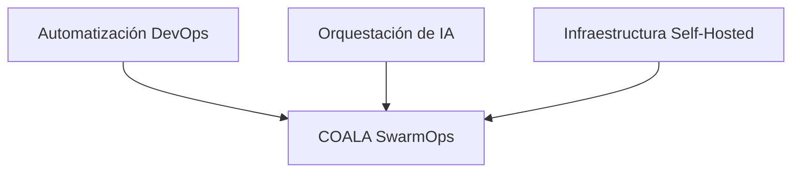
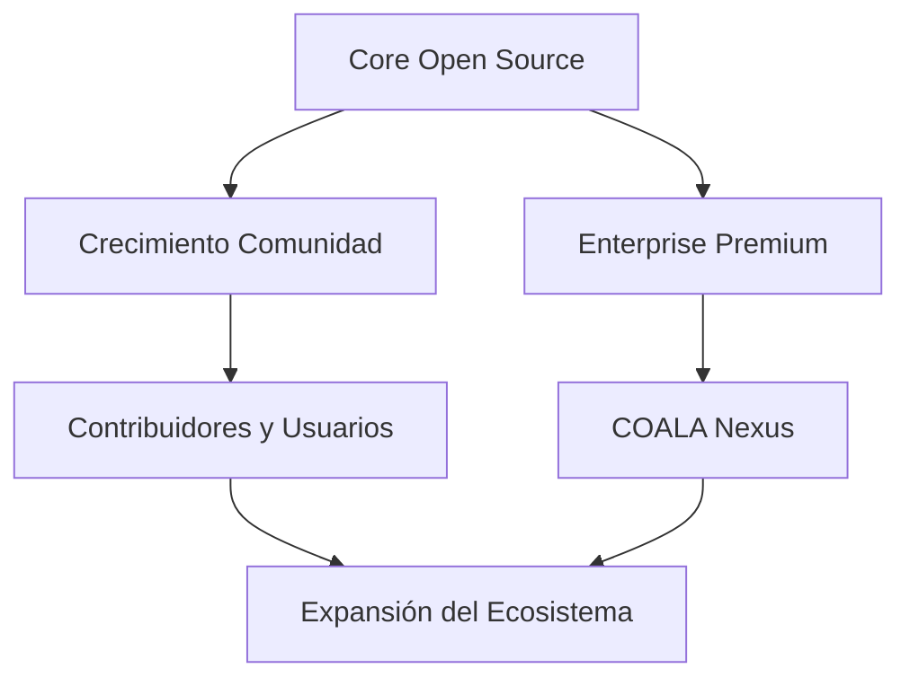
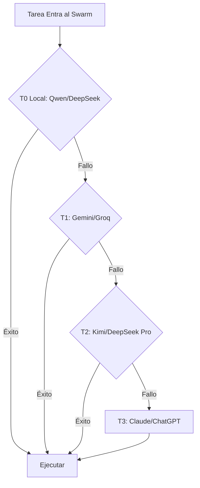

# COALA SwarmOps — Documento de Estrategia

> **Dirección, Crecimiento y Posicionamiento: Cómo COALA SwarmOps Compite y Gana**

---

## 1. Visión de Mercado

### 1.1 Dónde Competimos

COALA SwarmOps opera en la intersección de tres mercados en crecimiento:



| Mercado | Tamaño | Nuestro Nicho |
|---------|--------|---------------|
| **Automatización DevOps** | $20B+ para 2028 | Orquestación operacional con agentes IA, no solo scripts |
| **Orquestación de IA** | $15B+ para 2028 | Ejecución cost-aware, por niveles, con self-hosted first |
| **IA Self-Hosted** | $5B+ para 2028 | Windows nativo, enterprise-ready, soporte de modelos locales |

### 1.2 El Nicho Real

> **DevOps + Orquestación Operacional con IA Cost-Aware**

No competimos con:
- Frameworks genéricos de chatbot (LangChain Agents, AutoGPT)
- Asistentes de IA para IDE (GitHub Copilot, Cursor)
- Plataformas de orquestación solo-cloud (AWS Step Functions, Azure Logic Apps)
- Proyectos de investigación AGI (productos directos de OpenAI, Anthropic)

Competimos resolviendo un problema que ellos ignoran:
**Cómo orquestar flujos de trabajo reales de ingeniería con IA mientras se controlan costos y se mantiene el control operacional.**

---

## 2. Qué NO Es COALA SwarmOps

Esta sección es crítica. Define límites que previenen feature creep, desarrollo hype-driven y pérdida de identidad.

### 2.1 No-Metas Explícitas

| Qué NO Somos | Por Qué |
|--------------|---------|
| **Un proyecto AGI** | Orquestamos IA existente, no la creamos. |
| **Un framework genérico de chatbot** | No construimos IA conversacional. Construimos IA operacional. |
| **Un reemplazo de IDE** | Trabajamos junto a IDEs, no en lugar de ellos. |
| **Automatización hype-driven** | Resolvemos problemas reales, no perseguimos tendencias de IA. |
| **Una plataforma solo-cloud** | Self-hosted first. Cloud es fallback, no primario. |
| **Una herramienta no-code** | Nuestros usuarios son ingenieros. Escriben código, nosotros orquestamos ejecución. |
| **Un laboratorio de investigación IA** | Aplicamos IA probada, no investigamos nuevos modelos. |

### 2.2 La Prueba de Límites

Antes de añadir cualquier feature, pregúntate:

```
¿Sirve a flujos de trabajo de ingeniería operacional?
¿Reduce costos o mejora calidad de ejecución?
¿Funciona en Windows y Linux?
¿Puede ejecutarse self-hosted?
```

Si alguna respuesta es "no", el feature se rechaza.

---

## 3. Diferenciadores Competitivos

### 3.1 Contra Soluciones Existentes

| Competidor | Su Fortaleza | Nuestra Ventaja |
|------------|--------------|-----------------|
| **LangChain** | Flexibilidad, ecosistema | Somos operacionalmente enfocados, no framework-genéricos. Nuestro sistema de tiers es built-in, no añadido. |
| **AutoGPT** | Autonomía, hype | Somos controlados, no autónomos. Escalamos con propósito, no aleatoriamente. |
| **GitHub Copilot** | Integración IDE | Orquestamos flujos multi-paso, no solo completado de código. |
| **Kubernetes + Argo** | Orquestación enterprise | Somos más simples, IA-nativos, y no requieren expertise K8s. |
| **n8n / Zapier** | Constructor visual de flujos | Somos code-first, orientados a ingeniería, no a usuarios de negocio. |
| **CrewAI** | Framework multi-agente | Tenemos control de costos por niveles y soporte nativo Windows. |

### 3.2 Propuestas de Valor Únicas

1. **Origen Operacional Real**
   - Nacido de las necesidades de TanCerca.cl e img.bodegamk.cl
   - No un framework teórico, sino una solución práctica

2. **Flujos de Trabajo DevOps-Nativos**
   - Integración CI/CD built-in
   - Despliegue Docker-first
   - Inteligencia de repositorio vía GitNexus

3. **Soporte Nativo Windows**
   - 87/96 tests pasando en Windows 10
   - Compatible con Git Bash
   - Sin dependencia WSL
   - Entornos empresariales Windows totalmente soportados

4. **Arquitectura Self-Hosted**
   - Modelos locales primero (Ollama, Qwen, DeepSeek)
   - Privacidad por defecto
   - Sin vendor lock-in

5. **Escalación Adaptativa por Niveles**
   - T0 (local gratis) → T1 (cloud bajo costo) → T2 (avanzado) → T3 (cognitivo)
   - Escalación solo cuando fallan umbrales de confianza
   - Optimización de costos es arquitectónica, no opcional

6. **Desarrollo Dirigido por Especificaciones**
   - Cada feature comienza con una spec
   - Reduce alucinaciones
   - Optimización de tokens mediante contexto estructurado

7. **Transparencia de Costos Operacional**
   - Cada tarea tiene estimación de costo
   - Alertas de presupuesto por feature
   - Sugerencias de downgrade cuando es seguro

---

## 4. Estrategia Open Source

### 4.1 Modelo de Crecimiento

COALA SwarmOps sigue un **modelo open-core de doble licencia**:



**Fase 1: Fundación de Comunidad (Actual)**
- Motor de orquestación core completamente open source (MIT)
- Todas las features v6.2-v7 gratuitas y abiertas
- Onboarding basado en documentación
- Código amigable para contribuidores

**Fase 2: Premium Enterprise (Futuro)**
- COALA Nexus como capa enterprise
- Observabilidad avanzada
- Orquestación distribuida multi-nodo
- Soporte prioritario y SLAs

### 4.2 Onboarding de Contribuidores

| Etapa | Acción | Objetivo |
|-------|--------|----------|
| **Descubrir** | README.md, FOUNDATION.md, PHILOSOPHY.md | Entender qué es y qué no es COALA |
| **Aprender** | docs/architecture/, docs/specs/ | Entender cómo funciona el swarm |
| **Primera Contribución** | Good first issues: documentación, tests, fixes pequeños | Construir confianza |
| **Contribuidor Regular** | Implementaciones de features, reviews de specs | Ser parte del equipo core |
| **Mantenedor** | Decisiones de arquitectura, input de roadmap | Dar forma al futuro de COALA |

### 4.3 Canales de Comunidad

- **GitHub Discussions:** Debates de arquitectura, propuestas de features
- **Issues:** Reportes de bugs, solicitudes de features (deben seguir template)
- **Repositorio de Specs:** Cada feature comienza como PR a docs/specs/
- **Base de Datos de Errores:** Contribuidores pueden añadir patrones de error y fixes

---

## 5. Estrategia Enterprise

### 5.1 Propuesta de Valor de COALA Nexus

Para organizaciones que necesitan más que el core open source:

| Feature | Open Source | COALA Nexus |
|---------|-------------|-------------|
| Orquestación core | ✅ | ✅ |
| Soporte Windows + Linux | ✅ | ✅ |
| Ejecución por niveles | ✅ | ✅ |
| Despliegue single-node | ✅ | ✅ |
| Swarm distribuido multi-nodo | ❌ | ✅ |
| Dashboards de observabilidad avanzada | ❌ | ✅ |
| Sistemas de memoria enterprise | ❌ | ✅ |
| Algoritmos de routing avanzados | ❌ | ✅ |
| Soporte prioritario | ❌ | ✅ |
| Garantías SLA | ❌ | ✅ |
| Operador Kubernetes | ❌ | ✅ |

### 5.2 Perfiles Enterprise Target

| Perfil | Dolor | Solución COALA Nexus |
|--------|-------|---------------------|
| **Empresas tech medianas** | Costos de herramientas IA disparados | Routing cost-aware reduce gasto de tokens 40-60% |
| **Empresas Windows enterprise** | Sin orquestación de IA para Windows | Soporte nativo Windows sin WSL |
| **Industrias reguladas** | Preocupaciones de privacidad con IA cloud | Self-hosted first, datos nunca salen de las instalaciones |
| **Equipos DevOps** | Herramientas de automatización fragmentadas | Orquestación unificada de swarm para todos los flujos |
| **Agencias de software** | Setup repetido por cliente | Templates de swarm reutilizables y specs |

### 5.3 Filosofía de Monetización

> **Monetizamos conveniencia y escala, no capacidad.**

- La orquestación core permanece gratis para siempre
- Las features enterprise apuntan a organizaciones con complejidad operacional
- El pricing es basado en uso y transparente
- Sin feature gates que dañen la experiencia open source

**Postura actual:** Todas las herramientas usadas son MIT/gratis (Ollama, Qwen, DeepSeek, Gemini free tier). La IA comercial (ChatGPT, Claude) es fallback opcional T3. A medida que el ecosistema crezca, el pricing enterprise se definirá basado en el valor operacional entregado, no en restricciones artificiales.

---

## 6. Estrategia de Releases

### 6.1 Filosofía de Versionado

COALA SwarmOps usa **versionado semántico con garantías operacionales**:

```
MAJOR.MINOR.PATCH
```

| Nivel | Significado | Ejemplo |
|-------|-------------|---------|
| **MAJOR** | Cambio arquitectónico rompedor | v6 → v7: Adición de capa cognitiva |
| **MINOR** | Nueva feature, backward compatible | v6.2 → v6.3: Optimización TanCerca |
| **PATCH** | Bug fix, actualización de seguridad | v6.2.1: Fix de circuit breaker |

### 6.2 Ciclo de Release

| Fase | Duración | Actividades |
|------|----------|-------------|
| **Fase de Spec** | 1-2 semanas | Escribir spec de feature, revisión comunitaria |
| **Desarrollo** | 2-4 semanas | Implementar con TDD, ejecución de swarm de agentes |
| **Validación** | 1 semana | Test Engineer + Integration Tester + Evidence Checker |
| **Documentación** | 3-5 días | Actualizar README, docs, changelog |
| **Release** | 1 día | Tag de versión, publicar notas de release |

### 6.3 Promesa de Compatibilidad

- **Dentro de versión major:** Compatibilidad backward total
- **Upgrades de versión major:** Guía de migración provista, automatizada cuando sea posible
- **Política de deprecación:** Features deprecados en versión N, removidos en versión N+2

### 6.4 Roadmap Actual

| Versión | Enfoque | Target |
|---------|---------|--------|
| **v6.2.x** | Bug fixes, documentación, estabilidad | Actual |
| **v6.3** | Optimización TanCerca, Medusa.js | Activo |
| **v7.0** | Capa cognitiva, Smart Router, Cost Guardian | Q4 2026 |
| **v7.1** | Compresión de memoria, playbook auto-sanación | Q1 2027 |
| **v8.0** | Integración Hermes + GitNexus | Q2 2027 |
| **v8.1** | Swarm distribuido, multi-nodo | Q3 2027 |
| **v9.0** | Capa enterprise COALA Nexus | Q4 2027 |

---

## 7. Estrategia de Arquitectura

### 7.1 Evitando la Trampa de la Reescritura

Muchos proyectos open source mueren por reescrituras infinitas. COALA SwarmOps previene esto mediante:

**El Pacto v6.2**
- v6.2 es el tronco. Todo ramifica desde él.
- Sin decisiones de "empecemos de cero".
- La evolución es aditiva.

**Límites Modulares**
- La orquestación core es estable y raramente cambia
- Las nuevas features son plugins o extensiones
- Los agentes son intercambiables sin tocar el router
- Los proveedores (backends de IA) son adaptadores, no dependencias

**Contratos API**
- La comunicación inter-agente usa esquemas definidos
- APIs versionadas entre componentes
- Los cambios rompedores requieren ciclos de deprecación

### 7.2 Elecciones de Tecnología

| Capa | Tecnología | Racional |
|------|-----------|----------|
| **Orquestación** | TypeScript/Node.js | Cross-platform, async-friendly, ecosistema grande |
| **Modelos Locales** | Ollama | Hosting estandarizado de modelos locales |
| **Modelos Cloud** | Múltiples proveedores | Sin dependencia de vendor único |
| **Contenedores** | Docker | Despliegue universal, Windows + Linux |
| **CI/CD** | GitHub Actions | Integrado, gratis para open source |
| **Documentación** | Markdown | Universal, version-controlled, legible por agentes |

### 7.3 Estrategia de Integración

COALA SwarmOps se integra con herramientas existentes, no las reemplaza:

| Tipo de Herramienta | Integración | Nuestro Rol |
|---------------------|-------------|-------------|
| **Git** | Git CLI, GitHub API | Orquestar operaciones git entre repos |
| **Docker** | Docker CLI, Compose API | Orquestación de contenedores y despliegue |
| **CI/CD** | GitHub Actions, Jenkins | Trigger y monitoreo de pipelines |
| **Cloud Providers** | AWS/Azure/GCP CLI | Automatización de infraestructura |
| **APIs de IA** | OpenAI, Anthropic, Groq | Ejecución de fallback por niveles |
| **Monitoreo** | Prometheus, Grafana | Integración de observabilidad (futuro) |

---

## 8. Partnership de IA Comercial

### 8.1 ChatGPT y Claude como T3

COALA SwarmOps usa IA comercial (ChatGPT, Claude) como el **ápice cognitivo** del sistema de tiers:



**Rol de la IA Comercial:**
- Planificación estratégica y validación de arquitectura
- Razonamiento complejo que excede la capacidad de modelos locales
- Revisión final de código crítico y cambios de infraestructura
- El costo se justifica por la rareza de la invocación T3

**Control de Costos:**
- Las tareas T3 son menos del 5% del total de workload
- Alertas de presupuesto si el uso T3 excede umbral
- Opción de aprobación manual para operaciones T3 caras

### 8.2 Propuesta de Valor para Usuarios de IA Comercial

Para organizaciones que ya pagan por ChatGPT/Claude:

| Sin COALA | Con COALA |
|-----------|-----------|
| Todas las tareas van a modelos caros | 95% de tareas manejadas por modelos gratis/baratos |
| Sin orquestación, prompting manual | Flujos estructurados, ejecución automatizada |
| Sin tracking de costos | Transparencia de costos por feature |
| Sin integración Windows | Soporte nativo Windows enterprise |
| Sin integración DevOps | CI/CD, Docker, inteligencia de repositorio |

COALA SwarmOps hace las inversiones en IA comercial más eficientes, no redundantes.

---

## 9. Mitigación de Riesgos

### 9.1 Riesgos Técnicos

| Riesgo | Probabilidad | Impacto | Mitigación |
|--------|-------------|---------|------------|
| Modelos T0 fallan >50% | Media | Alto | Monitorear tasas de error, auto-escalar, mejorar modelos |
| Aumento de precios de proveedores cloud | Alta | Medio | Soporte multi-proveedor, arquitectura local-first |
| Regresión de compatibilidad Windows | Media | Alto | Tests CI/CD en Windows, validación Git Bash |
| Complejidad por proliferación de agentes | Media | Medio | Proceso estricto de aprobación de agentes, límite base de 18 |
| Desfase de documentación | Alta | Bajo | Chequeos automáticos de docs, actualizaciones spec-driven |

### 9.2 Riesgos de Mercado

| Riesgo | Probabilidad | Impacto | Mitigación |
|--------|-------------|---------|------------|
| Big tech lanza producto competidor | Media | Alto | Foco en nicho operacional, soporte Windows, control de costos |
| Comunidad open source no crece | Media | Alto | Calidad de documentación, onboarding de contribuidores, specs claras |
| Clientes enterprise no aparecen | Baja | Medio | Core open source se sostiene solo, enterprise es bonus |
| Calidad de modelos IA hace tiers obsoletos | Baja | Alto | Sistema de tiers se adapta a nuevos modelos, arquitectura es agnóstica |

### 9.3 Riesgos Arquitectónicos

| Riesgo | Probabilidad | Impacto | Mitigación |
|--------|-------------|---------|------------|
| Adopción prematura de Kubernetes | Media | Alto | Regla Docker-first, K8s solo después de v9.0 |
| Sobre-abstracción | Alta | Medio | Regla "código debe ser legible", simplicidad sobre elegancia |
| Tentación de reescritura | Media | Alto | Pacto v6.2, documento de Fundación como enforcement |
| Feature creep | Alta | Medio | Prueba de Límites, lista explícita de no-metas |

---

## 10. Métricas de Éxito

### 10.1 Corto Plazo (6 meses)

| Métrica | Target | Cómo |
|---------|--------|------|
| Estrellas GitHub | 500+ | Calidad de documentación, prueba social |
| Contribuidores activos | 10+ | Onboarding claro, good first issues |
| Features enviadas | 6+ | Desarrollo spec-driven, ejecución de swarm |
| Score v6.5 | 85/100 | Smart Router, Cost Guardian implementación |
| Tasa de tests Windows | 90/96+ | Mejora CI/CD, fixes de bugs |

### 10.2 Mediano Plazo (12 meses)

| Métrica | Target | Cómo |
|---------|--------|------|
| Estrellas GitHub | 2000+ | Casos de uso enterprise, charlas en conferencias |
| Contribuidores activos | 25+ | Eventos de comunidad, programa de reconocimiento |
| Score v7.0 | 100/100 | Implementación completa del roadmap |
| Pilotos enterprise | 3+ | Beta de COALA Nexus, case studies |
| Demo de reducción de costos | 50% vs solo-cloud | Benchmark público, métricas transparentes |

### 10.3 Largo Plazo (24 meses)

| Métrica | Target | Cómo |
|---------|--------|------|
| Reconocimiento en ecosistema DevOps | Top 10 herramientas de orquestación IA | Entrega consistente, advocacy comunitario |
| Ingresos sostenibles | Auto-sostenible open source + enterprise | Pricing transparente, entrega de valor |
| Extensibilidad de plataforma | 100+ plugins comunitarios | API de plugins, fundación de marketplace |

---

## 11. Principios Estratégicos

### 11.1 Framework de Decisiones

Cada decisión estratégica debe satisfacer al menos 3 de estos 5 criterios:

1. **Reduce costo operacional** para usuarios
2. **Mejora calidad de ejecución** de flujos de ingeniería
3. **Expande capacidad self-hosted** (menos dependencia cloud)
4. **Crece la comunidad de contribuidores** (menor barrera de entrada)
5. **Fortalece compatibilidad Windows + Linux**

### 11.2 El Principio de Honestidad

> **Vendemos lo que sabemos. Aprendemos en público. Mejoramos constantemente.**

- Cada limitación está documentada
- Cada falla es analizada y compartida
- Cada costo es transparente
- Cada feature tiene una justificación operacional real

Esta honestidad construye confianza con usuarios, contribuidores y futuros clientes.

---

> *"La estrategia no es un plan. Es un marco para tomar decisiones bajo incertidumbre."*
>
> *— Documento de Estrategia COALA SwarmOps*

---

**Versión del Documento:** 1.0  
**Basado en:** COALA SwarmOps v6.2  
**Última Actualización:** 2026-05-26  
**Próxima Revisión:** hito v7.0