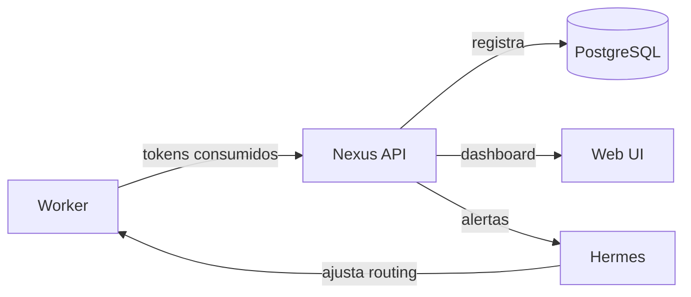

# Trazabilidad de Costos — Mecanismo Temporal

## Estado

- **Hasta Nexus:** Mecanismo manual con templates Markdown
- **Después de Nexus:** Automatización vía API + dashboard en tiempo real
- **Responsable:** `strategic-planner` (T3) + usuario humano
- **PRICES.md:** Archivo de precios actualizados manualmente — [`docs/PRICES.md`](PRICES.md)

---

## Por Qué es Importante

El control de costos es una regla absoluta del swarm:

> **Regla #4:** Presupuesto por feature. Si se excede el 160% estimado, STOP automático.

Sin trazabilidad, no puedes:
- Saber si una feature fue rentable
- Optimizar qué tier usar para cada tipo de tarea
- Negociar con clientes (si usas COALA como servicio)
- Detectar si un proveedor subió precios

---

## 💰 Realidad de Costos (Mayo 2026, API Directa)

Según datos reales de uso:

| Actividad | Costo típico | Notas |
|-----------|-------------|-------|
| Feature simple (1-2 SP) | $0.30 - $1.50 | T0 local maneja 60%+ del trabajo |
| Feature media (3-5 SP) | $1.50 - $5.00 | Mayoría de tareas van a T0 y T0.5 |
| Feature compleja (8-13 SP) | $5.00 - $15.00 | Solo validación crítica llega a T2/T3 |
| Sesión de desarrollo (2-3h) | $0.50 - $3.00 | Depende de cuántas features completas |
| Costo acumulado histórico | < $35.00 | Todo el trabajo realizado hasta la fecha |

> **Clave:** T0 (Ollama local) es gratuito y maneja el 60-70% de las tareas. T0.5 (DS Flash ~$0.14) maneja el 20-25%. Solo 10-15% del trabajo llega a T2/T3 (Kimi). Por eso los costos reales son órdenes de magnitud menores que los estimados con OpenRouter.

---

## Mecanismo Manual (v6.7)

### Paso 1: Crear archivo de costo por feature

Al iniciar una feature, el `strategic-planner` genera:

```bash
# Ruta estándar
docs/COST_REPORTS/FEAT-{ID}_cost.md
```

### Paso 2: Template del reporte

```markdown
# Cost Report — FEAT-042: Checkout con tarjeta de crédito

## Metadata
- **Feature ID:** FEAT-042
- **Story Points:** 5
- **Fecha inicio:** 2026-05-27
- **Fecha fin:** 2026-05-27
- **Proveedor principal:** DeepSeek Directo + Moonshot Directo
- **Presupuesto aprobado:** $5.00
- **Presupuesto máximo (160%):** $8.00

## Desglose por Fase

| Fase | Worker | Modelo | Tokens In | Tokens Out | Costo |
|------|--------|--------|-----------|------------|-------|
| FASE 0 | us-enricher | kimi-k2.5 | 2,000 | 3,000 | $0.0042 |
| FASE 1 | fastforward | kimi-k2.6 | 4,000 | 5,000 | $0.0120 |
| FASE 2 | strategic | kimi-k2.6 | 1,500 | 2,000 | $0.0048 |
| FASE 3 | branch | qwen-local (T0) | 1,000 | 500 | $0.00 |
| FASE 4 | tests | kimi-k2.5 | 1,500 | 2,000 | $0.0029 |
| FASE 5 | implement | flash-coder (T0.5) | 3,000 | 4,000 | $0.0015 |
| FASE 6 | verify | kimi-k2.5 | 1,000 | 1,500 | $0.0021 |
| FASE 7 | security | kimi-k2.5 | 1,500 | 2,000 | $0.0029 |
| FASE 8 | commit | qwen-local (T0) | 500 | 300 | $0.00 |
| FASE 9 | memory | kimi-k2.6 | 1,500 | 2,000 | $0.0048 |
| **TOTAL** | | | **17,500** | **22,300** | **~$0.035** |

> **Nota:** La mayoría de tareas son manejadas por T0 local ($0) y T0.5 Flash (~$0.0015). Solo validación y planificación usan T2/T3.

## Comparativa con Presupuesto

| Métrica | Valor |
|---------|-------|
| Presupuesto aprobado | $5.00 |
| Costo real estimado | ~$0.035 |
| Diferencia | -$4.965 |
| Porcentaje del presupuesto | 0.7% |
| Estado | ✅ BUDGET_OK |

## Análisis Post-Mortem

### ¿Qué salió bien?
- T0 local manejó git y comandos sin costo
- T0.5 Flash implementó código eficientemente a $0.0015
- Solo 3 fases necesitaron Kimi (planificación, validación, seguridad)

### ¿Qué se puede mejorar?
- FASE 1 podría usar DS Pro ($0.44) si fastforward no requiere razonamiento experto
- Comprimir contexto antes de enviar a Kimi K2.6

### Lecciones para el swarm
- 60%+ del trabajo fue T0/T0.5 = costo casi nulo
- Próxima feature similar: presupuestar $3.00, no $5.00

## Aprobaciones

- [ ] Strategic Planner estimó presupuesto
- [ ] Usuario aprobó presupuesto
- [ ] Costo final dentro del 160%
- [ ] Context Guardian actualizó swarm-context.md
```

### Paso 3: Registro centralizado

Al final de cada mes, `context-guardian` genera:

```markdown
# Cost Report Mensual — 2026-05

## Resumen
| Métrica | Valor |
|---------|-------|
| Features completadas | 8 |
| Story Points entregados | 28 |
| Costo total real | ~$2.50 |
| Costo por SP | ~$0.09 |
| Proveedor más usado | T0 Ollama local (65% de tareas) |

## Distribución por Tier
| Tier | % de tareas | Costo total |
|------|------------|-------------|
| T0 (Ollama) | 65% | $0.00 |
| T0.5 (DS Flash) | 22% | ~$0.30 |
| T1 (DS Pro) | 5% | ~$0.20 |
| T2 (Kimi K2.5) | 6% | ~$1.00 |
| T3 (Kimi K2.6) | 2% | ~$1.00 |

## Top 3 Features por Costo
| Feature | SP | Costo | % T0/T0.5 | Estado |
|---------|----|-------|-----------|--------|
| FEAT-038 | 8 | $1.20 | 72% | ✅ |
| FEAT-042 | 5 | $0.035 | 85% | ✅ |
| FEAT-039 | 3 | $0.18 | 78% | ✅ |

## Tendencias
- 87% del trabajo se resuelve en T0 + T0.5 (costo ~$0)
- Costo por SP bajando gracias a mejor uso de tiers locales
```

---

## ⚠️ Mantener Precios Actualizados — PRICES.md

Los precios de APIs cambian. Para no alucinar costos, mantenemos un archivo central de precios reales.

Ver y actualizar: [`docs/PRICES.md`](PRICES.md)

### Regla para agentes del swarm

Antes de estimar cualquier costo, todo agente debe:

1. Leer `docs/PRICES.md` para obtener precios actuales
2. Usar el precio de API DIRECTA si está configurada
3. Usar el precio de OpenRouter SOLO si no hay API directa disponible
4. Si `PRICES.md` tiene más de 30 días sin actualizar, mostrar advertencia

### Cómo actualizar PRICES.md

```bash
# Verificar precios actuales de DeepSeek
curl -s https://api.deepseek.com/v1/models | findstr "price"

# Verificar precios en OpenRouter
curl -s https://openrouter.ai/api/v1/models | findstr "pricing"

# Actualizar docs/PRICES.md manualmente con los valores obtenidos
```

---

## Conversión de Tokens a Dólares

### Fórmula

```
costo_total = (tokens_input / 1,000,000 * precio_input) + (tokens_output / 1,000,000 * precio_output)
```

### Precios de Referencia (API Directa, Mayo 2026)

> ⚠️ **Estos precios son ESTIMACIONES.** Verifica siempre [`docs/PRICES.md`](PRICES.md) para valores reales.

| Modelo | Input/1M | Output/1M |
|--------|----------|-----------|
| Ollama (Qwen, Granite) | $0.00 | $0.00 |
| DeepSeek Flash | ~$0.14 | ~$0.28 |
| DeepSeek Pro | ~$0.44 | ~$0.87 |
| Kimi K2.5 (Moonshot) | ~$0.30 | ~$1.20 |
| Kimi K2.6 (Moonshot) | ~$0.50 | ~$2.00 |

### Ejemplo real de cálculo

```
Feature de 5 SP, ~40K tokens totales:
- T0 (local): 25,000 tokens → $0.00
- T0.5 (Flash): 8,000 tokens (4K in + 4K out) → $0.0017
- T2 (Kimi K2.5): 6,000 tokens (2.5K in + 3.5K out) → $0.0050
- T3 (Kimi K2.6): 1,000 tokens (500 in + 500 out) → $0.0013
TOTAL: ~$0.008
```

---

## Reglas del Sistema de Costos

### 1. Presupuesto por Feature
- Cada feature debe tener un presupuesto estimado antes de iniciar
- Presupuesto conservador: `SP * $0.80` (basado en datos reales con API directa)
- Límite máximo: `presupuesto * 1.60`

### 2. Alertas (Implementar en Hermes)
- 🟢 **< 50% del presupuesto:** Normal (la mayoría de features caen aquí)
- 🟡 **50-80% del presupuesto:** Revisar si hay uso excesivo de T2/T3
- 🔴 **80-120% del presupuesto:** Alerta, requiere justificación
- 🛑 **> 160% del presupuesto:** STOP, aprobación humana obligatoria

### 3. Optimización de Costos
- Siempre intentar T0 primero ($0)
- Si T0 falla, usar T0.5 Flash (~$0.14) antes de T1 (~$0.44)
- Para validación, Kimi K2.5 directo (~$0.30/$1.20) es más barato que OpenRouter ($0.44/$2.00)
- Reutilizar contexto entre fases cuando sea posible

---

## Transición a Nexus

Cuando Nexus esté operativo, este mecanismo manual se reemplazará por:



### Funciones de Nexus

- **Tracking en tiempo real:** Cada worker reporta tokens al finalizar
- **Dashboard:** Gráficos de costo por feature, por día, por proveedor
- **Proyecciones:** "Con este ritmo, tu costo mensual será ~$3"
- **Comparativas:** "Esta feature costó 30% más que FEAT-038 similar"
- **Alertas:** Notificación cuando se acerca al 160%
- **Precios actualizados:** Nexus consulta APIs de proveedores y actualiza PRICES.md

---

## Checklist de Trazabilidad

Por cada feature:

- [ ] Leer `docs/PRICES.md` para precios actuales
- [ ] Crear `docs/COST_REPORTS/FEAT-XXX_cost.md` al inicio
- [ ] Registrar proveedor activo en cada fase
- [ ] Anotar tokens reales (input/output) por worker
- [ ] Calcular costo con precios de PRICES.md
- [ ] Comparar contra presupuesto aprobado
- [ ] Documentar desviaciones > 20%
- [ ] Actualizar reporte mensual
- [ ] Incluir lecciones aprendidas en `swarm-context.md`

---

*Mecanismo temporal. Reemplazar por Nexus cuando esté disponible.*
*Última actualización: 2026-05-27*
*Costos validados contra uso real (< $35 acumulado histórico)*
