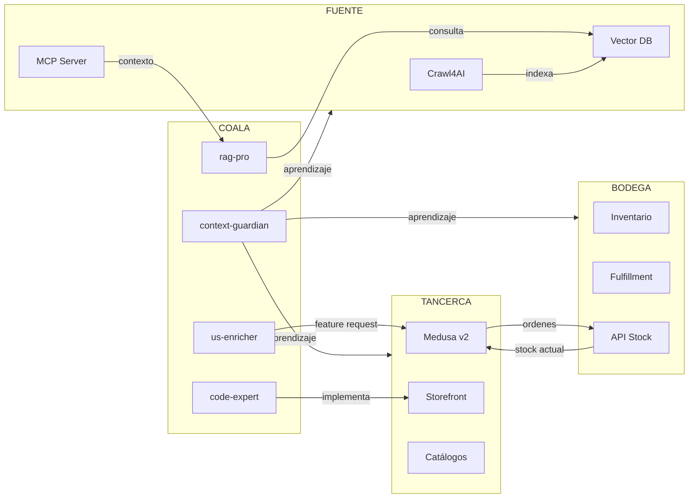

# Ecosistema COALA — Mapa de Repositorios y Relaciones

## Visión General

COALA-SwarmOps es la **cabeza cognitiva** del ecosistema. No es un proyecto aislado: está conectado orgánicamente con tres repositorios satélite que forman la base de datos, el comercio y la logística del sistema.

```
┌─────────────────────────────────────────────────────────────────────┐
│                      COALA-SwarmOps                                 │
│              [Cabeza Cognitiva · Orquestador]                       │
│                                                                     │
│   ┌─────────────┐  ┌─────────────┐  ┌─────────────┐              │
│   │   Hermes    │  │   Nexus     │  │  Pipeline   │              │
│   │  Orquesta   │  │  Costos/    │  │   SDD v6.7  │              │
│   │  Agentes    │  │  Trazabil.  │  │  9 Fases    │              │
│   └─────────────┘  └─────────────┘  └─────────────┘              │
└──────────┬─────────────────┬─────────────────┬────────────────────┘
           │                 │                 │
           ▼                 ▼                 ▼
┌──────────────────┐ ┌──────────────────┐ ┌──────────────────┐
│    tancerca      │ │  fuente-de-datos │ │  imp.bodegamk    │
│   [Ecommerce]    │ │   [Conocimiento] │ │   [Logística]    │
│  Medusa v2       │ │  RAG · Crawl4AI  │ │  Bodega · Stock  │
│  Dropshipping    │ │  Catálogos       │ │  Inventario      │
│  Checkout        │ │  Proveedores     │ │  Fulfillment     │
└──────────────────┘ └──────────────────┘ └──────────────────┘
```

## Repositorios

### 1. COALA-SwarmOps (Este repositorio)
**Rol:** Orquestador cognitivo y pipeline de desarrollo autónomo.

**Responsabilidades:**
- Enriquecer historias de usuario
- Generar especificaciones técnicas
- Implementar features con TDD
- Auditar seguridad
- Controlar costos por feature
- Coordinar agentes (actual) / Coordinar via Hermes (futuro)

**Puntos de entrada:**
- `docs/INSTALL.md` — Instalación del swarm
- `docs/USER_GUIDE.md` — Manual para clientes
- `docs/custom_modes/custom_modes_v6.7.yaml` — Definición de 21 workers

---

### 2. tancerca
**Rol:** Plataforma de ecommerce dropshipping.

**Ruta local:** `D:\repositorios\tancerca`

**Stack técnico:**
- MedusaJS v2 (backend ecommerce)
- Next.js Storefront
- PostgreSQL + Redis
- Docker Compose

**Relación con COALA:**
- El worker `rag-pro` consume documentación de Medusa v2 desde `tancerca/docs/`
- El swarm implementa features directamente en este repo (checkout, catálogos, SEO)
- Los catálogos de proveedores se indexan desde `tancerca/fuente-de-datos/proveedores/`

**Puntos de entrada:**
- `backend/` — API Medusa v2
- `storefront/` — Frontend Next.js
- `docs/` — Documentación de dominio

---

### 3. fuente-de-datos
**Rol:** Motor de conocimiento y RAG (Retrieval Augmented Generation).

**Ruta local:** `D:\repositorios\fuente de datos`

**Responsabilidades:**
- Crawl4AI: indexación de sitios de proveedores
- MCP Server: conectores de datos
- Novel Core: procesamiento de texto y embeddings
- Open WebSearch: búsqueda web enriquecida

**Relación con COALA:**
- `rag-pro` utiliza este repo como fuente de verdad para respuestas de dominio
- `context-guardian` actualiza `swarm-context.md` con aprendizajes de este repo
- Los catálogos indexados alimentan decisiones de compra en `tancerca`

**Puntos de entrada:**
- `mcp-server/` — Servidores de contexto
- `novel-core/` — Embeddings y vectorización
- `scripts/` — Automatización de crawling

---

### 4. imp.bodegamk
**Rol:** Sistema de gestión de bodega, stock e inventario.

**Ruta local:** `D:\repositorios\imp.bodegamk`

**Responsabilidades:**
- Control de inventario físico
- Gestión de SKUs y almacenes
- Fulfillment y despacho
- Integración con ecommerce

**Relación con COALA:**
- El swarm sincroniza stock entre `tancerca` (ventas online) e `imp.bodegamk` (bodega física)
- `devops-inspector` monitorea contenedores Docker de este repo
- `senior` genera scripts de integración de APIs entre ambos sistemas

**Puntos de entrada:**
- `backend/` — API de inventario
- `apps/` — Aplicaciones de gestión
- `docker/` — Compose de servicios

## Flujo de Datos entre Repos



## Fuente de Verdad por Dominio

| Dominio | Fuente principal | Repo | Worker que consume |
|---------|-----------------|------|-------------------|
| Ecommerce | Medusa v2 docs | tancerca/docs/ | rag-pro |
| Catálogos | Proveedores indexados | fuente-de-datos/ | rag-pro |
| Inventario | API de stock | imp.bodegamk/backend/ | senior, devops |
| Arquitectura | custom_modes.yaml | COALA-SwarmOps/ | micromanager |
| Costos | COST_REPORTS/ | COALA-SwarmOps/ | strategic-planner |
| Contexto histórico | swarm-context.md | COALA-SwarmOps/ | context-guardian |

## Reglas de Contribución Cruzada

1. **Nunca editar directamente `tancerca` sin pasar por el pipeline SDD**
   - Siempre iniciar con `/enrich_us` en COALA
   - El swarm genera branch, tests, implementación y PR

2. **Actualizar `fuente-de-datos` cuando cambia un catálogo**
   - Crawl4AI re-indexa automáticamente (si está configurado)
   - `rag-pro` debe verificar que el vector DB esté actualizado

3. **Sincronizar stock entre `tancerca` y `imp.bodegamk`**
   - Usar webhooks o polling según configuración
   - `devops-inspector` verifica que ambos servicios estén healthy

4. **Documentar aprendizajes en `swarm-context.md`**
   - Al finalizar cada feature (FASE 9)
   - Incluir errores, patrones detectados y optimizaciones

## Variables de Entorno Recomendadas

```bash
# COALA
export COALA_HOME="D:\repositorios\COALA-SwarmOps"
export COALA_CUSTOM_MODES="$COALA_HOME\docs\custom_modes"

# TANCERCA
export TANCERCA_HOME="D:\repositorios\tancerca"
export TANCERCA_BACKEND="$TANCERCA_HOME\backend"
export TANCERCA_STOREFRONT="$TANCERCA_HOME\storefront"

# FUENTE DE DATOS
export FUENTE_HOME="D:\repositorios\fuente de datos"
export MCP_SERVER="$FUENTE_HOME\mcp-server"

# BODEGA
export BODEGA_HOME="D:\repositorios\imp.bodegamk"
export BODEGA_API="$BODEGA_HOME\backend"
```

## Espacio para Fuentes Relacionadas (Agregar aquí)

> **Instrucción:** Cada vez que se integre un nuevo repositorio, servicio externo o fuente de datos, documentar aquí con el formato:

```markdown
### Nombre de la Fuente
**Rol:** Descripción breve
**Ruta/URL:** Ruta local o endpoint
**Relación con COALA:** Cómo se conecta
**Worker responsable:** Quién consume esta fuente
**Estado:** 🟢 Activo / 🟡 En desarrollo / 🔴 Inactivo
```

### Ejemplo: API de Pagos (Stripe)
**Rol:** Procesamiento de pagos para tancerca
**URL:** https://api.stripe.com/v1
**Relación con COALA:** El swarm implementa integraciones de checkout
**Worker responsable:** senior, code-expert
**Estado:** 🟡 En desarrollo

---

*Última actualización: 2026-05-27*
*Mantenedor: COALA-SwarmOps / context-guardian*
