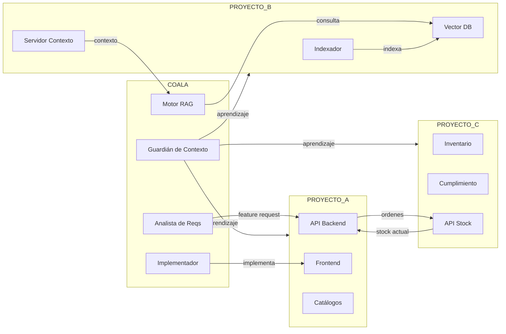

# Ecosistema COALA — Conceptos de Arquitectura Distribuida

## Visión General

COALA SwarmOps está diseñado para operar como la **capa cognitiva** de tu ecosistema de desarrollo. No es un proyecto aislado: se conecta orgánicamente con tus repositorios existentes para orquestar trabajo, validar calidad y mantener contexto entre proyectos.

```
┌─────────────────────────────────────────────────────────────────────┐
│                      COALA SwarmOps                                 │
│              [Capa Cognitiva · Orquestador]                         │
│                                                                     │
│   ┌─────────────┐  ┌─────────────┐  ┌─────────────┐              │
│   │   Planner   │  │  Knowledge  │  │  Pipeline   │              │
│   │  Estratégico│  │  /Costos    │  │   SDD 9 Fases│             │
│   └─────────────┘  └─────────────┘  └─────────────┘              │
└──────────┬─────────────────┬─────────────────┬────────────────────┘
           │                 │                 │
           ▼                 ▼                 ▼
┌──────────────────┐ ┌──────────────────┐ ┌──────────────────┐
│   Repo A         │ │   Repo B         │ │   Repo C         │
│   [Ecommerce]    │ │   [Conocimiento] │ │   [Logística]    │
│  Framework X     │ │  RAG · Crawl     │ │  Inventario      │
│  Frontend        │ │  Catálogos       │ │  Fulfillment     │
└──────────────────┘ └──────────────────┘ └──────────────────┘
```

> **Nota:** Este diagrama es conceptual. COALA se adapta a tus repositorios existentes — no requiere una arquitectura específica.

## Repositorios en el Ecosistema

### 1. COALA-SwarmOps (Este repositorio)
**Rol:** Orquestador cognitivo y pipeline de desarrollo autónomo.

**Responsabilidades:**
- Enriquecer historias de usuario
- Generar especificaciones técnicas
- Implementar features con TDD
- Auditar seguridad
- Controlar costos por feature
- Coordinar agentes (actual) / Coordinar via capa cognitiva (futuro)

**Puntos de entrada:**
- [`docs/INSTALL.md`](INSTALL.md) — Instalación del swarm
- [`docs/USER_GUIDE.md`](USER_GUIDE.md) — Manual para usuarios
- [`docs/custom_modes/custom_modes_v6.0.yaml`](custom_modes/custom_modes_v6.0.yaml) — Definición de agentes base

---

### 2. Tus Repositorios de Dominio
**Rol:** Código de negocio, APIs, storefronts, bases de datos.

**Ejemplos de stacks soportados:**
- Ecommerce: MedusaJS, Shopify APIs, WooCommerce
- Frontend: Next.js, React, Vue, Angular
- Backend: Node.js, Python, Go, Java
- Datos: PostgreSQL, MongoDB, Redis, vector databases

**Relación con COALA:**
- El swarm implementa features directamente en tus repos vía Git
- Los catálogos de documentación se indexan para consulta de agentes
- El contexto histórico se mantiene en `docs/swarm-context.md`

**Puntos de entrada:**
- Cualquier repo con Git
- APIs REST/GraphQL documentadas
- Docker Compose para entornos locales

---

## Flujo de Datos Conceptual



> Los nombres de proyectos y agentes son genéricos. COALA se adapta a tu arquitectura real.

## Fuente de Verdad por Dominio

| Dominio | Fuente principal | Tipo | Agente que consume |
|---------|-----------------|------|-------------------|
| Ecommerce | Documentación de framework | docs/ | Motor de consulta |
| Catálogos | Datos indexados | knowledge base/ | Motor de consulta |
| Inventario | API de stock | backend/ | Implementador, DevOps |
| Arquitectura | custom_modes.yaml | COALA-SwarmOps/ | Coordinador |
| Costos | COST_REPORTS/ | COALA-SwarmOps/ | Planificador |
| Contexto histórico | swarm-context.md | COALA-SwarmOps/ | Guardián de contexto |

## Reglas de Contribución Cruzada

1. **Nunca editar directamente repos de producción sin pasar por el pipeline SDD**
   - Siempre iniciar con `/enrich_us` en COALA
   - El swarm genera branch, tests, implementación y PR

2. **Actualizar fuentes de conocimiento cuando cambia documentación**
   - Re-indexar automáticamente (si está configurado)
   - Verificar que la base de vectores esté actualizada

3. **Sincronizar estado entre servicios conectados**
   - Usar webhooks o polling según configuración
   - Verificar que todos los servicios estén healthy

4. **Documentar aprendizajes en `swarm-context.md`**
   - Al finalizar cada feature (FASE 9)
   - Incluir errores, patrones detectados y optimizaciones

## Variables de Entorno Recomendadas

```bash
# COALA
export COALA_HOME="/ruta/a/COALA-SwarmOps"
export COALA_CUSTOM_MODES="$COALA_HOME/docs/custom_modes"

# TUS PROYECTOS (ejemplo)
export PROYECTO_A_HOME="/ruta/a/tu-proyecto"
export PROYECTO_A_BACKEND="$PROYECTO_A_HOME/backend"
export PROYECTO_A_FRONTEND="$PROYECTO_A_HOME/frontend"
```

## Espacio para Fuentes Relacionadas

> **Instrucción:** Cada vez que se integre un nuevo repositorio, servicio externo o fuente de datos, documentar aquí con el formato:

```markdown
### Nombre de la Fuente
**Rol:** Descripción breve
**Ruta/URL:** Ruta local o endpoint
**Relación con COALA:** Cómo se conecta
**Responsable:** Quién consume esta fuente
**Estado:** 🟢 Activo / 🟡 En desarrollo / 🔴 Inactivo
```

---

*Última actualización: 2026-05-30*
*Mantenedor: COALA SwarmOps*
