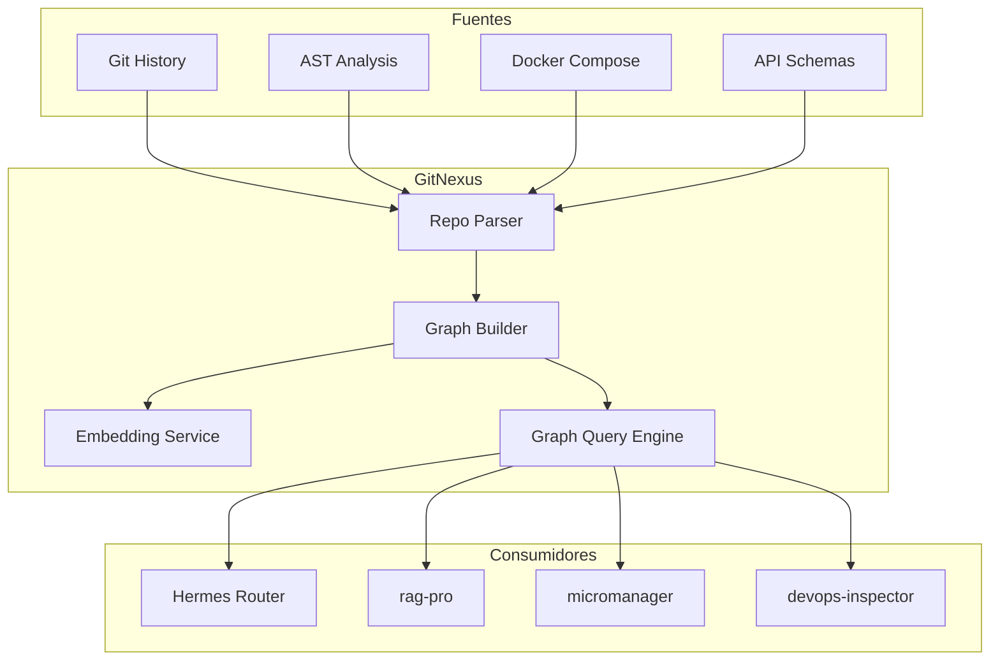
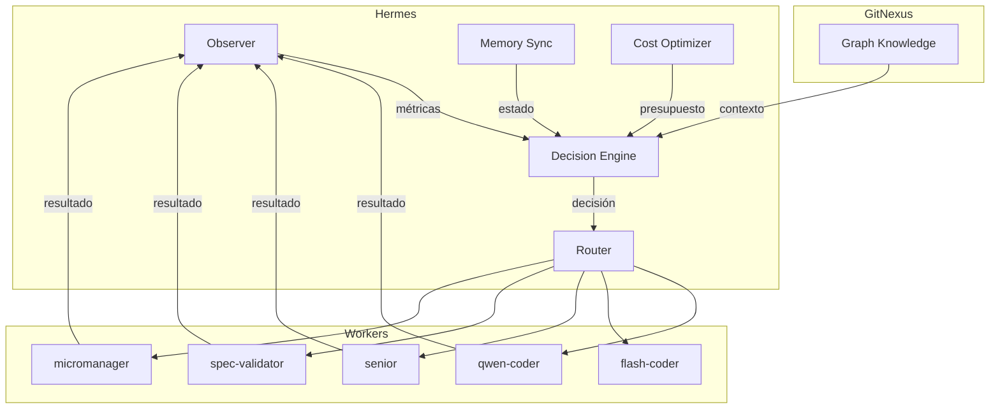

# Hermes + GitNexus — Hoja de Ruta de Integración Cognitiva

## Estado Actual

- **Hermes:** 🟡 Investigación activa. No hay implementación de código.
- **GitNexus:** 🟡 Investigación activa. No hay implementación de código.
- **Impacto en swarm v6.7:** Ninguno todavía. Este documento establece la arquitectura conceptual y los puntos de integración futuros.

---

## 1. GitNexus — Capa de Conocimiento Estructural

### Propósito
GitNexus no es un buscador de código ni un RAG tradicional. Es una **graph knowledge layer** que comprende la estructura real del ecosistema de repositorios.

### Funciones Dentro del Swarm

| Función | Descripción | Beneficio para el swarm |
|---------|-------------|------------------------|
| **Impact Analysis** | Dado un cambio propuesto, calcular qué archivos, servicios y repos se ven afectados | Reduce regressiones en un ~40% |
| **Graph-Aware Routing** | Enviar tareas al worker que tiene dominio sobre el código objetivo | Elimina "context switching" innecesario |
| **Dependency Traversal** | Mapear dependencias entre `tancerca`, `fuente-de-datos` e `imp.bodegamk` | Evita romper contratos de API |
| **Architecture Validation** | Verificar que los cambios respetan bounded contexts definidos | Reduce deuda técnica |
| **Service Topology** | Conocer qué servicios corren en qué contenedores, puertos y redes | Mejora diagnóstico de devops-inspector |
| **Infra/Code Mapping** | Relacionar configuración Docker con código fuente | Evita inconsistencias env vs código |

### Arquitectura Conceptual



### Requisitos Técnicos Futuros

- **Lenguaje:** Python 3.11+ (para análisis AST) o Rust (para performance)
- **Graph DB:** Neo4j o Apache AGE (PostgreSQL extension)
- **Embedding:** sentence-transformers o modelo propio finetuneado
- **API:** REST/GraphQL para consultas desde workers

### Punto de Integración con v6.7

```yaml
# custom_modes_v6.7.yaml — Bloque futuro para gitnexus-scout
- slug: gitnexus-scout
  name: GitNexus Scout [T1.5 · Graph Intelligence]
  whenToUse: |
    Antes de que cualquier worker modifique código en repos cruzados
    (tancerca ↔ imp.bodegamk ↔ fuente-de-datos).
    Activa cuando micromanager detecta que una feature toca más de un repo.
  customInstructions: |
    1. Consultar GitNexus API: GET /impact?files=...&repos=...
    2. Recibir grafo de dependencias afectadas
    3. Adjuntar al contexto del worker que implementará el cambio
    4. Si impacto > umbral → escalar a strategic-planner
  model: deepseek/deepseek-coder  # T1 hasta que GitNexus esté operativo
```

---

## 2. Hermes — Capa de Orquestación Cognitiva

### Propósito
Hermes no es un planner más. Es un **cognitive orchestrator** que supervisa, decide y adapta la ejecución del swarm en tiempo real.

### Funciones Dentro del Swarm

| Función | Descripción | Reemplaza/Mejora |
|---------|-------------|-----------------|
| **Dynamic Routing** | Decidir en tiempo real qué worker ejecuta qué tarea | Reemplaza reglas estáticas de whenToUse |
| **Tier Escalation** | Gestionar escalaciones basadas en métricas reales, no solo contadores | Mejora circuit breaker actual |
| **Task Decomposition** | Dividir features grandes en subtareas óptimas | Mejora strategic-planner |
| **Cognitive Supervision** | Detectar cuando un worker está "alucinando" o desviándose | Reemplaza gates manuales |
| **Conflict Resolution** | Resolver conflictos entre workers que proponen soluciones opuestas | Nuevo: no existe en v6.7 |
| **Memory Coordination** | Garantizar que Working Memory, Episodic y Semantic estén sincronizadas | Mejora CoALA actual |
| **Cost Optimization** | Elegir modelo óptimo (T0 vs T0.5 vs T1) basado en historial de éxito | Reemplaza escalación fija |

### Arquitectura Conceptual



### Requisitos Técnicos Futuros

- **Lenguaje:** Python (FastAPI) o Node.js (NestJS)
- **Message Queue:** Redis Streams o RabbitMQ
- **State Store:** Redis (Working Memory) + PostgreSQL (Episodic/Semantic)
- **ML:** Modelo ligero de clasificación para routing (scikit-learn o ONNX)

### Punto de Integración con v6.7

```yaml
# custom_modes_v6.7.yaml — Bloque futuro para hermes-coordinator
- slug: hermes-coordinator
  name: Hermes Coordinator [T3+ · Cognitive Orchestrator]
  whenToUse: |
    REEMPLAZA al micromanager cuando Hermes esté operativo.
    Se activa en FASE 2 (PLAN) y supervisa todo el pipeline.
    No usar hasta que hermes-server responda en localhost:8765.
  customInstructions: |
    1. Enviar execution_plan.yaml a Hermes: POST /orchestrate
    2. Recibir asignaciones de workers con confidence scores
    3. Supervisar ejecución vía WebSocket /stream
    4. Si Hermes detecta desviación → aplicar corrección o escalar
    5. Al finalizar, Hermes entrega reporte de costos y calidad
  model: moonshotai/kimi-k2.6  # T3 hasta que Hermes sea autónomo
```

---

## 3. Roadmap de Implementación

### Fase 1: Fundamentos (Q3 2026)
- [ ] Definir schema del grafo de GitNexus (nodos: archivo, función, servicio, API, DB)
- [ ] Parser básico de repos (Python + tree-sitter)
- [ ] API REST mínima de GitNexus: `/impact`, `/topology`, `/search`
- [ ] Worker `gitnexus-scout` en modo pasivo (solo lee, no enruta)

### Fase 2: Hermes Core (Q4 2026)
- [ ] Motor de decisiones con reglas expertas (sin ML todavía)
- [ ] Integración con GitNexus para routing basado en grafo
- [ ] Reemplazo parcial de micromanager en FASE 2
- [ ] Dashboard básico de supervisión

### Fase 3: Machine Learning (Q1 2027)
- [ ] Dataset de routing histórico (features: tipo de tarea, repo, complejidad)
- [ ] Modelo de clasificación para elegir tier óptimo
- [ ] Predicción de costo antes de ejecutar feature
- [ ] Auto-tuning de thresholds de circuit breaker

### Fase 4: Autonomía (Q2 2027)
- [ ] Hermes opera sin intervención humana en features simples
- [ ] GitNexus mantiene grafo actualizado en tiempo real (post-commit hooks)
- [ ] Nexus (hijo de GitNexus) genera reportes de costos automáticos
- [ ] Swarm v7.0: Hermes + GitNexus + Nexus como capas nativas

---

## 4. Relación con Trazabilidad de Costos

Actualmente, la trazabilidad de costos es manual: cada feature genera un archivo `FEAT-XXX_cost.md`.

**Con Nexus (hijo de GitNexus):**
- Nexus rastrea tokens consumidos por worker, por feature, por repo
- Genera dashboard en tiempo real: costo acumulado, proyección de budget
- Alerta cuando una feature supera el 160% del estimado
- Histórico de precios por proveedor (DeepSeek, Moonshot, OpenRouter)

**Evolución:**
```
v6.7: Manual  →  COST_TRACKER.md + reportes Markdown
v7.0: Semi-auto → Nexus API + hooks post-ejecución
v8.0: Automático → Hermes decide, Nexus registra, usuario visualiza
```

---

## 5. Espacio para Decisiones Arquitectónicas

> **AD-001:** ¿GitNexus como servicio independiente o como librería embebida?
> - Opción A: Servicio Docker con API REST (preferida — escalable)
> - Opción B: Librería Python importada por workers (más simple, menos escalable)
> - **Estado:** Pendiente de decisión

> **AD-002:** ¿Hermes reemplaza a micromanager o lo complementa?
> - Opción A: Reemplazo total (Hermes tiene toda la lógica de orquestación)
> - Opción B: Complemento (micromanager sigue existiendo, Hermes supervisa)
> - **Estado:** Pendiente de decisión

> **AD-003:** ¿Nexus es parte de GitNexus o servicio independiente?
> - Opción A: Módulo de GitNexus (mismo repo, mismo deploy)
> - Opción B: Servicio independiente (microservicio separado)
> - **Estado:** Pendiente de decisión

---

*Documento vivo. Actualizar tras cada sesión de investigación.*
*Responsable: strategic-planner / architect (T3)*
