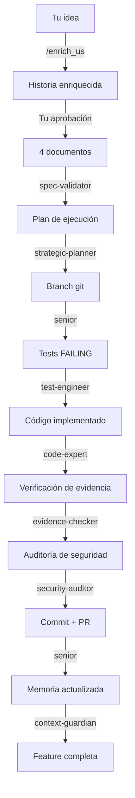

# Guía de Usuario — Cognitive Forge v6.7

## Para Quién es Este Manual

- Desarrolladores individuales que quieren un equipo de IA que trabaje autónomamente
- Startups sin presupuesto para contratar un equipo completo
- Equipos técnicos que quieren reducir costos de desarrollo en un 60-80%
- Empresas que necesitan auditabilidad, trazabilidad y calidad en cada línea de código

---

## Qué Recibes al Usar COALA-SwarmOps

### El Swarm como Servicio

Cognitive Forge no es un chatbot. Es un **pipeline de desarrollo completo** con 21 agentes especializados que ejecutan 9 fases de calidad:

```
Tu idea → Enriquecimiento → Especificación → Planificación → Branch → Tests → Código → Verificación → Seguridad → Commit → Memoria
```

Cada fase tiene un agente experto. Ningún código avanza sin validación.

### Lo que NO tienes que hacer

| Tarea tradicional | Con COALA |
|-------------------|-----------|
| Escribir tickets detallados | Dices "quiero pagos con tarjeta" y el swarm enriquece |
| Diseñar arquitectura | El planner genera execution_plan.yaml |
| Escribir tests antes del código | Test Engineer genera tests failing (TDD) |
| Code review manual | Code Reviewer analiza calidad y seguridad |
| Documentar cambios | Context Guardian actualiza swarm-context.md |
| Calcular costos por feature | Cost Tracker registra automáticamente |

### Lo que SÍ controlas tú

- Aprobar o rechazar historias enriquecidas (FASE 0)
- Aprobar specs antes de codificar (FASE 1)
- Presupuesto máximo por feature (configurable)
- Proveedor de API (DeepSeek directo, Moonshot directo, OpenRouter)
- Versión del swarm (v6.0, v6.2, v6.7)

---

## Primeros Pasos (5 minutos)

### Paso 1: Instalar el Cliente

Instala VS Code y la extensión RooCode. No necesitas instalar nada más.

```bash
# Windows / Linux / macOS: solo VS Code + RooCode
# Descarga desde: https://code.visualstudio.com/
# Extensión: busca "RooCode" en el marketplace
```

> **Nota:** También puedes usar cualquier cliente compatible con `custom_modes.yaml`. RooCode es el más probado.

### Paso 2: Configurar tu API Key

Elige tu proveedor:

**Opción A: DeepSeek Directo (más barato para T0.5 y T1)**
- Regístrate en https://platform.deepseek.com/
- Genera API key
- Copia la key en RooCode → Settings → API Provider → OpenAI Compatible → Base URL: `https://api.deepseek.com/v1`

**Opción B: Moonshot AI Directo (para Kimi K2.5/K2.6)**
- Regístrate en https://platform.moonshot.cn/
- Verifica tu cuenta (empresa recomendada para volúmenes altos)
- Copia la key en RooCode → Settings → API Provider → OpenAI Compatible → Base URL: `https://api.moonshot.cn/v1`

**Opción C: OpenRouter (fallback universal)**
- Regístrate en https://openrouter.ai/
- Recarga $5 mínimo
- Copia la key en RooCode → Settings → API Provider → OpenRouter

### Paso 3: Cargar los Modos Personalizados

```bash
# Windows
copy docs\custom_modes\custom_modes_v6.7.yaml %USERPROFILE%\.vscode\extensions\roo-code\.roo\custom_modes.yaml

# Linux / macOS
cp docs/custom_modes/custom_modes_v6.7.yaml ~/.vscode/extensions/roo-code/.roo/custom_modes.yaml
```

Reinicia RooCode. Verás 21 modos disponibles en el selector.

### Paso 4: Tu Primera Feature

Escribe en el chat:

```
/enrich_us "Como usuario, quiero poder filtrar productos por precio en la tienda"
```

El swarm hará:
1. **us-enricher** enriquece tu historia con criterios de aceptación
2. **fastforward-writer** genera 4 documentos de especificación
3. **spec-validator** valida que los documentos estén completos
4. **micromanager** crea un execution_plan.yaml con tareas atómicas

Tú apruebas cada gate antes de que continúe.

---

## Entendiendo los Tiers

### Analogía: Un Hospital

| Tier | Rol en el hospital | Costo | Cuándo se usa |
|------|-------------------|-------|---------------|
| T0 | Enfermera toma signos vitales | $0 | Tareas simples: listar archivos, verificar sintaxis |
| T0.5 | Técnico de laboratorio | ~$0.14 | Análisis rápido: encontrar patrones, código ≤100 líneas |
| T1 | Médico general | ~$0.44 | Diagnóstico y tratamiento: implementar features, comandos complejos |
| T2 | Especialista | ~$0.30/$1.20 | Validación crítica: code review, seguridad, tests |
| T3 | Cirujano jefe | ~$0.50/$2.00 | Planificación estratégica: arquitectura, orquestación |

**Regla de oro:** El swarm siempre intenta resolver con el tier más barato primero. Solo escala si falla.

---

## Costos Reales (API Directa)

### Precios por 1M tokens (mayo 2026)

| Modelo | Input | Output | Uso típico |
|--------|-------|--------|-----------|
| DeepSeek Flash | ~$0.14 | ~$0.28 | Código simple, exploración |
| DeepSeek Pro | ~$0.44 | ~$0.87 | Implementación compleja |
| Kimi K2.5 | ~$0.30 | ~$1.20 | Validación, review, seguridad |
| Kimi K2.6 | ~$0.50 | ~$2.00 | Planificación, orquestación |

> **Comparación con OpenRouter:** Usar API directa ahorra ~20-30% en costos totales.

### Presupuestos por Feature

| Tipo de feature | Story Points | Costo estimado | Tiempo |
|-----------------|--------------|----------------|--------|
| Bugfix simple | 1-2 | $2-5 | 30-60 min |
| Feature media | 3-5 | $8-18 | 2-4 horas |
| Módulo complejo | 8-13 | $22-45 | 6-10 horas |

### Control de Presupuesto

Configura un tope por feature. Si el swarm detecta que superará el 160% del estimado, se detiene y te pide aprobación.

---

## Ciclo de Vida de una Feature



### Gates de Aprobación (Tú decides)

- **ENRICH_APPROVED:** ¿La historia enriquecida refleja lo que quieres?
- **SPEC_VALID:** ¿Los documentos técnicos son correctos?
- **TESTS_FAILING:** ¿Los tests cubren los criterios de aceptación?
- **EVIDENCE_VERIFIED:** ¿El código entregado cumple con los tests?

---

## Conexión con tu Ecosistema

COALA-SwarmOps no trabaja solo. Se conecta con tus otros proyectos:

### Si tienes un Ecommerce (como tancerca)
- El swarm implementa features directamente en tu repo de Medusa v2
- `rag-pro` responde preguntas sobre tu catálogo usando `fuente-de-datos`
- Sincroniza stock con tu sistema de bodega (`imp.bodegamk`)

### Si tienes un SaaS
- Genera APIs RESTful con documentación OpenAPI
- Implementa multi-tenancy con tests de aislamiento
- Despliega con Docker Compose en tu VM

### Si tienes un Blog o Landing Page
- Escribe contenido SEO-optimizado
- Genera componentes React/Next.js
- Implementa analytics y conversion tracking

---

## Versiones del Swarm

### ¿Cuál elegir?

| Versión | Efectividad | Costo/SP | Ideal para |
|---------|-------------|----------|-----------|
| v6.0 | ~45% | Bajo | Demos, prototipos |
| v6.2 | 100% | Alto | Producción con máxima calidad |
| **v6.7** | **~115%** | **Medio** | **Producción real (recomendado)** |

**v6.7 es la mejor opción** porque:
- Tiene Tier 0.5 (Flash) para tareas intermedias a bajo costo
- Usa API keys directas (ahorro 20-30%)
- Mantiene todos los gates de calidad de v6.2
- Es la versión más madura y probada

---

## Troubleshooting para Usuarios

### "No veo los modos del swarm"
- Verifica que `custom_modes_v6.7.yaml` esté en la ruta correcta
- Reinicia VS Code completamente
- Verifica que el YAML sea válido en https://www.yamllint.com/

### "El swarm es muy caro"
- Verifica que estés usando API keys directas, no OpenRouter
- Asegúrate de que Ollama esté corriendo (T0 es gratuito)
- Configura un presupuesto máximo por feature
- Usa v6.0 para prototipos y v6.7 solo para producción

### "Un worker falla repetidamente"
- El circuit breaker se activará automáticamente
- El swarm escalará al siguiente tier
- Si T2 falla, el pipeline se detiene y te notifica
- Revisa `docs/errors/` para ver el historial de fallos

### "Quiero cambiar de proveedor mid-feature"
- Ve a RooCode Settings y cambia el API Provider
- El swarm continuará con el nuevo proveedor
- Los costos se registran con el proveedor activo en cada fase

---

## Soporte y Comunidad

- **Documentación técnica:** `docs/ARCHITECTURE.md`
- **Hoja de ruta:** `docs/ROADMAP.md`
- **Ecosistema:** `docs/ECOSYSTEM_CONTEXT.md`
- **Costos y trazabilidad:** `docs/COST_TRACKER.md`
- **Futuro:** `docs/HERMES_NEXUS_ROADMAP.md`

---

*Última actualización: 2026-05-27*
*Versión del manual: v6.7*
