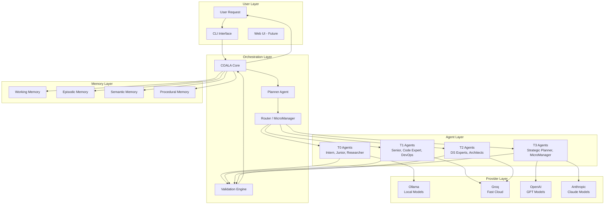
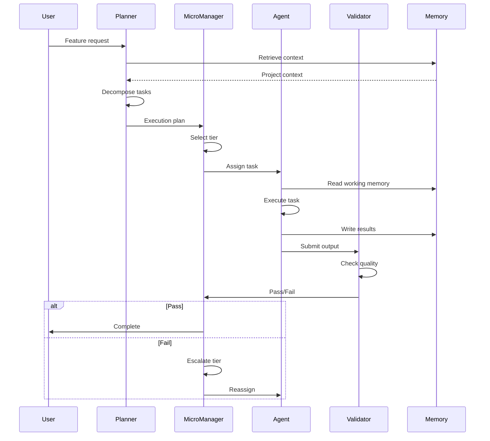

# COALA SwarmOps — Architecture Document

> **Technical architecture, component interactions, and system design.**

---

## Status

🚧 **DRAFT** — This document is under construction.  
Last updated: 2026-05-26  
Target completion: v7.0 milestone

---

## Purpose

This document provides the technical reference for COALA SwarmOps architecture including:
- Component diagrams and interactions
- Data flow patterns
- API contracts between agents
- Infrastructure requirements
- Deployment models

---

## High-Level Architecture



---

## Component Details

### COALA Core

**Responsibilities:**
- Swarm coordination
- Task routing
- Execution flow management
- Fallback handling
- Gate enforcement

**Interfaces:**
- Input: User requests, spec documents
- Output: Execution plans, task assignments, validation results

---

### Planner Agent

**Responsibilities:**
- Request decomposition
- Task identification
- Dependency mapping
- Execution plan creation

---

### Router / MicroManager

**Responsibilities:**
- Tier selection
- Agent assignment
- Pipeline orchestration
- Gate management

---

### Validation Engine

**Responsibilities:**
- Output verification
- Gate checking
- Evidence validation
- Quality metrics

---

## Data Flow

### Feature Pipeline Flow



---

## Deployment Models

### Single-Node (Current)

```
[Windows/Linux Host]
  ├── Docker Engine
  │   ├── COALA Core Container
  │   ├── Ollama Container
  │   └── Supporting Services
  ├── Git Repository
  └── Local File System
```

### Multi-Node (Future — COALA Nexus)

```
[Control Plane]
  ├── COALA Nexus
  ├── Global Memory
  └── Observability

[Worker Nodes]
  ├── Worker 1: T0/T1 Tasks
  ├── Worker 2: T2/T3 Tasks
  └── Worker N: Scalable
```

---

## API Contracts

### Agent Communication

```yaml
agent_message:
  version: "1.0"
  from: "agent_slug"
  to: "agent_slug_or_manager"
  task_id: "uuid"
  phase: "fase_number"
  content:
    type: "code|text|command|validation"
    data: "..."
  metadata:
    tier: "T0|T1|T2|T3"
    cost_estimate: "0.00"
    timestamp: "ISO8601"
```

### Gate Check

```yaml
gate_result:
  gate_name: "SPEC_VALID|ENRICH_APPROVED|TEST_PASS"
  status: "PASSED|BLOCKED|CONDITIONAL"
  evidence:
    - "reference_to_document"
    - "test_results"
  reviewer: "agent_slug"
  timestamp: "ISO8601"
```

---

## Infrastructure Requirements

### Minimum (Single Developer)

| Resource | Requirement |
|----------|-------------|
| OS | Windows 10+ or Linux |
| CPU | 4 cores |
| RAM | 8 GB |
| Storage | 20 GB |
| Docker | Docker Desktop |
| Git | Latest |

### Recommended (Team)

| Resource | Requirement |
|----------|-------------|
| OS | Windows Server 2019+ or Ubuntu 22.04+ |
| CPU | 8+ cores |
| RAM | 32 GB |
| Storage | 100 GB SSD |
| GPU | Optional, for local model acceleration |

---

## Security Architecture

### Current (v6.2)

- OWASP Top 10 baseline
- PCI-DSS awareness for payment-adjacent operations
- No secrets in code
- Local execution privacy by default

### Planned (v7.0+)

- SAST automated scanning
- Dependency vulnerability scanning
- Audit logging
- Role-based access control for multi-user deployments

---

## Migration Path

### v6.2 → v7.0

- Add Smart Router component
- Enhance Memory Layer with compression
- Introduce Cost Guardian
- No breaking changes to existing agents

### v7.0 → v8.0

- Add Hermes cognitive layer
- Add GitNexus repository intelligence
- Expand validation gates
- Maintain backward compatibility

---

*This document will be expanded as architecture decisions are finalized.*