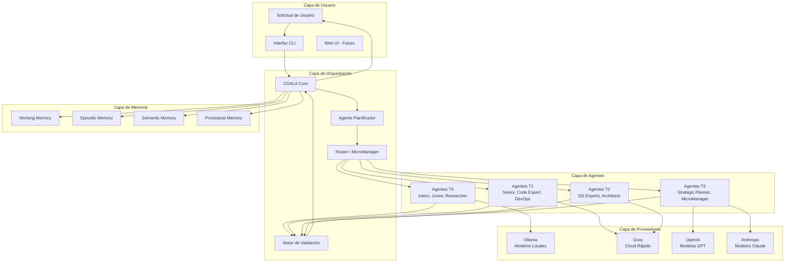
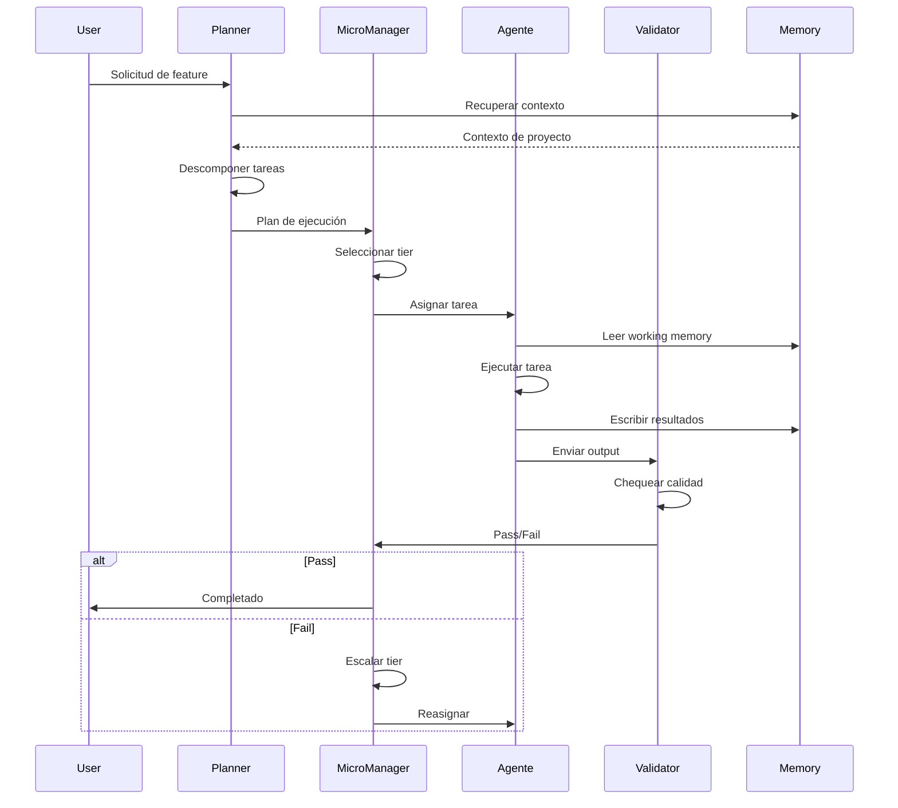

# COALA SwarmOps — Documento de Arquitectura

> **Arquitectura técnica, interacciones de componentes, y diseño de sistema.**

---

## Estado

🚧 **BORRADOR** — Este documento está en construcción.  
Última actualización: 2026-05-26  
Meta de completitud: hito v7.0

---

## Propósito

Este documento provee la referencia técnica para la arquitectura de COALA SwarmOps incluyendo:
- Diagramas de componentes e interacciones
- Patrones de flujo de datos
- Contratos API entre agentes
- Requerimientos de infraestructura
- Modelos de despliegue

---

## Arquitectura de Alto Nivel



---

## Detalles de Componentes

### COALA Core

**Responsabilidades:**
- Coordinación de swarm
- Routing de tareas
- Gestión de flujo de ejecución
- Manejo de fallback
- Enforcement de gates

**Interfaces:**
- Input: Solicitudes de usuarios, documentos de spec
- Output: Planes de ejecución, asignaciones de tareas, resultados de validación

---

### Agente Planificador

**Responsabilidades:**
- Descomposición de solicitudes
- Identificación de tareas
- Mapeo de dependencias
- Creación de plan de ejecución

---

### Router / MicroManager

**Responsabilidades:**
- Selección de tier
- Asignación de agente
- Orquestación de pipeline
- Gestión de gates

---

### Motor de Validación

**Responsabilidades:**
- Verificación de outputs
- Chequeo de gates
- Validación de evidencia
- Métricas de calidad

---

## Flujo de Datos

### Flujo del Pipeline de Feature



---

## Modelos de Despliegue

### Single-Node (Actual)

```
[Host Windows/Linux]
  ├── Docker Engine
  │   ├── Contenedor COALA Core
  │   ├── Contenedor Ollama
  │   └── Servicios de Soporte
  ├── Repositorio Git
  └── Sistema de Archivos Local
```

### Multi-Nodo (Futuro — COALA Nexus)

```
[Plano de Control]
  ├── COALA Nexus
  ├── Memoria Global
  └── Observabilidad

[Nodos Worker]
  ├── Worker 1: Tareas T0/T1
  ├── Worker 2: Tareas T2/T3
  └── Worker N: Escalable
```

---

## Contratos API

### Comunicación de Agentes

```yaml
agent_message:
  version: "1.0"
  from: "agent_slug"
  to: "agent_slug_or_manager"
  task_id: "uuid"
  phase: "fase_number"
  content:
    type: "code|text|command|validation"
    data: "..."
  metadata:
    tier: "T0|T1|T2|T3"
    cost_estimate: "0.00"
    timestamp: "ISO8601"
```

### Chequeo de Gate

```yaml
gate_result:
  gate_name: "SPEC_VALID|ENRICH_APPROVED|TEST_PASS"
  status: "PASSED|BLOCKED|CONDITIONAL"
  evidence:
    - "reference_to_document"
    - "test_results"
  reviewer: "agent_slug"
  timestamp: "ISO8601"
```

---

## Requerimientos de Infraestructura

### Mínimo (Desarrollador Individual)

| Recurso | Requerimiento |
|---------|---------------|
| SO | Windows 10+ o Linux |
| CPU | 4 cores |
| RAM | 8 GB |
| Almacenamiento | 20 GB |
| Docker | Docker Desktop |
| Git | Última versión |

### Recomendado (Equipo)

| Recurso | Requerimiento |
|---------|---------------|
| SO | Windows Server 2019+ o Ubuntu 22.04+ |
| CPU | 8+ cores |
| RAM | 32 GB |
| Almacenamiento | 100 GB SSD |
| GPU | Opcional, para aceleración de modelos locales |

---

## Arquitectura de Seguridad

### Actual (v6.2)

- Línea base OWASP Top 10
- Conciencia PCI-DSS para operaciones adyacentes a pagos
- Sin secrets en código
- Privacidad de ejecución local por defecto

### Planificado (v7.0+)

- Escaneo SAST automatizado
- Escaneo de vulnerabilidades de dependencias
- Logging de auditoría
- Control de acceso basado en roles para despliegues multi-usuario

---

## Ruta de Migración

### v6.2 → v7.0

- Añadir componente Smart Router
- Potenciar Capa de Memoria con compresión
- Introducir Cost Guardian
- Sin breaking changes para agentes existentes

### v7.0 → v8.0

- Añadir capa cognitiva Hermes
- Añadir inteligencia de repositorio GitNexus
- Expandir gates de validación
- Mantener compatibilidad backward

---

*Este documento se expandirá a medida que las decisiones de arquitectura se finalicen.*